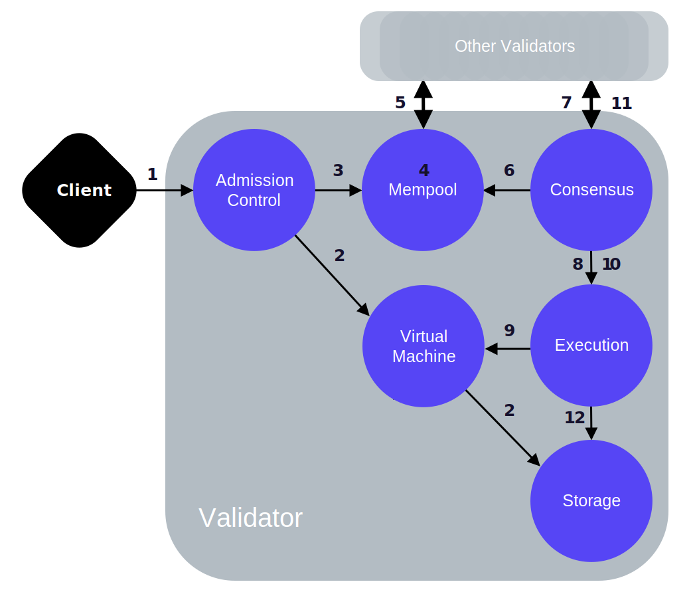
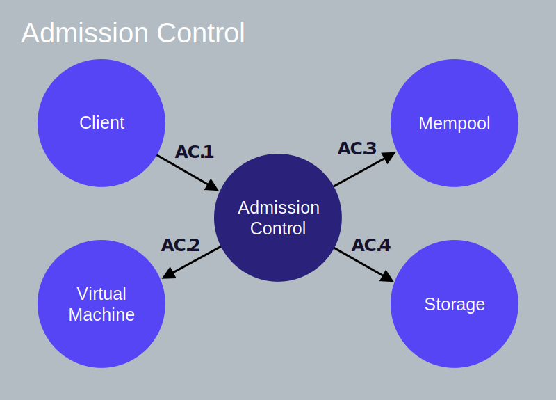
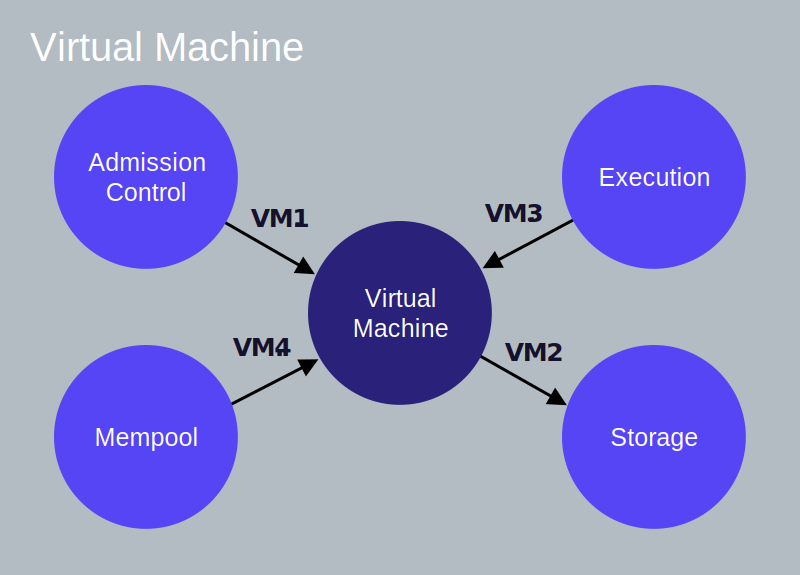
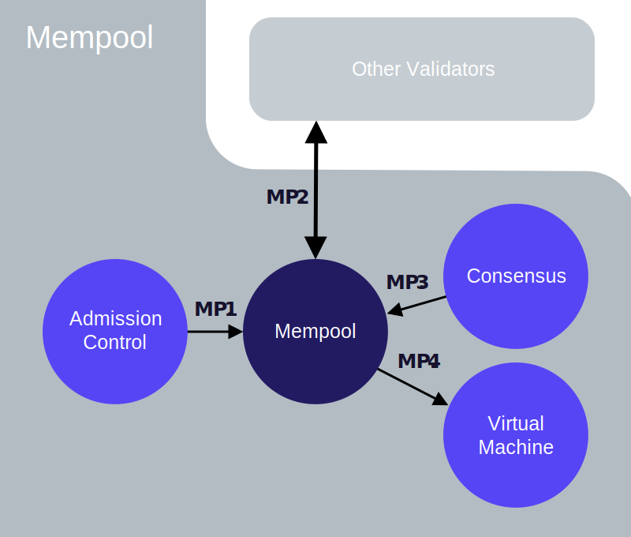
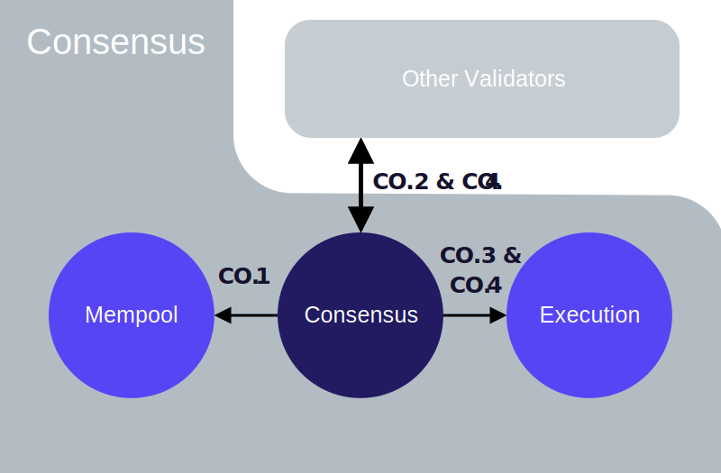
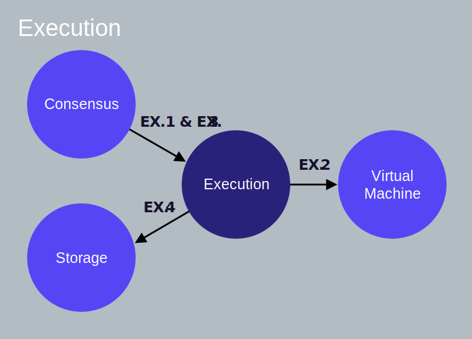
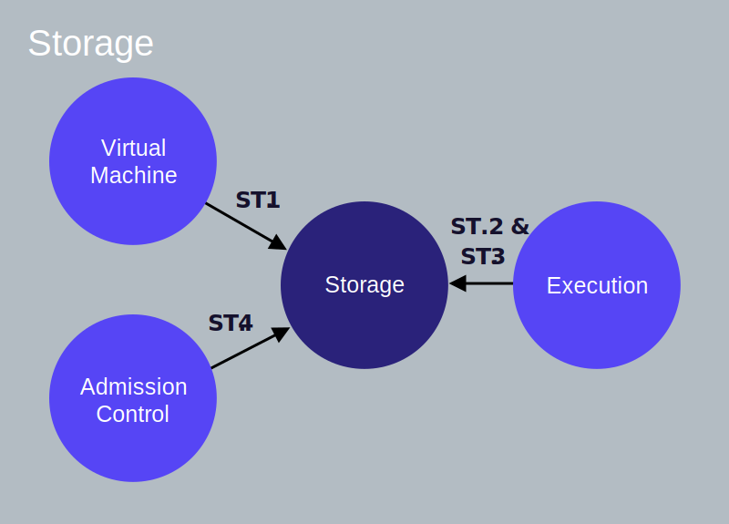

_**Note to readers:** This information was published before the Association released White Paper v2.0, which includes a number of key updates to the Libra payment system. This information has not been modified to incorporate those updates and should be read in that context._

To get a deeper understanding of the lifecycle of a Libra transaction, we will follow a transaction on its journey from being submitted to a Libra validator to being committed to the Libra Blockchain. We will then “zoom-in” on each logical component of a validator and take a look at its interactions with other components.

## Client Submits a Transaction

A Libra **client constructs a raw transaction** (let us call it T~5~raw) to transfer 10 LBR from Alice’s account to Bob’s account. The raw transaction includes the following fields. Each field is linked to its glossary definition.

* Alice's [account address](reference/glossary.md#account-address).
* A program that indicates the actions to be performed on Alice's behalf. It contains:
    * A Move bytecode [peer-to-peer transaction script](reference/glossary.md#transaction-script).
    * A list of inputs to the script (for this example, Bob's account address and the amount of payment).
* [Gas price](reference/glossary.md#gas-price) (in microlibra/gas units) &mdash; The amount Alice is willing to pay per unit of gas, to execute the transaction. Gas is a way to pay for computation and storage. A gas unit is an abstract measurement of computation with no inherent real-world value.
* [Maximum gas amount](reference/glossary.md#maximum-gas-amount) Alice is willing to pay for this transaction.
* [Expiration time](reference/glossary.md#expiration-time) of the transaction.
* [Sequence number](reference/glossary.md#sequence-number) &mdash; 5
    * A transaction with sequence number 5 can only be applied to an account with sequence number 5.

The **client signs transaction** T~5~raw with Alice's private key. The signed transaction T~5~ includes the following:

* The raw transaction.
* Alice's public key.
* Alice's signature.

### Assumptions

To describe the lifecycle of transaction T~5~, we will assume that:

* Alice and Bob have [accounts](reference/glossary.md#accounts) on the Libra Blockchain.
* Alice's account has 110 LBR.
* The current [sequence number](reference/glossary.md#sequence-number) of Alice's account is 5 (which indicates that 5 transactions have already been sent from Alice's account).
* There are a total of 100 validators &mdash; V~1~ to V~100~ on the network.
* The client submits transaction T~5~ to validator V~1~
* **Validator V~1~ is a proposer/leader for the current round.**

## Lifecycle of the Transaction

In this section, we will describe the lifecycle of transaction T~5~, from being submitted by the client to being committed to the Libra Blockchain.

Where relevant, and following a numbered step in the lifecycle, we have provided a link to the corresponding inter-component interactions of the validator node. After you are familiar with all the steps in the lifecycle of the transaction, you may want to refer to the information on the corresponding inter-component interactions for each step.

<blockquote class="block_note">

**Note:** The arrows in all the graphics in this document originate on the component initiating an interaction/action and terminate on the component on which the action is being performed. The arrows **do not represent** data read, written, or returned.
</blockquote>

<small class="figure">Figure 1.1 Lifecycle of a Transaction</small>

### Accepting the Transaction

**1** &mdash; The client submits transaction T~5~ to validator V~1~ whose admission control (AC) component receives the transaction. (Client → AC [AC.1](#client-ac-ac1))

**2** &mdash; AC will use the virtual machine (VM) component to perform validation checks, such as signature verification, checking that Alice's account has sufficient balance, checking that transaction T~5~ is not being replayed, etc. (AC → VM [AC.2](#ac-vm-ac2), [VM.1](#ac-vm-vm1))

**3** &mdash; When T~5~ passes the validation checks, AC sends T~5~ to V~1~'s mempool. (AC → Mempool [AC.3](#ac-mempool-ac3), [MP.1](#ac-mempool-mp1))

### Sharing the Transaction With Other Validators

**4** &mdash; The mempool will hold T~5~ in an in-memory buffer. Mempool may already contain multiple transactions sent from Alice's address.

**5** &mdash; Using the shared-mempool protocol, V~1~ will share the transactions (including T~5~) in its mempool with other validators (V~2~ to V~100~) and place transactions received from the other validators into its own mempool. (Mempool → Other Validators [MP.2](#mempool-other-validators-mp2))

### Proposing the Block

**6** &mdash; As validator V~1~ is a proposer/leader, it will pull a block of transactions from its mempool and replicate this block as a proposal to other validators via its consensus component. (Consensus → Mempool [MP.3](#consensus-mempool-mp3), [CO.1](#consensus-mempool-co1))

**7** &mdash; The consensus component of V~1~ is responsible for coordinating agreement among all validators on the order of transactions in the proposed block. (Consensus → Other Validators [CO.2](#consensus-other-validators-co2)). Refer to our technical paper [State Machine Replication in the Libra Blockchain](state-machine-replication-paper.md) for details of our proposed consensus protocol LibraBFT.

### Executing the Block and Reaching Consensus

**8** &mdash; As part of reaching agreement, the block of transactions (containing T~5~) is passed to the execution component. (Consensus → Execution [CO.3](#consensus-execution-consensus-other-validators-co3), [EX.1](#consensus-execution-ex1))

**9** &mdash; The execution component manages the execution of transactions in the virtual machine (VM). Note that this execution happens speculatively before the transactions in the block have been agreed upon. (Execution → VM [EX.2](#execution-vm-ex2), [VM.3](#execution-vm-vm3))

**10** &mdash; After executing the transactions in the block, the execution component appends the transactions in the block (including T~5~) to the [Merkle accumulator](#merkle-accumulators) (of the ledger history). This is an in-memory/temporary version of the Merkle accumulator. The (proposed/speculative) result of executing these transactions is returned to the consensus component. (Consensus → Execution [CO.3](#consensus-execution-consensus-other-validators-co3), [EX.1](#consensus-execution-ex1)). The arrow from "consensus" to "execution" indicates that the request to execute transactions was made by the consensus component. (For consistent use of arrows across this document, we are not using arrows to represent the flow of data).

**11** &mdash; V~1~ (the consensus leader) attempts to reach consensus on the block's execution result with other validators participating in the consensus. (Consensus → Other Validators [CO.3](#consensus-execution-consensus-other-validators-co3))

### Committing the Block

**12** &mdash; If the block's execution result is agreed upon and signed by a set of validators that have the super-majority of votes, validator V~1~'s execution component reads the result of the block execution from the speculative execution cache and commits all the transactions in the block to persistent storage. (Consensus → Execution [CO.4](#consensus-execution-co4), [EX.3](#consensus-execution-ex3)), (Execution → Storage [EX.4](#execution-storage-ex4), [ST.3](#execution-storage-st3))

**13** &mdash; Alice's account will now have 100 LBR, and its sequence number will be 6. If T~5~ is replayed by Bob, it will be rejected as the sequence number of Alice's account (6) is greater than the sequence number of the replayed transaction (5).

## Validator Component Interactions

In the [previous section](#lifecycle-of-the-transaction), we described the typical lifecycle of a sample transaction from being submitted to being committed to the blockchain's distributed database. Now let's look in more depth at the inter-component interactions of a validator as the validator processes transactions and responds to queries. This information will be most useful to those who:

* Would like to get an overall idea of how the system works under the covers.
* Are interested in eventually contributing to the Libra Core software.

For our narrative, we will assume that a client submits a  transaction T~N~ to a validator V~X~. For each validator component, we will describe each of its inter-component interactions in subsections under the respective component's section. Note that subsections describing the inter-component interactions are not listed strictly in the order in which they are performed. Most of the interactions are relevant to the processing of a transaction, and a few are relevant to read queries by the client (queries for existing information on the blockchain).

 Let us look at the core logical components of a validator node:

* [Admission Control](#admission-control-ac)
* [Mempool](#mempool)
* [Consensus](#consensus)
* [Execution](#execution)
* [Virtual Machine](#virtual-machine-vm)
* [Storage](#storage)

At the end of each section, we provide the link to the corresponding "README" of [Libra Core](libra-core-overview.md).

## Admission Control (AC)

<small class="figure">Figure 1.2 Admission Control</small>

Admission Control is the _sole external interface_ of the validator. Any request made by a client to the validator goes to AC first.

### Client → AC (AC.1)

A client submits a  transaction to the admission control of a validator V~X~. This is done via:
`AC::SubmitTransaction()`.

### AC → VM (AC.2)

Admission control accesses the virtual machine (VM) of the validator to perform preliminary checks on the transaction in order to reject malformed transactions early. This is done via:
 [`VM::ValidateTransaction()`](#virtual-machine-b).

### AC → Mempool (AC.3)

Once `VM::ValidateTransaction()` returns without errors, AC forwards the transaction to validator V~X~'s mempool via `Mempool::AddTransactionWithValidation().` The mempool for validator V~X~ will accept the transaction T~N~ from the AC only if the sequence number of T~N~ is greater than or equal to the current sequence number of the sender's account (note that the transaction will not be passed to consensus until it is the next sequence number).

### AC → Storage (AC.4)

When the client performs a read query on the Libra Blockchain (for example, to get the balance of Alice's account), AC interacts with the storage component directly to obtain the requested information.

### Admission Control README

For implementation details refer to the [Admission Control README](crates/admission-control.md).

## Virtual Machine (VM)

<small class="figure">Figure 1.3 Virtual Machine</small>

The [Move virtual machine](move-overview.md) (VM) verifies and executes transaction scripts written in Move bytecode.

### AC → VM (VM.1)

When admission control of validator V~X~ receives a transaction from a client, it invokes `VM::ValidateTransaction()` on the VM to validate the transaction.

### VM → Storage (VM.2)

When AC or mempool request the VM to validate a transaction via `VM::ValidateTransaction()`, the VM loads the transaction sender's account from storage and performs the following verifications:

* Checks that the input signature on the signed transaction is correct (to reject incorrectly signed transactions).
* Checks that the sender's account authentication key is the same as the hash of the public key (corresponding to the private key used to sign the transaction).
* Verifies that the sequence number for the transaction is not less than the current sequence number for the sender's account.  Doing this check prevents the replay of the same transaction against the sender's account.
* Verifies that the program in the signed transaction is not malformed, as a malformed program cannot be executed by the VM.
* Verifies that there is sufficient balance in the sender's account to support the max gas amount specified in the transaction, which ensures that the transaction can pay for the resources it uses.

### Execution → VM (VM.3)

The execution component utilizes the VM to execute a transaction via `VM::ExecuteTransaction()`.

It is important to understand that executing a transaction is different from updating the state of the ledger and persisting the results in storage. A transaction T~N~ is first executed as part of an attempt to reach agreement on blocks during consensus. If agreement is reached with the other validators on the ordering of transactions and their execution results, the results are persisted in storage and the state of the ledger is updated.

### Mempool → VM (VM.4)

When mempool receives a transaction from other validators via shared mempool, mempool invokes [`VM::ValidateTransaction()`](#action-b-1) on the VM to validate the transaction.

### VM README

For implementation details refer to the [Virtual Machine README](crates/vm.md).

## Mempool

<small class="figure">Figure 1.4 Mempool</small>

Mempool is a shared buffer that holds the transactions that are “waiting” to be executed. When a new transaction is added to the mempool, the mempool shares this transaction with other validators in the system. To reduce network consumption in the “shared mempool,” each validator is responsible for delivering its own transactions to other validators. When a validator receives a transaction from the mempool of another validator, the transaction is added to the mempool of the recipient validator.

### AC → Mempool (MP.1)

* After performing initial validation checks, a validator's AC sends the transaction to the validator’s mempool.
* The mempool for validator V~X~ accepts transaction T~N~ for the sender's account only if the sequence number of T~N~ is greater than or equal to the current sequence number of the sender's account.

### Mempool → Other Validators (MP.2)

* The mempool of validator V~X~ shares transaction T~N~ with the other validators on the same network.
* Other validators share the transactions in their mempool with V~X~’s mempool.

### Consensus → Mempool (MP.3)

* When validator V~X~ becomes the leader, its consensus will pull a block of transactions from its mempool and replicate the block to other validators. It does this to arrive at a consensus on the ordering of transactions and the execution results of the transactions in the block.
* Note that just because a transaction T~N~ was included in a consensus block, it does not guarantee that T~N~ will eventually be persisted in the distributed database of the blockchain.

### Mempool → VM (MP.4)

When mempool receives a transaction from other validators, mempool invokes [`VM::ValidateTransaction()`](#action-b-1) on the VM to validate the transaction.

### Mempool README

For implementation details refer to the [Mempool README](crates/mempool).

## Consensus

<small class="figure">Figure 1.5 Consensus</small>

The consensus component is responsible for ordering blocks of transactions and agreeing on the results of execution by participating in the [consensus protocol](#consensus-protocol) with other validators in the network.

### Consensus → Mempool (CO.1)

When validator V~X~ is a leader/proposer, the consensus of V~X~ pulls a block of transactions from its mempool via: `Mempool::GetBlock()`, and forms a proposal.

### Consensus → Other Validators (CO.2)

If V~X~ is a proposer/leader, its consensus replicates the proposed block of transactions to other validators.

### Consensus → Execution, Consensus → Other Validators (CO.3)

* To execute a block of transactions, consensus interacts with the execution component. Consensus executes a block of transactions via `Execution:ExecuteBlock()` (Refer to [Consensus → Execution](#consensus-execution-ex1))
* After executing the transactions in the block, execution responds to consensus with the result of executing these transactions.
* Consensus signs the execution results and attempts to reach agreement on this result with other validators participating in consensus.

### Consensus → Execution (CO.4)

If enough validators vote for the same execution result, the consensus component of V~X~ informs execution via `Execution::CommitBlock()` that this block is ready to be committed.

### Consensus README

For implementation details refer to the [Consensus README](crates/consensus.md).

## Execution

<small class="figure">Figure 1.6 Execution</small>

Execution's job is to coordinate the execution of a block of transactions and maintain a transient state that can be voted upon by consensus.

### Consensus → Execution (EX.1)

*  Consensus requests execution to execute a block of transactions via: `Execution::ExecuteBlock()`.
* Execution maintains a “scratchpad,” which holds in-memory copies of the relevant portions of the [Merkle accumulators](#merkle-accumulators). This information is used to calculate the root hash of the current state of the blockchain.
* The root hash of the current state is combined with the information about the transactions in the block to determine the new root hash of the accumulator. This is done prior to persisting any data, and to ensure that no state or transaction is stored until agreement is reached by a quorum of validators.
* Execution computes the speculative root hash and then consensus of V~X~ signs this root hash and attempts to reach agreement on this root hash with other validators.

### Execution → VM (EX.2)

When consensus requests execution to execute a block of transactions via `Execution::ExecuteBlock()`, execution uses the VM to determine the results of executing the block of transactions.

### Consensus → Execution (EX.3)

If a quorum of validators agrees on the block execution results, consensus of each validator informs its execution component via `Execution::CommitBlock()` that this block is ready to be committed.  This call to the execution component will include the signatures of the agreeing validators to provide proof of their agreement.

### Execution → Storage (EX.4)

Execution takes the values from its “scratchpad” and sends them to storage for persistence via `Storage::SaveTransactions()`. Execution then prunes the old values from the “scratchpad” that are no longer needed (for example, parallel blocks that cannot be committed).

### Execution README

For implementation details refer to the [Execution README](crates/execution).

## Storage

<small class="figure">Figure 1.7 Storage</small>

The storage component persists agreed upon blocks of transactions and their execution results. A block/set of transactions (which includes transaction T~N~) will be saved via storage when:

* There is agreement between more than 2f+1 of the validators participating in consensus on all of the following:
    * The transactions to include in a block.
    * The order of the transactions.
    * The execution results of the transactions to be included in the block.

Refer to [Merkle accumulators](reference/glossary.md#merkle-accumulators) for information on how a transaction is appended to the data structure representing the blockchain.

### VM → Storage (ST.1)

When AC or mempool invoke `VM::ValidateTransaction()` to validate a transaction, `VM::ValidateTransaction()` loads the sender's account from storage and performs the read-only validity checks on the transaction.

### Execution → Storage (ST.2)

When consensus calls `Execution::ExecuteBlock()`, execution reads the current state from storage combined with the in-memory “scratchpad” data to determine the execution results.

### Execution → Storage (ST.3)

* Once consensus is reached on a block of transactions, execution calls storage via `Storage::SaveTransactions()` to save the block of transactions and permanently record them. This will also store the signatures from the validator nodes who agreed on this block of transactions.
* The in-memory data in “scratchpad” for this block is passed to updated storage and persist the transactions.
* When the storage is updated, the sequence numbers of all resources modified by each transaction are updated accordingly.
* Note: The sequence number of an account on the Libra Blockchain increments by one for each committed transaction originating from that account.

### AC → Storage (ST.4)

For client queries that read information from the blockchain, AC directly interacts with storage to read the requested information.

### Storage README

For implementation details refer to the [Storage README](crates/storage.md).

## Reference

* [Welcome page](welcome-to-libra.md).
* [Libra Protocol: Key Concepts](libra-protocol.md) &mdash; Introduces you to the fundamental concepts of the Libra protocol.
* [My First Transaction](my-first-transaction.md) &mdash; Guides you through executing your very first transaction on the Libra Blockchain using the Libra CLI client.
* [Getting Started With Move](move-overview.md) &mdash; Introduces you to a new blockchain programming language called Move.
* [Libra Core Overview](libra-core-overview.md) &mdash; Provides the concept and implementation details of the Libra Core components through READMEs.
* [CLI Guide](reference/libra-cli.md) &mdash; Lists the commands (and their usage) of the Libra CLI client.
* [Libra Glossary](reference/glossary.md) &mdash; Provides a quick reference to Libra terminology.
* [State Machine Replication in the Libra Blockchain](state-machine-replication-paper.md) &mdash; Provides a detailed look into our consensus protocol **LibraBFT**.
