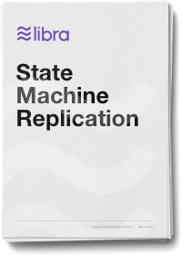

<!-- hide the table of contents -->

_**Note to readers:** This report has been modified to incorporate updates to the Libra payment system as found in the White Paper v2.0._

## Abstract

This report describes the Libra Byzantine Fault Tolerance (LibraBFT) algorithmic core and discusses next steps in its production. The consensus protocol is responsible for forming agreement on ordering and finalizing transactions among a configurable set of validators. LibraBFT maintains safety against network asynchrony and even if at any particular configuration epoch, a threshold of the participants are Byzantine.

LibraBFT is based on HotStuff, a recent protocol that leverages several decades of scientific advances in Byzantine Fault Tolerance (BFT) and achieves the strong scalability and security properties required by internet settings. Several novel features distinguish LibraBFT from HotStuff. LibraBFT incorporates a novel round synchronization mechanism that provides bounded commit latency under synchrony. It introduces a nil-block vote that allows proposals to commit despite having faulty leaders. It encapsulates the correct behavior by participants in a “tcb”-able module, allowing it to run within a secure hardware enclave that reduces the attack surface on participants.

LibraBFT can reconfigure itself, by embedding configuration-change commands in the sequence. A new configuration epoch may change everything from the validator set to the protocol itself.

### Downloads

[{: .download}](assets/papers/libra-consensus-state-machine-replication-in-the-libra-blockchain/2020-05-26.pdf)

<a href="/papers">Previous versions</a>
