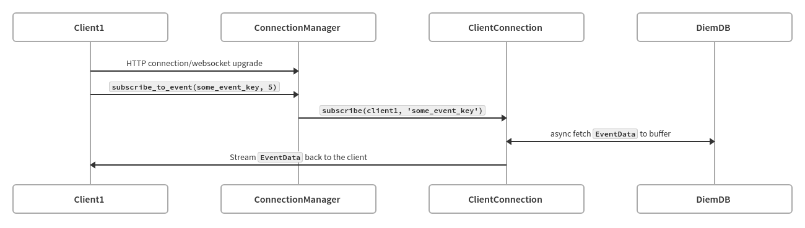

# Streaming RPC
The goal of the streaming RPC is to solve the following problems:
- There is significant overhead to making a new connection for each request, [compared to WebSockets or Server Side Events](http://www.diva-portal.se/smash/get/diva2:1133465/FULLTEXT01.pdf)
- Polling is wasteful vs server-side streaming, especially for sparse event streams

Simplified flow:

This document assumes the perspective of a fullnode. Any relative terms (i.e `incoming`) are therefore intended to mean `incoming to the fullnode`.

Configuration for the streaming RPC endpoint is in `/config/src/config/json_rpc_config.rs`.

## Transports
Transports handle connections to the outside world.
Transports are responsible for mapping external representations of communication to internal representations, and vice versa.

The currently supported transports are:
- Websockets

Planned transports are:
- Server-Side Events

For example: in the case of WebSockets, incoming messages have the form of `Result<warp::filters::ws::Message, warp::Error>`.
Different transports will have different external message representations, and so the `ConnectionManager` expects a `dyn Stream`
with messages in the form of `Result<Option<String>, stream_rpc::errors::StreamError>`.

For outgoing messages, still in the case of WebSockets, a similar process is required.
On the WebSocket channel (`warp::filters::ws::WebSocket`) Warp expects a `warp::filters::ws::Message`- but the `ConnectionManager`
only sends a `Result<String, anyhow::Error>`, which the WebSocket transport must wrap into a `Message::text(outbound_string)`.

This allows the transport to hide the specifics of dealing with a WebSocket connection (`ping`/`pong` messages, `close` messages, etc),
while exposing allowing a consistent API to the `ConnectionManager`.

If the transport layer decides to pass any kind of `Result::Err<_>` to the `ConnectionManager`, the `ConnectionManager` will
terminate all client subscriptions, and ultimately disconnect the client.
Likewise, if a transport sees an outbound `Err` it should expect (and if possible, initiate) a disconnect.
The transport should not attempt to pass this `Err` along to the client (in all likelihood the client would not be able to receive it).
Actual `Err`s at this level indicate unrecoverable communication errors.
At this transport level, `StreamJsonRpcError` are indistinguishable from `StreamJsonRpcResponse` or any other message (they are all JSON `String`).
It is important to make the distinction here between JsonRpc _messages_ (including `StreamJsonRpcError`), vs actual `Result::Err`s.

In practice:
- A `StreamJsonRpcError` could tell the client that they provided an invalid `start_version` param, which does not affect the transport layer.
- A `Result::Err<stream_rpc::errors::StreamError::ClientAlreadyClosed>` indicates the client has already disconnected: we can not recover,
    so we perform cleanup.

## Connection Manager
The `ConnectionManager` is the internal interface with which transports interact.
Put simply, it creates a bridge between a transport and `ClientConnections`, and monitors connection health.

For the incoming message stream (client->fullnode), the `ConnectionManager` expects a
`Box<dyn Stream<Item = Result<Option<String>, stream_rpc::errors::StreamError>> + Send + Unpin>`.
As mentioned in the Transport section, if a transport sends an `Err`, the `ConnectionManager` will terminate all client subscriptions, and end the connection.

Why the `Option<String>`? It's possible for a message to be handled during the process of mapping, and not have any meaning for
the subscription process. For example, in the case of websockets we have a `Message::Ping` type, which we can safely ignore
as warp/hyper automatically handle responding with the corresponding `Message::Pong`.

For outgoing messages (fullnode->client), the `ConnectionManager` expects the following channel:
`mpsc::Sender<Result<String, stream_rpc::errors::StreamError>>;`. An `Err` will begin the disconnection process, whereas
the `String` is the JSON being sent to a client.

When a new connection reaches transport, the transport will notify the `ConnectionManager`, which then:
1. Creates a `ClientConnection`, and passes the outbound (i.e to client) channel to it (along with configuration).
2. Launches a task which monitors for outbound connectivity, and initiates cleanup if the channel is closed.
3. Launches a task which pipes incoming messages to the `ClientConnection`, and initiates cleanup if the channel is closed.
4. If either of the above channels are closed, the `ConnectionManager` drops the associated `ClientConnection`, which handles
    its own cleanup.

## Client Connections
The `ClientConnection` represents the subscriptions for a given connection and contains helpers for sending data to clients.
It is responsible for parsing inbound `String` messages into the actual `struct` they represent (via `serde`), and then
starting the actual subscription `Task`. The `ClientConnection` keeps all of the `JoinHandle`s representing subscription tasks,
and kills them all when the client disconnects.

## Subscriptions
The `Subscription` trait allows for a unified way of managing subscription state, and sending data to clients.
For more details on how the `Subscription` trait works, please see [./subscription_types.rs](subscription_types.rs)

### Task Fanout
1. Each `ConnectionManager` spawns two `tokio::Task` for each connection (one each for monitoring incoming/outgoing channels).
2. Each `ClientConnection` then launches one `Task` per `Subscription`, which run in parallel.
