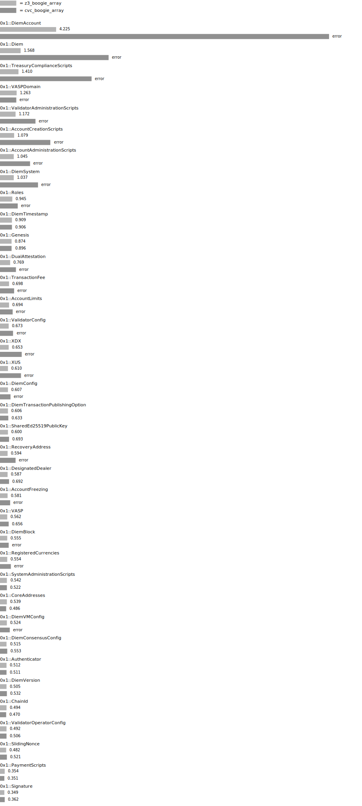
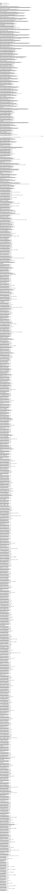

# CVC Lab

This lab is used to compare cvc5 and z3. The scope of the comparison is the full Diem framework.

The configurations of the Move prover for cvc4/z3 are found in the `experiments/*.toml` files, which
are in the standard format for Move prover options in files (see the user guide). Currently, only
basic configurations, with the non-extensional, boogie-array based theory for vectors, are compared.

Benchmark results are found in `experiments/<experiment>.XXX_data`, where `XXX` is indicating a
per-module or per-file comparison.
> NOTE: these files are currently not versioned, but they should be likely stamped with dates to keep a history.

There are two scripts in this directory:

- `run.sh` runs benchmaks and updates files in `experiments/*`.
- `plot.sh` converts benchmark results into `.svg` files in this directory.

Both scripts are wrappers around the Rust CLI defined by this crate (`cargo run -p prover-lab`).

HINT: to display the svg files directly in a system which has Chrome installed, try
`google-chrome <file>.svg`

## Current results

### Module by Module:

### Function by Function:

