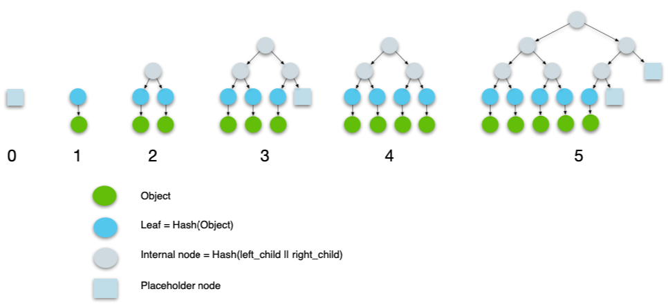
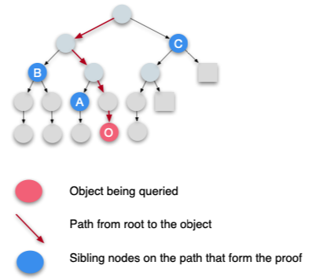
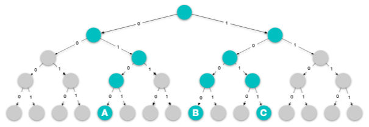
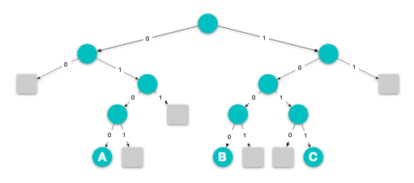
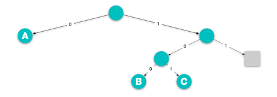
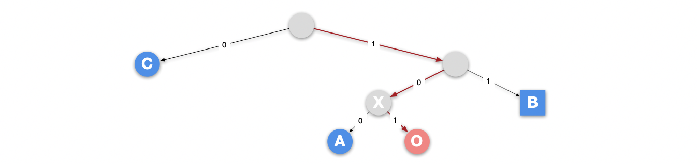
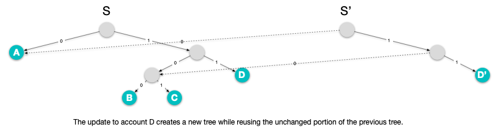

# Authenticated Data Structure Specification

## Overview

This document is intended to provide a specification for authenticated data structures used in the Diem protocol.

All data in the Diem Blockchain is stored in a single versioned database. A version number is an unsigned 64-bit integer that corresponds to the number of transactions the system has executed. At each version `i`, the database contains a tuple (T<sub>i</sub>, O<sub>i</sub> , S<sub>i</sub>) representing the transaction (T<sub>i</sub>), transaction output (O<sub>i</sub>), and ledger state (S<sub>i</sub>). Given a deterministic execution function `Apply`, the meaning of the tuple is: executing transaction T<sub>i</sub> against ledger state S<sub>i−1</sub> produces output O<sub>i</sub> and a new ledger state S<sub>i</sub>; that is, `Apply`(S<sub>i−1</sub>, T<sub>i</sub>) -> ⟨O<sub>i</sub> , S<sub>i</sub>⟩. The genesis transaction (T<sub>0</sub>) is applied on an empty database, which produces the genesis state (S<sub>0</sub>).

The format of transaction and the `Apply` function are specified in XXX. The remaining of this document specifies:

1. Ledger state and transaction output.
2. How they form an immutable ledger history.
3. Once consensus protocol produces a commit, how the client authenticates response from server when making queries.

## Merkle Trees and Proofs

Authenticated data structures in the Diem protocol are based on Merkle trees. Like all the other Merkle trees, the root hash of a tree is a short authenticator, which forms a binding commitment to the entire tree that holds a large data structure. When a client queries an untrusted server for a specific part of the tree, the server returns the result with a short proof, and the client is able to verify the result using the proof and the authenticator. In this section we describe specific Merkle trees used in the Diem protocol which form the basic building blocks.

### Hash Function

The hash functions used in this document follow the [Cryptography Specification](../crypto/spec.md).

### Merkle Accumulator

#### Definition

A Merkle Accumulator is an append-only binary Merkle tree that stores a list of objects. The value of each leaf is a `HashValue` that equals to the cryptographic hash of corresponding object. The value of each internal node is a `HashValue` that equals to the hash of the concatenation of its two children. The root hash of the tree is the value of the root node.

The exact form of the Merkle tree is determined by the total number of objects that have been added to the tree. For a Merkle Accumulator that stores `k` objects, define `n` as the smallest power of two greater or equal to `k`. The structure of the tree is equivalent to a perfect binary tree that has `n` leaves where the leftmost `k` leaves correspond to all the objects, and the rightmost
`n-k` leaves being placeholder nodes, except that any subtree that has only placeholder nodes is replaced by a single placeholder node.

The value of the placeholder node is defined by appending zeros to the byte array `b"ACCUMULATOR_PLACEHOLDER_HASH"` until it is 32-byte long and using the result as a `HashValue`. This `HashValue` does not have a known pre-image.

The diagram below illustrates how the structure of a Merkle Accumulator changes as more objects are added to the tree.



#### APIs

Merkle Accumulator supports the following operations:

```rust
trait MerkleAccumulator<T> {
    /// Appends next object to the existing tree.
    fn append(&self, object: T);

    /// Queries the `index`-th object. Returns the object with a proof if the
    /// object exists in the tree. Errors if the tree has less than `index+1`
    /// objects in total.
    fn get_with_proof(&self, index: usize) -> Result<(T, AccumulatorProof)>;

    /// Similar to get_with_proof but queries a range of objects starting from
    /// `first_index`.
    fn get_range_with_proof(
        &self,
        first_index: usize,
        num_objects: usize,
    ) -> Result<(Vec<T>, AccumulatorRangeProof)>;
}
```

The next section describes the format of `AccumulatorProof` and `AccumulatorRangeProof`.

#### Proof format and verification

##### AccumulatorProof

###### Format

For an object, there is a path from this object to the root node. An `AccumulatorProof` for this object consists of all the siblings on this path. Note that the sibling nodes are ordered from bottom to top so the ones near the bottom appear at the beginning of the list.

```rust
struct AccumulatorProof {
    siblings: Vec<HashValue>,
}
```

As an example, if object `O` at index 3 is being queried, the sibling list will be `[A, B, C]`.



###### Proof verification

In this section, we assume:

1. The client knows that the accumulator has `k` objects in total.
2. The client has obtained the root hash `H` of this accumulator.
3. The client queries for the `i`-th object (`i < k`).

After the server responds with object `O` and a proof consisting of `siblings`, the client performs proof verification following these steps:

1. Ensure that the number of siblings in the proof is not greater than 63.
2. Using the index `i`, the client determines for sibling node whether it is a left child of its parent or a right child.
3. Hash the object `O` to obtain the value of the corresponding leaf.
4. Combine the leaf with the siblings in the proof to reconstruct the root node and obtain the root hash.
5. Compare the root hash computed in the previous step with the known root hash `H`. The object and proof are trusted if and only if the root hashes match.

The verification can be expressed as pseudo code below:

```rust
fn verify_accumulator_proof(
    index: usize,
    known_root_hash: HashValue,
    obj: Object,
    proof: AccumulatorProof,
) -> Result<()> {
    // We assume that the accumulator will never have more than 2^63 leaves,
    // which should be reasonable in real world scenarios. We do a sanity check
    // here to ensure that if the proof is too long, it gets rejected
    // immediately to avoid wasting further computation.
    ensure!(proof.siblings.len() <= 63);

    let mut current_hash = hash(obj);
    for sibling in proof.siblings {
        if sibling.is_left_child(index) {
            current_hash = hash(sibling || current_hash);
        } else {
            current_hash = hash(current_hash || sibling);
        }
    }

    ensure!(current_hash == known_root_hash);
    Ok(())
}
```

### Sparse Merkle Tree

#### Definition

The sparse Merkle tree used in Diem protocol stores a key-value map, where all the keys are 256-bit byte arrays and values are arbitrary objects that are serializable as binary blobs. Sparse Merkle tree is also a binary tree, and each leaf in the tree corresponds to an entry in the map. Unlike Merkle Accumulator where objects are immutable once appended, sparse Merkle tree supports updating existing entries as well as adding and removing entries.

Given a map of key-value pairs, the sparse Merkle tree is constructed as follows. Using a prefix tree, we can represent a set of 2<sup>256</sup> entries. For simplicity, 4-bit keys are used in the examples. The diagram below shows a tree with 3 entries, where the keys are `0b0100`, `0b1000` and `0b1011`.



A tree of size 2<sup>256</sup> is however an intractable representation. Two optimizations are applied to transform the above naive implementation into an efficient one, assuming that the tree is always extremely sparse in practice. First, subtrees that consist entirely of empty nodes are replaced with a placeholder node.



Second, subtrees that consist of exactly one leaf are replaced with the corresponding leaf node.



Given the optimized sparse Merkle tree, the value of each leaf node is defined as the hash of a `SparseMerkleLeafNode` object:

```rust
struct SparseMerkleLeafNode {
    /// The 256-bit key is usually generated by hashing the original key, for
    /// the purpose of making sure the keys are evenly distributed, so a
    /// HashValue is used here.
    key: HashValue,

    /// Hash of the object. The reason of this being the hash of the value
    /// instead of the value itself is that, in some cases for a non-membership
    /// proof, this needs to be presented to the client. Using a hash avoids the
    /// need to present the client the entire blob, which could potentially be
    /// large. See later section on proof format for more details.
    value_hash: HashValue,
}
```

Similar to Merkle Accumulator, the value of each internal node is a `HashValue` that equals the hash of the concatenation of its two children. The root hash of the tree is the value of the root node. The value of the placeholder node is defined by appending zeros to the byte array `b"SPARSE_MERKLE_PLACEHOLDER_HASH"` until it is 32-byte long and using the result as a `HashValue`.

#### APIs

Sparse Merkle tree supports the following operations:

```rust
trait SparseMerkleTree<T> {
    /// Inserts a new key-value pair into the tree if the key did not exist,
    /// otherwise update the value corresponding to the key.
    fn put(&self, key: HashValue, value: T);

    /// Queries the object indexed by the key. Returns a tuple where the first
    /// element is the object, None if the key does not exist. The second
    /// element is the proof.
    fn get_with_proof(&self, key: HashValue) -> (Option<T>, SparseMerkleProof);

    /// Similar to get_with_proof but queries a range of objects.
    fn get_range_with_proof(&self, start_key: HashValue, end_key: HashValue)
        -> (Vec<T>, SparseMerkleRangeProof);
}
```

It is also possible to delete an entry from the tree, but the Diem protocol does not utilize this functionality at the moment.

#### Proof format and verification

##### SparseMerkleProof

###### Format

Sparse Merkle tree supports both membership proof and non-membership proof.

```rust
struct SparseMerkleProof {
    leaf: Option<SparseMerkleLeafNode>,
    siblings: Vec<HashValue>,
}
```

In the case that the key being queried exists in the tree, the membership proof is very similar to `AccumulatorProof`. `siblings` consists of all the siblings on the path from the object to the root node. `leaf` will be `Some(node)` where the node corresponds to what was queried. Note that `leaf` is not strictly required in this case, since the key is known and the value hash can be computed using the object, but it is here so the format of membership proof and non-membership proof can be unified.

Using the same sparse Merkle tree as an example. Note that the existing keys are `0b0100`, `0b1000` and `0b1011`. If the client queries key `0b1011`, the object `O` will be returned. The `leaf` in the proof will be `Some(0b1011, Hash(O))` and the `siblings` will be `[A, B, C]`.



In the case that the key being queried does not exist in the tree, the above struct will represent a non-membership proof. Starting from the root node, if we go down the tree from the path specified by the key, there are two possible scenarios depending on the leaf node we end up seeing:

1. Imagine the key being queried is `0b1100`, so we end up at node `B` which is a placeholder node. This means that no key in the tree has a prefix of `0b11`, which in turn means the key `0b1100` does not exist. In this case, `leaf` will be `None` and `siblings` will be `[X, C]`.
2. Imagine the key being queried is `0b1010`, so we end up at node `O` which is a node that has data and its key is `0b1011`. This means that the key `0b1011` is the only key that exists in this subtree, so the key `0b1010` does not exist. In other words, if the key `0b1010` did exist, an internal node instead of the leaf node `O` would have appeared at this position. In this case, `leaf` will be `Some(0b1011, Hash(O))` and the `siblings` will be `[A, B, C]`. Note that the hash of object `O` is used instead of `O` itself, which reduces the size of the proof in case the object is large.

###### Proof verification

In this section, we assume:

1. The client has obtained the root hash `H` of this sparse Merkle tree.
2. The client queries for a key `K`.

After the server responds with object `O` (or `None`) and a proof, the client performs proof verification following these steps:

1. If the server claims that the key exists, `proof.leaf` must be `Some`. Check that `leaf.key` matches the key and `leaf.value_hash` matches the object. Then use `Hash(leaf)` as the value of the leaf node.
2. If the server claims that the key does not exist:
  a) If `proof.leaf` is `Some`, check that `leaf.key` does not equal to the key. Also check that the length of the common prefix of `K` and `leaf.key` in bits is not shorter than the number of siblings in the proof. Then use `Hash(leaf)` as the value of the leaf node.
  b) If `proof.leaf` is `None`, use the value of the placeholder node as the value of the leaf node.
3. Using the key, the client determines for each sibling node whether it is a left child of its parent or a right child.
4. Now that the client has the value of the leaf node, combine it with the siblings to reconstruct the root node and obtain the root hash.
5. Compare the root hash computed in the previous step with the known root hash `H`. The object and proof are trusted if and only if the root hashes match.

The verification can be expressed as pseudo code below:

```rust
fn verify_sparse_merkle_proof(
    key: HashValue,
    known_root_hash: HashValue,
    object: Option<Object>,
    proof: SparseMerkleProof,
) -> Result<()> {
    // Since the depth of the sparse Merkle tree is at most 256 (the length of
    // `HashValue` in bits), the proof should not consist of more than 256
    // siblings. Reject very long proofs immediately to avoid wasting further
    // computation.
    ensure!(proof.siblings.len() <= 256);

    let leaf = match object {
        Some(obj) => {
            match proof.leaf {
                Some(leaf_node) => {
                    ensure!(leaf_node.key == key);
                    ensure!(leaf_node.value_hash == hash(obj));
                    hash(leaf_node)
                }
                None => bail!("Invalid proof."),
            }
        }
        None => {
            match proof.leaf {
                Some(leaf_node) => {
                    ensure!(leaf_node.key != key);
                    ensure!(common_prefix_bits_len(key, leaf_node.key) >= proof.siblings.len());
                    hash(leaf_node)
                }
                None => SPARSE_MERKLE_PLACEHOLDER_HASH,
            }
        }
    };

    let mut current_hash = leaf;
    for sibling in proof.siblings {
        if sibling.is_left_child(key) {
            current_hash = hash(sibling || current_hash);
        } else {
            current_hash = hash(current_hash || sibling);
        }
    }

    ensure!(current_hash == known_root_hash);
    Ok(())
}
```

## Diem Data Structure

The previous section described Merkle accumulator and sparse Merkle tree that form the basic building blocks of authenticated data structure used in the Diem Payment Network (LPN). In this section we describe the specific objects that build LPN.

### Ledger State

The ledger state represents the ground truth about the Diem ecosystem, including the quantity of coins held by each user at a given version. Each validator must know the ledger state at the latest version in order to execute new transactions. Specifically, the ledger state is a map from `AccountAddress` to a binary blob `AccountStateBlob` that represents the state of an account.

Each `AccountAddress` is hashed to a 256-bit `HashValue`. Then each `(hash(address), account_state_blob)` tuple is inserted into a sparse Merkle tree as a key-value pair. Based on the properties of cryptographic hash functions, we can assume that the resulting sparse Merkle tree is balanced no matter how the addresses are generated. This sparse Merkle tree represents the entire ledger state and the root hash of this tree is the state root hash, which means the state root hash is the authenticator for any account state at the same version.

```rust
type LedgerState = SparseMerkleTree<AccountStateBlob>;
```

When the state tree is updated after the execution of a transaction and a new tree is created, an efficient implementation often reuses unchanged portions of the previous version, forming a persistent data structure.



#### Accounts

At the logical level, an account is a collection of Move resources and modules. At the physical level, an account is an ordered map of access paths to byte array values. TODO: link to definition of access path. When an account is stored in the ledger state, the ordered map is serialized using Binary Canonical Serialization (BCS) to create a binary blob `AccountStateBlob` that gets inserted into a sparse Merkle tree.

```rust
type Path = Vec<u8>;

struct AccessPath {
    address: AccountAddress,
    path: Path,
}

type AccountState = BTreeMap<Path, Vec<u8>>;

struct AccountStateBlob {
    blob: Vec<u8>,
}

impl From<AccountState> for AccountStateBlob {
    fn from(account_state: AccountState) -> Self {
        Self {
            blob: bcs::to_bytes(&account_state),
        }
    }
}
```

### Transaction and Transaction Output

Each transaction makes updates to one or more accounts, which generates a new ledger state. Although the changes to ledger state are the direct output of the transaction, some additional information are also generated for the convenience of client queries:

1. A list of contract events emitted by the transaction.
2. The amount of gas consumed during the transaction execution.
3. The major status code that indicates the transaction execution result.

#### Events

The list of events emitted by each transaction are stored in an individual Merkle accumulator (`MerkleAccumulator<ContractEvent>`). The events are appended to the accmulator in the same order that Move VM outputs them. The root hash of the accumulator is the event root hash and acts as the authenticator for any event.

See [ContractEvent](../common/data_structures.md#contractevent) for details of `ContractEvent`.

### Ledger History

The ledger history consists of every single transaction that has ever been committed and their corresponding output. We use the type `TransactionInfo` to represent both the transaction and its output. This way any `TransactionInfo` object acts as the authenticator for the corresponding transaction and its output, including the state of every account at the end of executing this transaction.

```rust
struct TransactionInfo {
    /// The hash of the transaction.
    transaction_hash: HashValue,

    /// The root hash of the ledger state at the end of this transaction.
    state_root_hash: HashValue,

    /// The root hash of the Merkle accumulator that stores all the events
    /// emitted by this transaction.
    event_root_hash: HashValue,

    /// The amount of gas consumed during this transaction execution.
    gas_used: u64,

    /// The major status code that indicates the transaction execution result.
    major_status: StatusCode,
}
```

The ledger history is a Merkle accumulator. It starts with a single item that represents the genesis transaction and state. As more transactions are committed to the Blockchain, more `TransactionInfo` objects are appended to the accumulator.

```rust
type LedgerHistory = MerkleAccumulator<TransactionInfo>;
```

Therefore, the root hash of the ledger history accumulator acts as the authenticator for all the `TransactionInfo` objects, which in turn authenticate everything that has happened on the Blockchain, including all the transactions, current and historical ledger state, and all the contract events that were emitted. When the network is running, the consensus protocol will periodically distributed signed `LedgerInfo` which contains the root hash. Clients can use this to verify anything linked to the root of the accumulator.

## Examples of using authenticated data structure in Diem

In the previous sections, we have specified the basic building blocks such as Merkle accumulator and sparse Merkle tree, as well as how the Diem data structures are constructed based on these Merkle trees. Here we give a few concrete examples of how clients can utilize the data structures to authenticate the responses they get from the server.

In this section, we always assume that the client has obtained the latest `LedgerInfo`, as well as enough signatures on this `LedgerInfo`. Therefore the client knows the latest root hash of the ledger history accumulator, which is part of the `LedgerInfo` struct.

### Prove a transaction

To prove that a transaction `T` is the transaction committed at version `v`, `TransactionInfoWithProof` is used. The verification simply consists of two steps: first use the accumulator proof from root to leaf to prove the correctness of the `TransactionInfo` object, then use the transaction hash inside the transaction info to prove the correctness of the transaction.

```rust
struct TransactionInfoWithProof {
    // The accumulator proof from the root of the ledger history accumulator to
    // the `TransactionInfo` object at version `v`. This proves that the
    // `transaction_info` object below is correct.
    ledger_info_to_transaction_info_proof: AccumulatorProof,

    // The `TransactionInfo` object at version `v`. Since it has the hash of the
    // transaction, verifying that `transaction_info.transaction_hash` matches
    // the tranasction should convince the verifier that the transaction is
    // correct.
    transaction_info: TransactionInfo,
}
```

### Prove an account state

To prove the state of an account at version `v`, `AccountStateProof` is used. First, we verify the `TransactionInfo` object at version `v` similar to what was described above. Then we combine the state root hash inside the transaction info and the sparse Merkle proof from transaction info to the account to verify the account state.

```rust
struct AccountStateProof {
    transaction_info_with_proof: TransactionInfoWithProof,

    transaction_info_to_account_proof: SparseMerkleProof,
}
```
