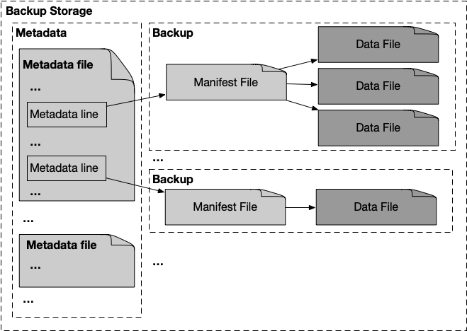

# DiemDB Backup

Diem nodes runs on top of [DiemDB](../../storage/diemdb) that serves the [core data stucture](../data_structure/spec.md) to other parts of the system. While the DiemDB is designed to provide efficient access to the recent history of the block chain, and append data to it, the DiemDB Backup is a concise data format to archive the full history of the chain, away from the running Diem validator network. It's useful in at least these situations:

* In case a validator lost its DiemDB, restoring the full transaction history from a backup is supposed to be 10x or more faster than replying on synchronizing from a peer.
* In case of a fatal bug in the software destroying the DB on every single Diem Node, we can recover the network using the backups. The backups are not likely to be corrupt at the same time because the format is 1. Different; 2. Simple.
* If a fork ever happens, and we plan to make resolve and converge the branches,  this piece of history can still be archived in the form of backups.


## Data structure



``` rust
/// URI pointing to a file in a backup storage, like "s3:///bucket/path/file".
/// These are created by the storage when `create_for_write()`, stored in manifests by the backup
/// controller, and passed back to the storage when `open_for_read()` by the restore controller
/// to retrieve a file referred to in the manifest.
pub type FileHandle = String;

/// TextLines are strings without newlines, so that the storage system can join them with
/// newlines and group them in a same file.
pub struct TextLine(String);
```

A DiemDB **backup storage** stores **backups** and **metadata lines**.

Each of the **backups** contains information that reflects different aspects of the blockchain history. It is identified by its manifest file (human readable, in JSON), which can contain links to data files. Depending on the specific type of backup, the content differs. The backup system doesn’t care about how physically the storage organizes backups, it dumps backups as group of files (although it does try to hint the storage that the group are related to each other, see the [Backup Storage interface](#backup-storage-interface)), asking back one single FileHandle to identify the whole backup. The restore system takes `FileHandle`s pointing to manifests, it’s up to the human / external system to decide which manifests are relevant, probably based on the **metadata**.

Among other purposes, **Metadata lines** mainly serve as an index of all the backups in the storage. After each backup is written to the storage, the backup system put in one line of metadata, containing the FileHandle it just got from the storage. One can get a complete picture of what's in a backup storage by looking at all the metadata lines. Similar to files in a backup, the backup system doesn't care about how the storage organizes the metadata lines, each line can be a separate file or a DB record.

At this point we backup three essential types of the information, with which a DiemDB can be popped up and start supporting the functionality of a Validator or a Full Node. It describes below each of the backup types:

### TransactionBackup

Manifest structure: (N.B when actually stored, manifests are serialized in JSON.)

``` rust
/// A chunk of a transaction backup manifest to represent the
/// [`first_version`, `last_version`] range (right side inclusive).
struct TransactionChunk {
    first_version: Version,
    last_version: Version,
    /// Repeated `len(record) + record`, where `record` is BCS serialized tuple
    /// `(Transaction, TransactionInfo)`
    transactions: FileHandle,
    /// BCS serialized `(TransactionAccumulatorRangeProof, LedgerInfoWithSignatures)`.
    /// The `TransactionAccumulatorRangeProof` links the transactions to the
    /// `LedgerInfoWithSignatures`, and the `LedgerInfoWithSignatures` can be verified by the
    /// signatures it carries, against the validator set in the epoch. (Hence proper
    /// `EpochEndingBackup` is needed for verification.)
    proof: FileHandle,
}

/// Transaction backup manifest, representing transactions in the
/// [`first_version`, `last_version`] range (right side inclusive).
struct TransactionBackup {
    first_version: Version,
    last_version: Version,
    chunks: Vec<TransactionChunk>,
}

```

The ledger itself.  By replaying all transactions till a specified version, we can recreate any state in history, including one's account balance at any time in history and full streams of events that ever happened. But it can be extremely slow at a large target version, hence the existence of the other two types of backups. The epoch ending LedgerInfos verifies a backup, and the state snapshot helps to quickly reach the state of any specific version in history.

### EpochEndingBackup

Manifest structure:

``` rust
/// A chunk of an epoch ending backup manifest, representing the
/// [`first_epoch`, `last_epoch`] range (right side inclusive).
struct EpochEndingChunk {
    first_epoch: u64,
    last_epoch: u64,
    ledger_infos: FileHandle,
}

/// Epoch ending backup manifest, representing epoch ending information in the
/// [`first_epoch`, `last_epoch`] range (right side inclusive).
struct EpochEndingBackup {
    first_epoch: u64,
    last_epoch: u64,
    waypoints: Vec<Waypoint>,
    chunks: Vec<EpochEndingChunk>,
}
```

With a chain of such information, we can derive waypoints and validator sets at each epoch boundary.
Comparing the waypoints, backups can validate against each other that they are of the same chain, without replaying all transactions beforehand.
And with the validator sets we can verify signatures on any cryptographic proof belonging to the chain, which is specifically useful for verifying the other two types of backup data, without replaying all transactions beforehand.

In practise, recover these Waypoints to the DB first, all other backups can be verified against them.

### StateSnapshotBackup

Manifest structure:

``` rust
/// A chunk of a state snapshot manifest, representing accounts in the key range
/// [`first_key`, `last_key`] (right side inclusive).
#[derive(Deserialize, Serialize)]
pub struct StateSnapshotChunk {
    /// index of the first account in this chunk over all accounts.
    pub first_idx: usize,
    /// index of the last account in this chunk over all accounts.
    pub last_idx: usize,
    /// key of the first account in this chunk.
    pub first_key: HashValue,
    /// key of the last account in this chunk.
    pub last_key: HashValue,
    /// Repeated `len(record) + record` where `record` is BCS serialized tuple
    /// `(key, account_state_blob)`
    pub blobs: FileHandle,
    /// BCS serialized `SparseMerkleRangeProof` that proves this chunk adds up to the root hash
    /// indicated in the backup (`StateSnapshotBackup::root_hash`).
    pub proof: FileHandle,
}

/// State snapshot backup manifest, representing a complete state view at specified version.
#[derive(Deserialize, Serialize)]
pub struct StateSnapshotBackup {
    /// Version at which this state snapshot is taken.
    pub version: Version,
    /// Hash of the state tree root.
    pub root_hash: HashValue,
    /// All account blobs in chunks.
    pub chunks: Vec<StateSnapshotChunk>,
    /// BCS serialized
    /// `Tuple(TransactionInfoWithProof, LedgerInfoWithSignatures)`.
    ///   - The `TransactionInfoWithProof` is at `Version` above, and carries the same `root_hash`
    /// above; It proves that at specified version the root hash is as specified in a chain
    /// represented by the LedgerInfo below.
    ///   - The signatures on the `LedgerInfoWithSignatures` has a version greater than or equal to
    /// the version of this backup but is within the same epoch, so the signatures on it can be
    /// verified by the validator set in the same epoch, which can be provided by an
    /// `EpochStateBackup` recovered prior to this to the DB; Requiring it to be in the same epoch
    /// limits the requirement on such `EpochStateBackup` to no older than the same epoch.
    pub proof: FileHandle,
}
```

With a state tree at a certain version, transactions can be executed on top of that version. This is essential for a Diem node to start synchronizing new transactions from other nodes, as well as a Validator to proposal and commit blocks.

Note that it's possible to restore a DB from empty by applying all transactions from the beginning, without the need for a state snapshot, but it can be extremely painful when the blockchain grows big.

# Metadata

Currently, the following types of metadata are supported. The restore system can read these and automatically make an execution plan (a group of manifests to restore from) to generate state at a given version.

Note each of these is serialized as a single line JSON dict before fed into `BackupStorage::save_metadata_line()`.

```
pub struct EpochEndingBackupMeta {
    pub first_epoch: u64,
    pub last_epoch: u64,
    pub first_version: Version,
    pub last_version: Version,
    pub manifest: FileHandle,
}

pub struct StateSnapshotBackupMeta {
    pub version: Version,
    pub manifest: FileHandle,
}

pub struct TransactionBackupMeta {
    pub first_version: Version,
    pub last_version: Version,
    pub manifest: FileHandle,
}
```


## Architecture


It's shown above the intended structure of the Diem backup and restore workflow, discussed in detail by components below.

## Backup Storage interface

Backups can be sent to and retrieved from different types of backend storage, it's intended that Node operators create their custom backup storage to operate on their own storage solutions. A custom storage is implemented either:
1. In rust, implementing the `trait BackupStorage` described next, or
2. In any language, as separate commands that take in arguments from stdin and return results/errors to stdout/stderr; We support this by a `CommandAdapter` storage type implementing the `trait BackupStorage`

```rust
/// String returned by a specific storage implementation to identify a backup, probably a folder name
/// which is exactly the same with the backup name we pass into `create_backup()`
/// This is created and returned by the storage when `create_backup()`, passed back to the storage
/// when `create_for_write()` and persisted nowhere (once a backup is created, files are referred to
/// by `FileHandle`s).
type BackupHandle = String;

/// Through this, the backup controller promises to the storage the names passed to
/// `create_backup()` and `create_for_write()` don't contain funny characters tricky to deal with
/// in shell commands.
/// Specifically, names follow the pattern "\A[a-zA-Z0-9][a-zA-Z0-9._-]{0,126}\z"
struct ShellSafeName(String);

trait BackupStorage {
    /// Hint that a bunch of files are gonna be created related to a backup identified by `name`,
    /// which is unique to the content of the backup, i.e. it won't be the same name unless you are
    /// backing up exactly the same thing.
    /// Storage can choose to take actions like create a dedicated folder or do nothing.
    /// Returns a string to identify this operation in potential succeeding file creation requests.
    fn create_backup(&self, name: &ShellSafeName) -> BackupHandle;
    /// Ask to create a file for write, `backup_handle` was returned by `create_backup` to identify
    /// the current backup.
    fn create_for_write(
        &self,
        backup_handle: &BackupHandleRef,
        name: &ShellSafeName,
    ) -> (FileHandle, WritableStream);
    /// Open file for reading.
    fn open_for_read(
        &self,
        file_handle: &FileHandleRef,
    ) -> ReadableStream;
    /// Asks to save a metadata entry. A metadata entry is one line of text.
    /// The backup system doesn't expect a metadata entry to exclusively map to a single file
    /// handle, or the same file handle when accessed later, so there's no need to return one. This
    /// also means a local cache must download each metadata file from remote at least once, to
    /// uncover potential storage glitch sooner.
    /// See `list_metadata_files`.
    fn save_metadata_line(&self, name: &ShellSafeName, content: &str);
    /// The backup system always asks for all metadata files and cache and build index on top of
    /// the content of them. This means:
    ///   1. The storage is free to reorganise the metadata files, like combining multiple ones to
    /// reduce fragmentation.
    ///   2. But the cache does expect the content stays the same for a file handle, so when
    /// reorganising metadata files, give them new unique names.
    fn list_metadata_files(&self) -> Vec<FileHandle>;
}
```

To make things extremely simple, for operations on data files, a storage is required only to provide sequential read and write based on `FileHandle`s, which are simply URIs pointing to resources in the storage. `FileHandle`s are returned by the storage and stored in manifests to refer to data files. When the backup system intends to make a backup, it requests to `create_backup`, which hints the storage that potentially multiple related files are gonna be created around a backup of a certain `name`. It's up to the storage to decide how to relate those files under a same backup, it can, for example, make a sub folder with the exact `name` or do nothing, but it'll return a string as a `BackupHandle` to the backup system, so that later when files are created, the storage get it back and can come up with actual file paths considering both the `BackupHandle` and the file `name`.

While on the metadata side, when feeding metadata lines to the storage, the backup system doesn't ask back an identifier for it, because the restore system will always ask for all metadata files and read all lines out of them, if a metadata file is not cached by the restore system already.

As mentioned above, we provide `CommandAdapter` storage type that adaptes a set of shell command lines to the storage interface.

A config file following this structure (In TOML though) defines a specific adapter:

```rust
pub struct EnvVar {
    pub key: String,
    pub value: String,
}

struct Commands {
    /// Command line to create backup.
    /// input env vars:
    ///     $BACKUP_NAME
    /// expected output on stdout:
    ///     BackupHandle, trailing newline is trimmed
    create_backup: String,
    /// Command line to open a file for writing.
    /// input env vars:
    ///     $BACKUP_HANDLE returned from the previous command
    ///     $FILE_NAME
    /// stdin will be fed with byte stream.
    /// expected output on stdout:
    ///     FileHandle, trailing newline
    create_for_write: String,
    /// Command line to open a file for reading.
    /// input env vars:
    ///     $FILE_NAME
    /// expected stdout to stream out bytes of the file.
    open_for_read: String,
    /// Command line to save a line of metadata
    /// input env vars:
    ///     $FILE_NAME
    /// stdin will be fed with a line of text with a trailing newline.
    pub save_metadata_line: String,
    /// Command line to list all existing metadata file handles.
    /// expected stdout to stream out lines of file handles.
    pub list_metadata_files: String,
}

pub struct CommandAdapterConfig {
    /// Command lines that implements `BackupStorage` APIs.
    commands: Commands,
    /// Additional environment variables to be set when command lines are spawned.
    env_vars: Vec<EnvVar>,
}
```

Example config for a S3 storage based on the aws-cli command line:

```toml
[[env_vars]]
key = "BUCKET_AND_PREFIX"
value = "diem-backup/backup1"

[commands]
create_backup = 'echo "$BACKUP_NAME"'
create_for_write = 'echo "s3://$BUCKET_AND_PREFIX/$BACKUP_HANDLE/$FILE_NAME" && exec >&- && aws s3 cp - "s3://$BUCKET/$BACKUP_HANDLE/$FILE_NAME"'
open_for_read = 'aws s3 cp "$FILE_HANDLE" -'
save_metadata_line= 'aws s3 cp - "s3://$BUCKET_AND_PREFIX/metadata/$FILE_NAME"'
list_metadata_files = 'aws s3 ls s3://$BUCKET_AND_PREFIX/metadata/ | sed -ne "s/.* //p" | xargs -I{} echo s3://$BUCKET/metadata/{}'
```

This will create a folder structure like the following in the s3 bucket diem-backup:

```
s3://diem-backup/backup1/
  metadata/
    epoch_ending_0-0.meta
    state_snapshot_ver_0.meta
    state_snapshot_ver_10000000.meta
    transaction_0-0.meta
    transaction_1-10000.meta
    transaction_10001-20000.meta
    ...
  epoch_ending_0-.0f95
    0-.chunk
    epoch_ending.manifest
  state_ver_0.26ff
    0-.chunk
    0-10322.proof
    10323-.chunk
    10323-11234.proof
    state.proof
    state.manifest
  transaction_0-.321c
    0-.chunk
    0-0.proof
    transaction.manifest
  ...
```

## Backup service inside of a Diem Validator/Full node

Since the DB we are backing up from is likely to be already open (and actively operated on) by a Diem Validator / Full Node, access to the DB by the backup system is done in the same process, as the Backup Service. The service is open to localhost only, as a preliminary security measure, and is supposed to be accessed only by the `BackupController` described below. The protocol between them is deemed private to the Diem implementation and in reality its in BCS over HTTP.

## Backup Controllers

A Backup Controller is the actual driver of a single backup process, it parses input parameters, fetches data from the local backup service, persists data to a Backup Storage, compose manifests according with `FileHandle`s returned by the storage, and finally persists the manifests to the storage. There is one BackupController implemented for each backup type.

A BackupCoordinator is implemented as well, which runs in the background and monitors the chain continuously, issuing backups as needed.

## Restore Controllers

Similar to the Backup controller, a RestoreController glues the functionality of a BackupStorage and the DiemDb. The difference is a RestoreController operates directly on an (potentially empty) DB, without the dependency on a running Node. A node is instead supposed to be started on top of a DB created by the controllers.

To create a DiemDB from scratch, on top of which a validator can boot and join the network, one usually needs to pick a state snapshot at version V, and a target version T and do the following:

1. Recover EpochEnding backup from epoch 0 all the way to the one which right precedes version T.
3. (Optional, but supposed to do in Diem V1, since Diem nodes doesn't work on partial transaction history in V1.) Restore transactions from 0 to V to DB.
2. Recover the state snapshot at version V.
4. Replay transactions from version V+1 to T to recreate state at version T.

A RestoreCoordinator is implemented to do the above automatically, given a target state version.
