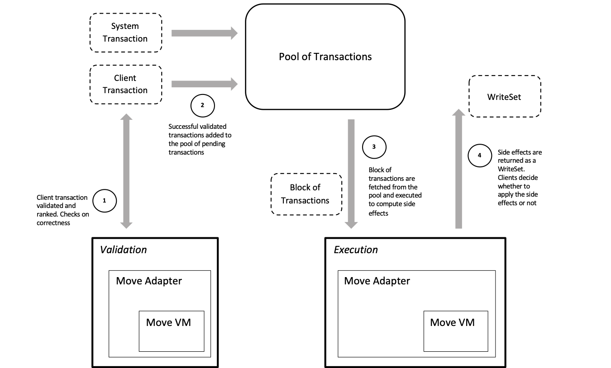

# Move Adapter: Transaction Validation and Execution

## Introduction

The **Move Adapter** is responsible for the validation and execution of transactions.
**Validation** and **Execution** are different steps, exposed through different entry points
and using different instances of the adapter.

_[Validation](#Validation)_ performs various checks on a transaction to determine if it is well formed and to evaluate its priority.
When entering the system, each user transaction is validated relative to a starting state and either discarded if it is malformed or added to a ranked pool of pending transactions otherwise.
A **discarded** transaction is removed from the system without being recorded on the blockchain.
A **validated** transaction can proceed but may still be discarded during the execution step.

_[Execution](#Execution)_ receives a block of transactions and a starting state and evaluates those transactions in order.
Each transaction is first revalidated. The system state may have changed since the validation step, so that a transaction has become invalid and needs to be discarded.
Otherwise, the execution process computes a set of side effects for each transaction. Those side effects are used in two ways: they are included in the final per-transaction results of the execution step, and they are applied locally within the execution process so that they are visible to subsequent transactions within the same block.

The following diagram shows how the Move Adapter fits into the system.



The **Move Adapter** uses a **[Move Virtual Machine](#Move-VM)** (VM)
to execute code in the context of the Diem ecosystem.
The Move VM is not aware of the structure and semantics of Diem transactions,
nor is it aware of the Diem storage layer; it only knows how to execute Move functions.
It is the adapter's job to use the VM in a way that honors the Diem protocol.

We will describe the Move Adapter and the Move VM architecture in Diem and how they share responsibilities.

## Validation

Validation operates on a transaction (`SignedTransaction`) with a given state (`StateView`). The state is read-only: validation does
not execute the transaction and so it does not compute side effects.
If a transaction is malformed the adapter returns a result (`VMValidatorResult`) indicating that the transaction must be discarded. If the transaction is successfully validated, the result also includes information to rank the transaction priority.

```rust
/// The entry point to validate a transaction
pub trait VMValidator {
    fn validate_transaction(
        &self,
        transaction: SignedTransaction,
        state_view: &dyn StateView,
    ) -> VMValidatorResult;
}

/// `StateView` is a read-only snapshot of the global state.
pub trait StateView {
    fn id(&self) -> StateViewId;
    fn get(&self, access_path: &AccessPath) -> Result<Option<Vec<u8>>>;
    fn multi_get(&self, access_paths: &[AccessPath]) -> Result<Vec<Option<Vec<u8>>>>;
    fn is_genesis(&self) -> bool;
}

/// The result of running the transaction through the VM validator.
pub struct VMValidatorResult {
    /// Result of the validation: `None` if the transaction was successfully validated
    /// or `Some(DiscardedVMStatus)` if the transaction should be discarded.
    status: Option<DiscardedVMStatus>,

    /// Score for ranking the transaction priority (e.g., based on the gas price).
    /// Only used when the status is `None`. Higher values indicate a higher priority.
    score: u64,

    /// The account role for the transaction sender, so that certain
    /// governance transactions can be prioritized above normal transactions.
    /// Only used when the status is `None`.
    governance_role: GovernanceRole,
}
```

Validation examines the content of a transaction to determine if it is well formed. The transaction content is organized into three layers: `SignedTransaction`, `RawTransaction`, and the transaction payload (`TransactionPayload` and `WriteSetPayload`):

```rust
/// A transaction that has been signed.
pub struct SignedTransaction {
    /// The raw transaction
    raw_txn: RawTransaction,

    /// Public key and signature to authenticate
    authenticator: TransactionAuthenticator,
}

/// RawTransaction is the portion of a transaction that a client signs.
pub struct RawTransaction {
    /// Sender's address.
    sender: AccountAddress,

    /// Sequence number of this transaction. This must match the sequence number
    /// stored in the sender's account at the time the transaction executes.
    sequence_number: u64,

    /// The transaction payload, e.g., a script to execute.
    payload: TransactionPayload,

    /// Maximal total gas to spend for this transaction.
    max_gas_amount: u64,

    /// Price to be paid per gas unit.
    gas_unit_price: u64,

    /// The currency code, e.g., "XDX", used to pay for gas. The `max_gas_amount`
    /// and `gas_unit_price` values refer to units of this currency.
    gas_currency_code: String,

    /// Expiration timestamp for this transaction, represented
    /// as seconds from the Unix Epoch. If the current blockchain timestamp
    /// is greater than or equal to this time, then the transaction is
    /// expired and will be discarded. This can be set to a large value far
    /// in the future to indicate that a transaction does not expire.
    expiration_timestamp_secs: u64,

    /// Chain ID of the Diem network this transaction is intended for.
    chain_id: ChainId,
}

/// Different kinds of transactions.
pub enum TransactionPayload {
    /// A system maintenance transaction.
    WriteSet(WriteSetPayload),
    /// A transaction that executes code.
    Script(Script),
    /// A transaction that publishes code.
    Module(Module),
}

/// Two different kinds of WriteSet transactions.
pub enum WriteSetPayload {
    /// Directly passing in the WriteSet.
    Direct(ChangeSet),
    /// Generate the WriteSet by running a script.
    Script {
        /// Execute the script as the designated signer.
        execute_as: AccountAddress,
        /// Script body that gets executed.
        script: Script,
    },
}

/// The set of changes and events produced by a transaction.
pub struct ChangeSet {
    write_set: WriteSet,
    events: Vec<ContractEvent>,
}

/// A transaction script runs code with a specified set of arguments.
pub struct Script {
    code: Vec<u8>,
    ty_args: Vec<TypeTag>,
    args: Vec<TransactionArgument>,
}

/// A module publishing transaction contains the code to be published.
pub struct Module {
    code: Vec<u8>,
}
```

There are several different kinds of transactions that can be stored in the transaction payload: executing a script, publishing a module, and applying a WriteSet for system maintenance or updates. The payload is stored inside a `RawTransaction` structure that includes the various fields that are common to all of these transactions, and the `RawTransaction` is signed and wrapped inside a `SignedTransaction` structure that includes the signature and public key.

The adapter performs a sequence of checks to validate a transaction. Some of these checks are implemented directly in the adapter and others are specified in Move code and evaluated via the [Move VM](#Move-VM). Some of the checks apply to all transactions and others are specific to the type of payload.

### General Checks

The adapter performs the following steps for any transaction, regardless of the payload:

* Check if the signature in the `SignedTransaction` is consistent with the public key and the `RawTransaction` content. If not, this check fails with an `INVALID_SIGNATURE` status code. Note that comparing the transaction's public key against the sender account's authorization key is done separately in Move code.

* Check that the `gas_currency_code` in the `RawTransaction` is a name composed of ASCII alphanumeric characters where the first character is a letter. If not, validation will fail with an `INVALID_GAS_SPECIFIER` status code. Note that this check does not ensure that the name corresponds to a currency recognized by the Diem Framework.

* Normalize the `gas_unit_price` from the `RawTransaction` to the Diem (XDX) currency. If the the validation is successful, the normalized gas price is returned as the `score` field of the `VMValidatorResult` for use in prioritizing the transaction. The normalization is calculated using the `to_xdx_exchange_rate` field of the on-chain `CurrencyInfo` for the specified gas currency. This can fail with a status code of `CURRENCY_INFO_DOES_NOT_EXIST` if the exchange rate cannot be retrieved.

* Load the `RoleId` resource from the sender's account. If the the validation is successful, this value is returned as the `governance_role` field of the `VMValidatorResult` so that the client can choose to prioritize governance transactions.

### Gas and Size Checks

Next, there are a series of checks related to the transaction size and gas parameters. These checks are performed for `Script` and `Module` payloads, but not for `WriteSet` transactions. The constraints for these checks are defined by the `GasConstants` structure in the `DiemVMConfig` module.

* Check if the transaction size exceeds the limit specified by the `max_transaction_size_in_bytes` field of `GasConstants`. If the transaction is too big, validation fails with a `EXCEEDED_MAX_TRANSACTION_SIZE` status code.

* If the `max_gas_amount` field in the `RawTransaction` is larger than the `maximum_number_of_gas_units` field of `GasConstants`, then validation fails with a status code of `MAX_GAS_UNITS_EXCEEDS_MAX_GAS_UNITS_BOUND`.

* There is also a minimum gas amount based on the transaction size. The `GasConstants` structure specifies a `min_transaction_gas_units` value that is charged for all transactions regardless of their size. If the transaction size in bytes is larger than the `large_transaction_cutoff` value, then the minimum gas amount is increased by `instrinsic_gas_per_byte` for every byte in excess of `large_transaction_cutoff`. If the `max_gas_amount` for the transaction is less than this minimum requirement, validation fails with a status code of `MAX_GAS_UNITS_BELOW_MIN_TRANSACTION_GAS_UNITS`.

* The `gas_unit_price` from the `RawTransaction` must be within the range specified by the `GasConstants`. If the price is less than `min_price_per_gas_unit`, validation fails with a status code of `GAS_UNIT_PRICE_BELOW_MIN_BOUND`. If the price is more than `max_price_per_gas_unit`, validation fails with a status code of `GAS_UNIT_PRICE_ABOVE_MAX_BOUND`.

### Prologue Checks

The rest of the validation is performed in Move code, which is run using the Move VM with gas metering disabled. Each kind of transaction payload has a corresponding prologue function that is used for validation. These prologue functions are defined in the `DiemAccount` module of the Diem Framework:

* `Script`: The prologue function is `script_prologue`. In addition to the common checks listed below, it also calls the `is_script_allowed` function in the `DiemTransactionPublishingOption` module with the hash of the script bytecode to check if it is on the list of allowed scripts. If not, validation fails with an `UNKNOWN_SCRIPT` status code.

* `Module`: The prologue function is `module_prologue`. In addition to the common checks listed below, it also calls the `is_module_allowed` function in the `DiemTransactionPublishingOption` module to see if publishing is allowed for the transaction sender. If not, validation fails with a `INVALID_MODULE_PUBLISHER` status code.

* `WriteSet`: The prologue function is `writeset_prologue`. In addition to the common checks listed below, it also checks that the sender is the Diem root address and that `Roles::has_diem_root_role(sender)` is true. If those checks fail, the status code is set to `REJECTED_WRITE_SET`.

The following checks are performed by all the prologue functions:

* If the transaction's `chain_id` value does not match the expected value for the blockchain, validation fails with a `BAD_CHAIN_ID` status code.

* Check if the transaction sender has an account, and if not, fail with a `SENDING_ACCOUNT_DOES_NOT_EXIST` status code.

* Call the `AccountFreezing::account_is_frozen` function to check if the transaction sender's account is frozen. If so, the status code is set to `SENDING_ACCOUNT_FROZEN`.

* Check that the hash of the transaction's public key (from the `authenticator` in the `SignedTransaction`) matches the authentication key in the sender's account. If not, validation fails with an `INVALID_AUTH_KEY` status code.

* The transaction sender must be able to pay the maximum transaction fee. The maximum fee is the product of the transaction's `max_gas_amount` and `gas_unit_price` fields. If the sender's account balance for the coin specified by the transaction's `gas_currency_code` is less than that maximum fee, validation fails with an `INSUFFICIENT_BALANCE_FOR_TRANSACTION_FEE` status code. For `WriteSet` transactions, the maximum fee is treated as zero, regardless of the gas parameters specified in the transaction.

* The transaction's `sequence_number` must match the current sequence number in the sender's account. If the transaction sequence number is too low, validation fails with a `SEQUENCE_NUMBER_TOO_OLD` status code. If the number is too high, the behavior depends on whether it is the initial validation or the revalidation done as part of the execution phase. Multiple transactions with consecutive sequence numbers from the same account can be in flight at the same time, but they must be executed strictly in order. For that reason, a transaction sequence number higher than expected for the sender's account is accepted during the initial validation, but rejected with a `SEQUENCE_NUMBER_TOO_NEW` status code during the execution phase.

* Check if the transaction is expired. If the transaction's `expiration_timestamp_secs` field is greater than or equal to the current blockchain timestamp, fail with a `TRANSACTION_EXPIRED` status code.

If the prologue function fails for any other reason, which would indicate some kind of unexpected problem, validation fails with a status code of `UNEXPECTED_ERROR_FROM_KNOWN_MOVE_FUNCTION`.

### Configuration

Validation instantiates a Move Adapter and the adapter loads configuration data from the view provided.
Configuration data resides in the blockchain storage, and the adapter queries the view for that data.
The adapter also instantiates a Move VM at creation time.

Invocation into the Move VM will load all code related to the transaction prologue functions on first reference.
As described later in the [Move VM section](#Code-Cache), that code is never released and lives in the code cache of the VM
instance for as long as the instance is alive.

The Move code executed during validation involves exclusively the call graph
rooted at the transaction prologues, all within code published at genesis. The transaction prologues do
not make any updates to on-chain data; they must always be pure.

Transactions may alter the configuration of the system or force-upgrade code that was published at genesis.
In those cases the system publishes specific events that require clients to restart the adapter.
It is a client's responsibility to watch for those events and restart an adapter, since the adapter has no knowledge of execution or the client architecture.

In conclusion, any changes in either configuration data or transaction prologue code
require a restart of the adapter. Failure to do so can lead to incorrect validation.

### Tests

We have both positive and negative end-to-end tests. All tests that successfully execute transactions will naturally exercise the path through the validation logic. Each of the conditions checked in validation has a corresponding test that fails with the expected status code.

### Threats

Validation has an important role in the system. A bad policy can stall the system either by depriving it
of transactions to execute or by submitting transactions that will be discarded.

* Stale view: The state view provided by the client to the adapter may be out of date. For example, after a key rotation transaction executes, subsequent transactions from that account cannot be validated until the state view is updated with the new key.
The delay in accepting any transaction for that account is a function of the validator latency
in refreshing the view. If a validator can be "stalled" into a view, a user may be locked out of the system
and unable to submit transactions.
What is a tolerable delay?
Can administrative accounts (e.g., DiemRoot) be locked out of the system?

* Configuration updates: The validator must be restarted after a configuration update, and failure to notice an update may result in inconsistent behavior of the entire system.

* Panics: What happens if the validator panics? How will a panic be noticed?

### Monitoring and Logging

* Monitoring:
    - `diem_vm_transactions_validated`: Number of transactions processed by the validator, with either "success" or "failure" labels
    - `diem_vm_txn_validation_seconds`: Histogram of validation time (in seconds) per transaction
    - `diem_vm_critical_errors`: Counter for critical internal errors; intended to trigger alerts, not for display on a dashboard

* Logging on catastrophic events must report enough info to debug.

### Runbook

* Related to monitoring and logging obviously.
* Configuration and setup for the adapter? where?
* Common/known problems

## Execution

Execution takes a vector of transactions (`Transaction`) and an initial state (`StateView`) and produces a corresponding vector of side effects (`TransactionOutput`) for each transaction. The transactions are executed in the order of their position in the input vector. The side effects for each transaction are computed, cached, and accounted for in subsequent transaction execution. Each `TransactionOutput` entry in the output vector contains the results of the transaction at the corresponding position in the input vector. Clients are responsible to apply the side effects in the transaction output.

```rust
pub trait VMExecutor: Send {
    /// Executes a block of transactions and returns the output for each one of them.
    fn execute_block(
        transactions: Vec<Transaction>,
        state_view: &dyn StateView,
    ) -> Result<Vec<TransactionOutput>, VMStatus>;
}

pub enum Transaction {
    /// Transaction submitted by a user.
    UserTransaction(SignedTransaction),

    /// Transaction that applies a WriteSet to the current storage.
    GenesisTransaction(WriteSetPayload),

    /// Transaction to update the block metadata resource at the beginning of a block.
    BlockMetadata(BlockMetadata),
}

pub struct BlockMetadata {
    id: HashValue,
    round: u64,
    timestamp_usecs: u64,
    // The vector has to be sorted to ensure consistent result among all nodes
    previous_block_votes: Vec<AccountAddress>,
    proposer: AccountAddress,
}

/// The output of executing a transaction.
pub struct TransactionOutput {
    /// The list of writes this transaction intends to do.
    write_set: WriteSet,

    /// The list of events emitted during this transaction.
    events: Vec<ContractEvent>,

    /// The amount of gas used during execution.
    gas_used: u64,

    /// The execution status.
    status: TransactionStatus,
}

/// `WriteSet` contains all access paths that one transaction modifies.
/// Each of them is a `WriteOp` where `Value(val)` means that serialized
/// representation should be updated to `val`, and `Deletion` means that
/// we are going to delete this access path.
pub struct WriteSet {
    write_set: Vec<(AccessPath, WriteOp)>,
}

pub enum WriteOp {
    Deletion,
    Value(Vec<u8>),
}

/// The status of executing a transaction. The wrapped `VMStatus` value
/// provides more detail on the final execution state of the VM.
pub enum TransactionStatus {
    /// Discard the transaction output
    Discard(DiscardedVMStatus),

    /// Keep the transaction output
    Keep(KeptVMStatus),

    /// Retry the transaction, e.g., after a reconfiguration
    Retry,
}
```

The `Transaction` type has three variants:

* `UserTransaction`: This variant is for all transactions that are signed by a user (possibly a system administrator) and submitted to the system. This uses the `SignedTransaction` type described in the [Validation section](#Validation).

* `GenesisTransaction`: This is for a transaction that resets the blockchain to the original genesis state or to a fixed waypoint. `WriteSetPayload` is the same type used for WriteSet transactions submitted by a user, but this variant is needed to allow resetting the system when the consensus system is not operational.

* `BlockMetadata`: Each block on the blockchain begins with a `BlockMetadata` transaction that records things like a timestamp and round number. This kind of transaction may not always be at the beginning of the vector of transactions given to `execute_block` because the input vector does not necessarily correspond to a block on the blockchain (e.g., when replaying transactions).

Because user transactions originate from outside the system, they must go through validation before they are executed. The other transaction variants do not go through validation.

The `TransactionOutput` has four components:

* `write_set`: This `WriteSet` value contains a vector of the write operations performed by the transaction. Each write operation is associated with a resource at a particular access path in the blockchain state. The operation may either delete that resource or set it to a new value, specified as a vector of bytes. No access path should be included more than once in a single `WriteSet`, and a non-existent access path should never be deleted.

* `events`: This is a vector of `ContractEvent` values describing the events emitted while executing the transaction. Events in Diem are stored separately from the blockchain state, so these events are not part of the transaction `WriteSet`.

* `gas_used`: This is the number of gas units consumed while executing the transaction.

* `status`: The status of the transaction execution typically falls into either the `Discard` or `Keep` categories, indicating whether the transaction should be discarded or recorded on the blockchain. In both cases, there is an associated value that records a more detailed status code from the Move VM. There is also a third category of `Retry` that indicates that the client should resubmit the transaction following a configuration change. Note that a transaction with a `Keep` status may not have completed successfully, but it still needs to be written to the blockchain, for example, to record the transaction fee.

Execution is a static entry point in the adapter. The adapter creates its implementation on the stack and its
lifetime is limited to the `execute_block` call.
The Move Adapter considers any transaction that may produce a configuration change as the end of a block. All subsequent transactions in the input vector are marked `Retry` so that the client will add them to a later block after the configuration change. Thus, beyond checking for transactions to retry, the execution client need not do anything special to reconfigure the adapter.

## Implementation

The adapter uses a data cache to keep track of the side effects computed, so subsequent transactions can execute
on a consistent state. (The `StateView` input is a read-only view of the blockchain state.) The state changes in the `WriteSet` for each transaction are recorded in this cache. When reading a value from the state, the adapter checks first in the cache and uses any value there before falling back to retrieve the original value from the input state.

The `execute_block` function processes each transaction in its input vector according to the kind of transaction:

* `GenesisTransaction`: The `WriteSetPayload` from the transaction may contain either a `Direct` value or a `Script` value.

  - A `Direct` value specifies a `ChangeSet` holding both the `WriteSet` of state changes and a vector of events. These are simply copied to the transaction output.
  - For a `Script` value, the Move transaction script is run via the Move VM. The script runs with the `execute_as` address passed into the vector of senders given to the VM session's `execute_script` function. Gas metering is disabled while running the script. A failure from executing the script is reported with the `INVALID_WRITE_SET` status code.

  For both kinds of payload, each access path from the output `WriteSet` is read from the state. This is done to to maintain a read-before-write invariant for states. If one of those reads fails, the transaction will fail with a `STORAGE_ERROR` status code.

* `BlockMetadata`: This transaction is handled by running the `block_prologue` function from the `DiemBlock` module in the Diem Framework to record the metadata at the start of a new block. The sender of the transaction is set to  the reserved VM address (zero), and the `round`, `timestamp_usecs`, `previous_block_votes` and `proposer` fields are extracted from the transaction and passed as arguments to the function. Gas metering is disabled when running this in the Move VM, and any error is reported with the `UNEXPECTED_ERROR_FROM_KNOWN_MOVE_FUNCTION` status code.

* `UserTransaction`: The first step here is to repeat the transaction validation process in case things have changed since the initial validation. See the [Validation section](#Validation) for details. Invalid transactions are discarded. The signature verification step of validation is computationally expensive, so for performance reasons, it is a good idea for the adapter implementation to do that checking in parallel for all the input transactions, instead of waiting to do it as the transactions are executed sequentially. After successful validation, the `TransactionPayload` is processed as described in the following sections for different kinds of payloads.

Whenever the Move VM is used in this transaction processing, the adapter must translate the `TransactionEffects` from the VM's `Session` into both a `WriteSet` and a set of events. That translation can fail with either an `UNKNOWN_INVARIANT_VIOLATION_ERROR` or an `EVENT_KEY_MISMATCH` status code.

Regardless of the kind of transaction, the `WriteSet` changes that it produces are stored in the adapter's data cache, so they will be seen when processing subsequent transactions.

The adapter needs to check if a transaction reconfigures the blockchain. It does that by checking the generated events to see if a `NewEpochEvent` was emitted. If so, the `execute_block` function returns after marking the `TransactionStatus` of all subsequent transactions as `Retry`.

Errors for user transactions, either running scripts or publishing modules, do not stop the execution. A failed user transaction may be kept on-chain to charge for gas, or it may be discarded, but it will not cause the `execute_block` function to return an error. However, if an error occurs for a `WriteSet` transaction or other system transaction, the error is immediately propagated to the result of the `execute_block` function, so that none of the input transactions are executed.

### Script and Module Transactions

After revalidating a user transaction, the adapter processes the payload, depending on its contents. In the common case, the payload is either a script or a module:

  * `Script`: The Move VM is used to [execute](#Script-Execution) the script with the types and arguments specified in the transaction.

  * `Module`: The Move VM is used to [publish](#Publishing) the code module from the transaction.

The Move VM operations used here consume gas according to the gas schedule that is stored in an on-chain configuration. The adapter loads that gas schedule before invoking the VM.

If the script or module payload is processed successfully, the Move VM is next used to [execute](#Function-Execution) the `epilogue` function from the `DiemAccount` module. The epilogue increments the sender's `sequence_number` and deducts the transaction fee based on the gas price and the amount of gas consumed. This function execution is done using the same VM `Session` that was used when processing the payload, so that all the side effects are combined. The epilogue function is run with gas metering disabled.

If an error occurs when processing the payload or when running the epilogue, the adapter will discard all the side effects from the transaction, but it still needs to charge the transaction fee for gas consumption to the sender's account. It does that by creating a new VM `Session` to run the epilogue function. Note that the epilogue function may be run twice. For example, the transaction may make a payment that drops the account balance so that the first attempt to run the epilogue fails because of insufficient funds to pay the transaction fee. After dropping the side effects of the payment, however, the second attempt to run the epilogue should always succeed, because the validation process ensures that the account balance can cover the maximum transaction fee. If the second "failure" epilogue execution somehow fails (due to an internal inconsistency in the system), execution fails with a `UNEXPECTED_ERROR_FROM_KNOWN_MOVE_FUNCTION` status, and the transaction is discarded

### WriteSet Transactions

The third possible kind of user transaction is a `WriteSet`, and there are some differences in handling those compared to other user transactions. For the most part, the `WriteSetPayload` is processed just like a `GenesisTransaction`, but there are two differences. First, for a `Script` payload, the vector of senders passed to the VM has the transaction sender as the first value followed by the `execute_as` value from the transaction. Second, if there is an error reading the states touched by the `WriteSet`, the error status code is reported as `INVALID_WRITE_SET` instead of `STORAGE_ERROR`. There are no gas charges for `WriteSet` transactions.

Instead of the standard epilogue function, for `WriteSet` transactions the adapter executes the special `writeset_epilogue` function from the `DiemAccount` module. The `writeset_epilogue` calls the standard epilogue to increment the `sequence_number`, emits an `AdminTransactionEvent`, and if the `WriteSetPayload` is a `Direct` value, it also emits a `NewEpochEvent` to trigger reconfiguration. For a `Script` value in the `WriteSetPayload`, it is the responsibility of the code in the script to determine whether a reconfiguration is necessary, and if so, to emit the appropriate `NewEpochEvent`. If the epilogue does not execute successfully, the status code is set to `UNEXPECTED_ERROR_FROM_KNOWN_MOVE_FUNCTION`.

The epilogue is run with a new VM `Session`. (If the `WriteSetPayload` was `Direct` then there is no other `Session` to use.) Because of that, the side effects of the epilogue function, both the state changes and the events, need to be merged with those from the payload. If those changes conflict, i.e., if they modify the same access paths or events, the transaction fails with an `INVALID_WRITE_SET` status.

If errors occur while processing either the payload or the epilogue, the transaction fails and the `execute_block` function returns an error.

## Tests

End to end, mostly/exclusively positive tests: smoke tests

Versioning: ...

Unit test: e2e tests

## Threats

* Configuration updates: configuration updates may (and conservatively should) require a refresh of the adapter.
  Both configuration data and the VM should be reloaded with the updated view. What are the guarantees of the
  adapter?
* Panics

* Transaction executed, transaction executed by the VM, success vs fail, certain error type.

* Monitoring:
    - `diem_vm_user_transactions_executed`: Number of user transactions executed, with either "success" or "failure" labels
    - `diem_vm_system_transactions_executed`: Number of system transactions executed, with either "success" or "failure" labels
    - `diem_vm_txn_total_seconds`: Histogram of execution time (in seconds) per user transaction
    - `diem_vm_num_txns_per_block`: Histogram of number of transactions per block
    - `diem_vm_critical_errors`: Counter for critical internal errors; intended to trigger alerts, not for display on a dashboard

* Logging on catastrophic events must report enough info to debug.

## Runbook

* Related to monitoring and logging obviously.
* Configuration and setup for the adapter? where?
* Common/known problems

## Move VM

Instantiation of a Move VM just initializes an instance of a `Loader`, that is, a small set of empty tables
(few instances of `HashMap` and `Vec` behind `Mutex`). Initialization of a VM is reasonably inexpensive.
The `Loader` is effectively the code cache. The code cache has the lifetime of the VM.
Code is loaded at runtime when functions and scripts are executed. Once loaded, modules and scripts are
reused in their loaded form and ready to be executed immediately.
Loading code is expensive and the VM performs eager loading. When execution starts, no more loading takes place,
all code through any possible control flow is ready to be executed and cached at load time.
Maybe, more importantly, the eager model guarantees that no runtime errors can come from linking at runtime, and
that a given invocation will not fail loading/linking because of different code paths. The consistency of the
invocation is guaranteed before execution starts. Obviously runtime errors are still possible and "expected".

This model fits well Diem requirements:

* Validation uses only few functions published at genesis. Once loaded, code is always fetched from the cache and
immediately available.
* Execution is in the context of a given data view, a stable and immutable view. As such code is stable too, and it
is important to optimize the process of loading. Also, transactions are reasonably homogeneous
and reuse of code leads to significant improvements in performance and stability.

The VM in its current form is optimized for Diem, and it offers an API that is targeted for that environment.
In particular the VM has an internal implementation for a data cache that relieves the Diem client from an
important responsibility (data cache consistency). That abstraction is behind a `Session` which is the only
way to talk to the runtime.

```rust
// A trait build on a data view (`StateView`) which offers an API suitable to the VM.
pub trait RemoteCache {
    // Get a binary (`Vec<u8>`) given a `ModuleId`. Return `None` if no binary was
    // published for that `ModuleId`
    fn get_module(&self, module_id: &ModuleId) -> VMResult<Option<Vec<u8>>>;

    // Get a resource in its serialized form given an `AccountAddress` where the resource
    // is published and a resource type
    fn get_resource(
        &self,
        address: &AccountAddress,
        tag: &TypeTag,
    ) -> PartialVMResult<Option<Vec<u8>>>;
}

// A client interaction with a VM that collects side effects across multiple invocation.
pub struct Session<'r, 'l, R>;

// A `MoveVM`
impl MoveVM {
    // Get a `Session` given a `RemoteCache`
    pub fn new_session<'r, R: RemoteCache>(&self, remote: &'r R) -> Session<'r, '_, R>;
}

impl<'r, 'l, R: RemoteCache> Session<'r, 'l, R> {
    // Execute a function. The function identity is the `ModuleId` and the function name.
    pub fn execute_function(
        &mut self,
        // instantiated function
        module: &ModuleId,
        function_name: &IdentStr,
        ty_args: Vec<TypeTag>,
        // arguments
        args: Vec<Value>,
        // sender
        sender: AccountAddress,
        // amount of computation allowed
        cost_strategy: &mut CostStrategy,
        log_context: &impl LogContext,
    ) -> VMResult<()>;

    // Execute a client script.
    pub fn execute_script(
        &mut self,
        // instantiated script entry point
        script: Vec<u8>,
        ty_args: Vec<TypeTag>,
        // arguments
        args: Vec<Value>,
        // senders
        senders: Vec<AccountAddress>,
        // amount of computation allowed
        cost_strategy: &mut CostStrategy,
        log_context: &impl LogContext,
    ) -> VMResult<()>;

    // Publish a Module.
    pub fn publish_module(
        &mut self,
        // module to publish in its serialized form
        module: Vec<u8>,
        // publisher
        sender: AccountAddress,
        // amount of computation allowed
        cost_strategy: &mut CostStrategy,
        log_context: &impl LogContext,
    ) -> VMResult<()>;

    pub fn finish(self) -> VMResult<TransactionEffects>;
}

pub struct TransactionEffects {
    // Updated resources, grouped by `AccountAddress`.
    pub resources: Vec<(
        AccountAddress,
        Vec<(TypeTag, Option<(MoveTypeLayout, Value)>)>,
    )>,
    // Published modules.
    pub modules: Vec<(ModuleId, Vec<u8>)>,
    // Events reported.
    pub events: Vec<(Vec<u8>, u64, TypeTag, MoveTypeLayout, Value)>,
}
```
The objective of a `Session` is to create and manage the data cache for a set of invocations into the VM.
It is also intended to return side effects in a format that is suitable to the adapter, and in line with Diem
and the generation of a `WriteSet`.

A `Session` forwards calls to the `Runtime` which is where the logic and implementation of the VM lives and starts.
A Runtime offers 3 entry points that are one-to-one with the `Session` API:

```rust
impl Runtime {
    // Publish a Module.
    pub fn publish_module(
        &self,
        // module to publish in its serialized form
        module: Vec<u8>,
        // publisher
        sender: AccountAddress,
        // data store
        data_store: &mut dyn DataStore,
        // amount of computation allowed
        cost_strategy: &mut CostStrategy,
        log_context: &impl LogContext,
    ) -> VMResult<()>;

    // Execute a function. The function identity is the `ModuleId` and the function name.
    pub fn execute_function(
        &self,
        // instantiated function
        module: &ModuleId,
        function_name: &IdentStr,
        ty_args: Vec<TypeTag>,
        // arguments
        args: Vec<Value>,
        // sender
        sender: AccountAddress,
        // data store
        data_store: &mut dyn DataStore,
        // amount of computation allowed
        cost_strategy: &mut CostStrategy,
        log_context: &impl LogContext,
    ) -> VMResult<()>;

    // Execute a client script.
    pub fn execute_script(
        &self,
        // instantiated script entry point
        script: Vec<u8>,
        ty_args: Vec<TypeTag>,
        // arguments
        args: Vec<Value>,
        // sender
        sender: AccountAddress,
        // data store
        data_store: &mut dyn DataStore,
        // amount of computation allowed
        cost_strategy: &mut CostStrategy,
        log_context: &impl LogContext,
    ) -> VMResult<()>;
}
```

All entry points take the following 3 arguments:
`sender: AccountAddress, data_store: &mut dyn DataStore, cost_strategy: &mut CostStrategy, log_context: &impl LogContext`

* **sender: AccountAddress**. This is the address that originated the call. In a sense the address that takes
responsibility of the call. The `sender` is a special address in the Adapter as it represents either VM authority
(for special calls) or the [signer of the transaction](#Script-Execution).
* **data\_store: DataStore**. The `DataStore` is the read/write API over the data for the VM. Remember that
an adapter takes a `StateView` which is a read only view of the data. The Adapter is expected to wrap that
view and provide the VM with a read/write API. The adapter uses that cache to track side effects and write set,
and it forwards request to the `StateView` for loading data that is not in the cache yet.
* **cost\_strategy: CostStrategy**. `CostStrategy` is a protocol to meter the VM. Metering allows a client
to limit the amount of computation a call into the VM can perform. It is also the mechanism by which a
transaction is charged. At the end of execution, `CostStrategy` will carry the transaction charges.
* **log\_context: LogContext**. This is a trait used by the VM to trigger alerts for critical errors.

#### Code Cache

When loading a Module for the first time, the VM queries the data store for the Module.
That binary is deserialized, verified, loaded and cached by the loader.
Once loaded, a Module is never requested again for the lifetime of that VM instance.
Code is an immutable resource in the system.

The process of loading can be summarized through the following steps:

1. a binary—Module in a serialized form, `Vec<u8>`—is fetched from the data store. This may require a network access
2. the binary is deserialized and verified
3. dependencies of the module are loaded (repeat 1.–4. for each dependency)
4. the module is linked to its dependencies (transformed in a representation suitable for runtime)
and cached by the loader.

So a reference to a loaded module does not perform any fetching from the network, or verification, or
transformations into runtime structures (e.g. linking).

In Diem, consistency of the code cache can be broken by a system transaction that performs a hard upgrade,
requiring the adapter to stop processing transactions until a restart takes place.
Other clients may have different "code models" (e.g. some form of versioning).

Overall, a client holding an instance of a Move VM has to be aware of the behavior of the code cache and
provide data views (`DataStore`) that are compatible with the loaded code. Moreover, a client is responsible
to release and instantiate a new VM when specific conditions may alter the consistency of the code cache.

### Publishing

Clients may publish modules in the system by calling

```rust
// Publish a Module if passes verification and would be loadable by the VM.
pub fn publish_module(
    &self,
    // module to publish
    module: Vec<u8>,
    // publisher
    sender: AccountAddress,
    // data store
    data_store: &mut dyn DataStore,
    // amount of computation allowed
    cost_strategy: &mut CostStrategy,
) -> VMResult<()>;
```

the module is in a [serialized form](#Binary-Format) and the VM performs the following steps:

* **Deserialize the module**. If the module does not deserialize, an error is returned with a proper `StatusCode`.
* **Check that the module address and the `sender` address are the same**. This check verifies that the publisher
is the account that will eventually [hold the module](#References-to-Data-and-Code). If the 2 addresses
do not match, an error with `StatusCode::MODULE_ADDRESS_DOES_NOT_MATCH_SENDER` is returned.
* **Check that the module is not alredy published**. Code is immutable in Move. An attempt to overwrite
an exiting module results in an error with `StatusCode::DUPLICATE_MODULE_NAME`.
* **Verify loading**. The VM performs [verification](#Verification) of the module to prove correctness.
However, neither the module nor any of its dependencies are actually saved in the cached.
The VM ensures that the module will be loadable when a reference will be found. If a module would fail to load
an error with proper `StatusCode` is returned.
* **Publish**. The VM writes the module (as the original `module: Vec<u8>`),
with the [proper key](#References-to-Data-and-Code) to the `DataStore`. `Ok(())` is returned.
After this step any reference to the module is valid.

### Tests

### Threats

### Monitoring and Logging

### Runbook

## Script Execution

The VM allows the execution of [scripts](#Binary-Format). A script is an entry point (equivalent to a `main(...)`)
that executes Move code. A script performs calls into the Diem Framework (_reference to specification?_) to
accomplish a logical transaction.
A script is not saved on storage, like modules are, and a script cannot be invoked by other scripts or modules.
A script is "temporary" code intended to move the state using calls into the Diem Framework.

```rust
// Execute a user script
pub fn execute_script(
    &self,
    // script entry point instantiated
    script: Vec<u8>,
    ty_args: Vec<TypeTag>,
    // arguments
    args: Vec<Value>,
    // sender
    sender: AccountAddress,
    // data store
    data_store: &mut dyn DataStore,
    // amount of computation allowed
    cost_strategy: &mut CostStrategy,
) -> VMResult<()>;
```

a script is in a [serialized form](#Binary-Format) (`script: Vec<u8>`), and an instantiation (`ty_args: Vec<TypeTag>`)
is provided if the script entry point is generic (`main()` vs `main<T: copyable>()`).
If the entry point takes arguments (`main(v: u64)`) those are provided in `args: Vec<Value>`.
The VM performs the following steps:

* **Load the Script and the main function**
    - The hash value of the script binary (`script: Vec<u8>`) is computed (`HashValue::sha3_256_of`)
    - The hash is used to access the script cache to see if the script was loaded. The hash
    is used for script identity.
    - If not in the cache the script is [loaded](#Loading). If loading fails, execution stops and an error
    with a proper `StatusCode` is returned.
    - The script main function is [checked against the instantiation](#Verification) (`ty_args: Vec<TypeTag>`)
    and if there are errors, execution stops and the error returned.
* **Build the argument list**. If the first parameter of the script main signature is `&Signer` the VM
prepends the argument list in input with an instance of a `Signer` whose address is the `sender: AccountAddress`.
The list is then checked against a whitelisted set of permitted types (_specify which types_).
The VM returns an error with `StatusCode::TYPE_MISMATCH` if any of the types is not permitted.
* **Execute the script**. The VM invokes the interpreter to [execute the script](#Interpreter).
Any error during execution is returned, and the transaction aborted.
The VM returns whether execution succeeded or failed. Clients track side effects through the `DataStore` instance.

### Tests

### Threats

### Monitoring and Logging

### Runbook

## Function Execution

The VM allows the execution of [any function in a Module](#Binary-Format) through a `ModuleId` and a function
name. Function names are unique within a Module (no overloading), so the signature of the function is not
required. Arguments check is done by the [interpreter](#Interpreter).

The adapter uses this entry point to run specific system functions as described in [validation](#Validation) and
[execution](#Execution). This is a very powerful entry point into the system given there are no visibility checks.
Clients would likely use this entry point internally (e.g., for constructing a genesis state), or wrap and expose it with restrictions.

```rust
// Execute a function. The function identity is the `ModuleId` and the function name.
pub fn execute_function(
    &self,
    // function signature instantiated
    module: &ModuleId,
    function_name: &IdentStr,
    ty_args: Vec<TypeTag>,
    // arguments
    args: Vec<Value>,
    // sender
    sender: AccountAddress,
    // data store
    data_store: &mut dyn DataStore,
    // amount of computation allowed
    cost_strategy: &mut CostStrategy,
) -> VMResult<()>;
```

* **Load Function**.
    - The Module identified by `module: &ModuleId` is [loaded](#Loading). An error in loading halts execution,
    and returns the error with a proper `StatusCode`.
    - The VM looks up the function in the module. Failure to resolve the function returns an error with a proper
    `StatusCode`.
    - Every type in `ty_args: Vec<TypeTag>` is [loaded](#Loading). An error in loading halts execution,
    and returns the error with a proper `StatusCode`. Type arguments are checked against type parameters and
    an error returned if there is a mismatch (argument inconsistent with generic declaration)
* **Build the argument list**. Arguments are checked against a whitelisted set of permitted types
(_specify which types_).
The VM returns an error with `StatusCode::TYPE_MISMATCH` if any of the types is not permitted.
* **Execute the function**. The VM invokes the interpreter to [execute the function](#Interpreter).
Any error during execution aborts the interpreter and returns the error.
The VM returns whether execution succeeded or failed. Clients track side effects through the `DataStore` instance.

### Tests

### Threats

### Monitoring and Logging

### Runbook

## Binary Format
Modules and Scripts can only enter the VM in binary form, and Modules are saved on chain in binary form.
A Module is logically a collection of functions and data structures. A Script is just an entry point,
a single function with arguments and no return value.

Modules can be thought as library or shared code, whereas Scripts can only come in input with the Transaction.

Binaries are composed by a couple of headers and a set of tables.
Some of those tables are common to both Modules and Scripts, others specific to one or the other.
There is also data specific only to Modules or Scripts.

The binary format makes a heavy use of [ULEB128](https://en.wikipedia.org/wiki/LEB128) to compress integers.
Most of the data in a binary is in the form of indices, and as such compression offers an important saving.
Integers, when used with no compression are in [little-endian](https://en.wikipedia.org/wiki/Endianness) form.

Vectors are serialized with the size first, in ULEB128 form, followed by the elements contiguously.

##### Binary Header
Every binary starts with a header that has the following format:

* **Magic**: 4 bytes - constant 0xA11CEB0B (aka AliceBob)
* **Version**: U32, 4 bytes, in little-endian form
* **Table count**: number of tables in ULEB128 form. The current maximum number of tables is contained in 1 byte,
so this is effectively the count of tables in one byte. Not all tables need to be present.
Each kind of table can only be present once, table repetitions are not allowed. Tables can be serialized in any
order.

##### Table Headers
Following the binary header are the table headers. There are as many tables as defined in "table count".
Each table header is a tuple of 3 elements and it has the following format:

* **Table Kind**: 1 byte - the [kind of table](#Tables) that is serialized at the location defined by the next 2 entries
* **Table Offset**: ULEB128 - offset from the end of the table headers where the table content starts
* **Table Length**: ULEB128 - byte count of the table content

Tables must be contiguous to each other, starting from the end of the table headers. There must not be any gap
between the content of the tables. Table content must not overlap.

##### Tables
A **Table Kind** is 1 byte, and it is one of:

* `0x1`: MODULE\_HANDLES - for both Modules and Scripts
* `0x2`: STRUCT\_HANDLES - for both Modules and Scripts
* `0x3`: FUNCTION\_HANDLES - for both Modules and Scriptss
* `0x4`: FUNCTION\_INSTANTIATIONS - for both Modules and Scripts
* `0x5`: SIGNATURES - for both Modules and Scripts
* `0x6`: CONSTANT\_POOL - for both Modules and Scripts
* `0x7`: IDENTIFIERS - for both Modules and Scripts
* `0x8`: ADDRESS\_IDENTIFIERS - for both Modules and Scripts
* `0x9`: STRUCT\_DEFINITIONS - only for Modules
* `0xA`: STRUCT\_DEF\_INSTANTIATIONS - only for Modules
* `0xB`: FUNCTION\_DEFINITIONS - only for Modules
* `0xC`: FIELD\_HANDLES - only for Modules
* `0xD`: FIELD\_INSTANTIATIONS - only for Modules

following is the format of each table:

* **_MODULE\_HANDLES_** - A Module Handle is a pair of indices that identify the location of a module
    * **_address_**: ULEB128 - index into the ADDRESS\_IDENTIFIERS table of the account under
    which the module is published
    * **_name_**: ULEB128 - index into the IDENTIFIERS table of the name of the module
* **_STRUCT\_HANDLES_** - A Struct Handle contains all the information to uniquely identify a user type
    * **_module_**: ULEB128 - index in the MODULE\_HANDLES table of the module where the struct is defined
    * **_name_**: ULEB128 - index into the IDENTIFIERS table of the name of the struct
    * **_nominal resource_**: U8 - a bool (0: false, 1: true) defining whether the struct is a resource (true/1) or
    not (false/0)
    * **_type parameters_**: vector of [type parameter kinds](#Kinds) if the struct is generic,
    an empty vector otherwise:
        * **_length_**: ULEB128 - length of the vector, effectively the number of type parameters for the generic
        struct
        * **_kinds_**: kind (U8) * length - contiguous kinds, not present if length is 0
* **_FUNCTION\_HANDLES_** - A Function Handle contains all the information to uniquely identify a function
    * **_module_**: ULEB128 - index in the MODULE\_HANDLES table of the module where the function is defined
    * **_name_**: ULEB128 - index into the IDENTIFIERS table of the name of the function
    * **_parameters_**: ULEB128 - index into the SIGNATURES table for the argument types of the function
    * **_return_**: ULEB128 - index into the SIGNATURES table for the return types of the function
    * **_type parameters_**: vector of [type parameter kinds](#Kinds) if the function is generic,
    an empty vector otherwise:
        * **_length_**: ULEB128 - length of the vector, effectively the number of type parameters for the generic
        function
        * **_kinds_**: kind (U8) * length - contiguous kinds, not present if length is 0
* **_FUNCTION\_INSTANTIATIONS_** - A Function Instantiation describes the instantation of a generic function.
Function Instantiation can be full or partial. E.g. given a generic function `f<K, V>()` a full instantiation
would be `f<U8, Bool>()` whereas a partial instantiation would be `f<U8, Z>()` where `Z` is a type parameter in
a given context (typically another function `g<Z>()`)
    * **_function handle_**: ULEB128 - index into the FUNCTION\_HANDLES table of the generic function for
    this instantiation (e.g. `f<K, W>()`)
    * **_instantiation_**: ULEB128 - index into the SIGNATURES table for the instantiation of the function
* **_SIGNATURES_** - The set of signatures in this binary. A signature is a vector of
[Signature Tokens](#SignatureTokens), so every signature will carry the length (in ULEB128 form)
followed by the Signature Tokens
* **_CONSTANT\_POOL_** - The set of constants in the binary. A constant is a copyable primitive value or
a vector of vectors of primitives. Constants cannot be user types. Constants are serialized according to the
rule defined in [Move Values](#Move-Values) and stored in the table in serialized form. A constant in the constant pool
has the following entries:
    * **_type_**: the [Signature Token](#SignatureTokens) (type) of the value that follows
    * **_length_**: the length of the serialized value in bytes
    * **_value_**: the serialized value
* **_IDENTIFIERS_** - The set of identifiers in this binary. Identifiers are vectors of chars. Their format
is the length of the vector in ULEB128 form followed by the chars. An identifier can only have characters in the
ASCII set and specifically: must start with a letter or '\_', followed by a letter, '\_' or digit
* **_ADDRESS\_IDENTIFIERS_** - The set of addresses used in ModuleHandles. Addresses are fixed size so they are
stored contiguously in this table
* **_STRUCT\_DEFINITIONS_** - The structs or user types defined in the binary. A struct definition contains
the following fields:
    * **_struct\_handle_**: ULEB128 - index in the STRUCT\_HANDLES table for the handle of this definition
    * **_field\_information_**: Field Information provides information about the fields of the struct or
    whether the struct is native
        * **_tag_**: 1 byte - `0x1` if the struct is native, `0x2` if the struct contains fields, in which
        case it is followed by
        * **_field count_**: ULEB128 - number of fields for this struct
        * **_fields_**: a field count of
            * **_name_**: ULEB128 - index in the IDENTIFIERS table containing the name of the field
            * **_field type_**: [SignatureToken](#SignatureTokens) - the type of the field
* **_STRUCT\_DEF\_INSTANTIATIONS_** - the set of instantiation for any given generic struct. It contains the following
fields:
    * **_struct handle_**: ULEB128 - index into the STRUCT\_HANDLES table of the generic struct for
    this instantiation (e.g. `struct X<T>`)
    * **_instantiation_**: ULEB128 - index into the SIGNATURES table for the instantiation of the struct
    The instantiation can be either partial or complete (e.g. `X<U64>` or `X<Z>` when inside another generic
    function or generic struct with type parameter `Z`)
* **_FUNCTION\_DEFINITIONS_** - the set of functions defined in this binary. A function definition contains the
following fields:
    * **_function\_handle_**: ULEB128 - index in the FUNCTION\_HANDLES table for the handle of this definition
    * **_flags_**: 1 byte -
        * `0x0` if the function is private to the Module
        * `0x1` if the function is public and thus visible outside this module
        * `0x2` if the function is native, not implemented in Move
    * **_acquires\_global\_resources_**: resources accessed by this function
        * **_length_**: ULEB128 - length of the vector, number of resources acquired by this function
        * **_resources_**: ULEB128 * length indices into the STRUCT\_DEFS table, for the resources acquired
        by this function
    * **_code\_unit_**: if the function is not native, the code unit follows:
        * **_locals_**: ULEB128 - index into the SIGNATURES table for the types of the locals of the function
        * **_code_**: vector of [Bytecodes](#Bytecodes), the body of this function
            * **_length_**: the count of bytecodes the follows
            * **_bytecodes_**: Bytecodes, they are variable size
* **_FIELD\_HANDLES_** - the set of fields accessed in code. A field handle is composed by the following fields:
    * owner: ULEB128 - an index into the STRUCT\_DEFS table of the type that owns the field
    * index: ULEB128 - the position of the field in the vector of fields of the "owner"
* **_FIELD\_INSTANTIATIONS_** - the set of generic fields accessed in code. A field instantiation is a pair of indices:
    * field handle: ULEB128 - an index into the FIELD\_HANDLES table for the generic field
    * instantiation: ULEB128 - index into the SIGNATURES table for the instantiation of the type that owns the field

##### Kinds
A "Type Parameter Kind" is 1 byte, and it is one of:

* `0x1`: **ALL** - the type parameter can be substituted by either a resource, or a copyable type
* `0x2`: **COPYABLE** - the type parameter must be substituted by a copyable type
* `0x3`: **RESOURCE** - the type parameter must be substituted by a resource type

##### SignatureTokens
A SignatureToken is 1 byte, and it is one of:

* `0x1`: **BOOL** - a boolean
* `0x2`: **U8** - a U8 (byte)
* `0x3`: **U64** - a 64-bit unsigned integer
* `0x4`: **U128** - a 128-bit unsigned integer
* `0x5`: **ADDRESS** - an `AccountAddress` in Diem, which is a 128-bit unsigned integer
* `0x6`: **REFERENCE** - a reference; must be followed by another SignatureToken representing the type referenced
* `0x7`: **MUTABLE\_REFERENCE** - a mutable reference; must be followed by another SignatureToken representing
the type referenced
* `0x8`: **STRUCT** - a structure; must be followed by the index into the STRUCT\_HANDLES table describing the
type. That index is in ULEB128 form
* `0x9`: **TYPE\_PARAMETER** - a type parameter of a generic struct or a generic function; must be followed by the
index into the type parameters vector of its container. The index is in ULEB128 form
* `0xA`: **VECTOR** - a vector - must be followed by another SignatureToken representing the type of the vector
* `0xB`: **STRUCT\_INST** - a struct instantiation; must be followed by an index into the STRUCT\_HANDLES table
for the generic type of the instantiation, and a vector describing the substitution types, that is, a vector
of SignatureTokens
* `0xC`: **SIGNER** - a signer type, which is a special type for the VM representing the "entity" that signed
the transaction. Signer is a resource type

Signature tokens examples:

* `u8, u128` -> `0x2 0x2 0x4` - size(`0x2`), U8(`0x2`), u128(`0x4`)
* `u8, u128, A` where A is a struct -> `0x3 0x2 0x4 0x8 0x10` - size(`0x3`), U8(`0x2`), u128(`0x4`), Struct::A
(`0x8 0x10` assuming the struct is in the STRUCT\_HANDLES table at position `0x10`)
* `vector<address>, &A` where A is a struct -> `0x2 0xA 0x5 0x8 0x10` - size(`0x2`), vector<address>(`0xA 0x5`), &Struct::A
(`0x6 0x8 0x10` assuming the struct is in the STRUCT\_HANDLES table at position `0x10`)
* `vector<A>, &A<B>` where A and B are a struct -> `0x2 0xA 0x8 0x10 0x6 0xB 0x10 0x1 0x8 0x11` -
size(`0x2`), vector\<A\>(`0xA 0x8 0x10`), &Struct::A\<Struct::B\> (`0x6` &, `0xB 0x10` A<\_>, `0x1 0x8 0x11` B type
instantiation; assuming the struct are in the STRUCT\_HANDLES table at position `0x10` and `0x11` respectively)

##### Bytecodes
Bytecodes are variable size instructions for the Move VM. Bytecodes are composed by opcodes (1 byte) followed
by a possible payload which depends on the specific opcode and specified in "()" below:

* `0x01`: **POP**
* `0x02`: **RET**
* `0x03`: **BR\_TRUE(offset)** - offset is in ULEB128 form, and it is the target offset in the code stream from
the beginning of the code stream
* `0x04`: **BR\_FALSE(offset)** - offset is in ULEB128 form, and it is the target offset in the code stream from
the beginning of the code stream
* `0x05`: **BRANCH(offset)** - offset is in ULEB128 form, and it is the target offset in the code stream from
the beginning of the code stream
* `0x06`: **LD\_U64(value)** - value is a U64 in little-endian form
* `0x07`: **LD\_CONST(index)** - index is in ULEB128 form, and it is an index in the CONSTANT\_POOL table
* `0x08`: **LD\_TRUE**
* `0x09`: **LD\_FALSE**
* `0x0A`: **COPY\_LOC(index)** - index is in ULEB128 form, and it is an index referring to either an argument or a local
of the function. From a bytecode perspective arguments and locals lengths are added and the index must be in that
range. If index is less than the length of arguments it refers to one of the arguments otherwise it refers to one of
the locals
* `0x0B`: **MOVE\_LOC(index)** - index is in ULEB128 form, and it is an index referring to either an argument or a local
of the function. From a bytecode perspective arguments and locals lengths are added and the index must be in that
range. If index is less than the length of arguments it refers to one of the arguments otherwise it refers to one of
the locals
* `0x0C`: **ST\_LOC(index)** - index is in ULEB128 form, and it is an index referring to either an argument or a local
of the function. From a bytecode perspective arguments and locals lengths are added and the index must be in that
range. If index is less than the length of arguments it refers to one of the arguments otherwise it refers to one of
the locals
* `0x0D`: **MUT\_BORROW\_LOC(index)** - index is in ULEB128 form, and it is an index referring to either an argument or a
local of the function. From a bytecode perspective arguments and locals lengths are added and the index must be in that
range. If index is less than the length of arguments it refers to one of the arguments otherwise it refers to one of
the locals
* `0x0E`: **IMM\_BORROW\_LOC(index)** - index is in ULEB128 form, and it is an index referring to either an argument or a
local of the function. From a bytecode perspective arguments and locals lengths are added and the index must be in that
range. If index is less than the length of arguments it refers to one of the arguments otherwise it refers to one of
the locals
* `0x0F`: **MUT\_BORROW\_FIELD(index)** - index is in ULEB128 form, and it is an index in the FIELD\_HANDLES table
* `0x10`: **IMM\_BORROW\_FIELD(index)** - index is in ULEB128 form, and it is an index in the FIELD\_HANDLES table
* `0x11`: **CALL(index)** - index is in ULEB128 form, and it is an index in the FUNCTION\_HANDLES table
* `0x12`: **PACK(index)** - index is in ULEB128 form, and it is an index in the STRUCT\_DEFINITIONS table
* `0x13`: **UNPACK(index)** - index is in ULEB128 form, and it is an index in the STRUCT\_DEFINITIONS table
* `0x14`: **READ\_REF**
* `0x15`: **WRITE\_REF**
* `0x16`: **ADD**
* `0x17`: **SUB**
* `0x18`: **MUL**
* `0x19`: **MOD**
* `0x1A`: **DIV**
* `0x1B`: **BIT\_OR**
* `0x1C`: **BIT\_AND**
* `0x1D`: **XOR**
* `0x1E`: **OR**
* `0x1F`: **AND**
* `0x20`: **NOT**
* `0x21`: **EQ**
* `0x22`: **NEQ**
* `0x23`: **LT**
* `0x24`: **GT**
* `0x25`: **LE**
* `0x26`: **GE**
* `0x27`: **ABORT**
* `0x28`: **NOP**
* `0x29`: **EXISTS(index)** - index is in ULEB128 form, and it is an index in the STRUCT\_DEFINITIONS table
* `0x2A`: **MUT\_BORROW\_GLOBAL(index)** - index is in ULEB128 form, and it is an index in the STRUCT\_DEFINITIONS table
* `0x2B`: **IMM\_BORROW\_GLOBAL(index)** - index is in ULEB128 form, and it is an index in the STRUCT\_DEFINITIONS table
* `0x2C`: **MOVE\_FROM(index)** - index is in ULEB128 form, and it is an index in the STRUCT\_DEFINITIONS table
* `0x2D`: **MOVE\_TO(index)** - index is in ULEB128 form, and it is an index in the STRUCT\_DEFINITIONS table
* `0x2E`: **FREEZE\_REF**
* `0x2F`: **SHL**
* `0x30`: **SHR**
* `0x31`: **LD\_U8(value)** - value is a U8
* `0x32`: **LD\_U128(value)** - value is a U128 in little-endian form
* `0x33`: **CAST\_U8**
* `0x34`: **CAST\_U64**
* `0x35`: **CAST\_U128**
* `0x36`: **MUT\_BORROW\_FIELD\_GENERIC(index)** - index is in ULEB128 form, and it is an index in the
FIELD\_INSTANTIATIONS table
* `0x37`: **IMM\_BORROW\_FIELD\_GENERIC(index)** - index is in ULEB128 form, and it is an index in the
FIELD\_INSTANTIATIONS table
* `0x38`: **CALL\_GENERIC(index)** - index is in ULEB128 form, and it is an index in the FUNCTION\_INSTANTIATIONS table
* `0x39`: **PACK\_GENERIC(index)** - index is in ULEB128 form, and it is an index in the STRUCT\_DEF\_INSTANTIATIONS table
* `0x3A`: **UNPACK\_GENERIC(index)** - index is in ULEB128 form, and it is an index in the
STRUCT\_DEF\_INSTANTIATIONS table
* `0x3B`: **EXISTS\_GENERIC(index)** - index is in ULEB128 form, and it is an index in the
STRUCT\_DEF\_INSTANTIATIONS table
* `0x3C`: **MUT\_BORROW\_GLOBAL\_GENERIC(index)** - index is in ULEB128 form, and it is an index in the
STRUCT\_DEF\_INSTANTIATIONS table
* `0x3D`: **IMM\_BORROW\_GLOBAL\_GENERIC(index)** - index is in ULEB128 form, and it is an index in the
STRUCT\_DEF\_INSTANTIATIONS table
* `0x3E`: **MOVE\_FROM\_GENERIC(index)** - index is in ULEB128 form, and it is an index in the
STRUCT\_DEF\_INSTANTIATIONS table
* `0x3F`: **MOVE\_TO\_GENERIC(index)** - index is in ULEB128 form, and it is an index in the
STRUCT\_DEF\_INSTANTIATIONS table

##### Module Specific Data
A binary for a Module contains an index in ULEB128 form as its last entry. That is after all tables.
That index points to the ModuleHandle table and it is the self module. It is where the module is stored, and
a specification of which one of the Modules in the MODULE\_HANDLES tables is the self one.

##### Script Specific Data
A Script does not have a FUNCTION\_DEFINITIONS table, and the entry point is explicitly described in the
following 3 entries, at the end of a Script Binary, in the order below:

* **_type parameters_**: if the script entry point is generic, the number and kind of the type parameters is
in this vector.
    * **_length_**: ULEB128 - length of the vector, effectively the number of type parameters for the generic
    entry point. 0 if the script is not generic
    * **_kinds_**: [Kind](#Kinds) (U8) * length - contiguous kinds, not present if length is 0
* **_parameters_**: ULEB128 - index into the SIGNATURES table for the argument types of the entry point
* **_code_**: vector of [Bytecodes](#Bytecodes), the body of this function
    * **_length_**: the count of bytecodes
    * **_bytecodes_**: Bytecodes contiguously serialized, they are variable size

### Tests

### Threats

### Monitoring and Logging

### Runbook

## Loading

### Tests

### Threats

### Monitoring and Logging

### Runbook

## Verification

### Tests

### Threats

### Monitoring and Logging

### Runbook

## Interpreter

### Tests

### Threats

### Monitoring and Logging

### Runbook

## References to Data and Code

### Tests

### Threats

### Monitoring and Logging

### Runbook

## Move Values

### Tests

### Threats

### Monitoring and Logging

### Runbook
