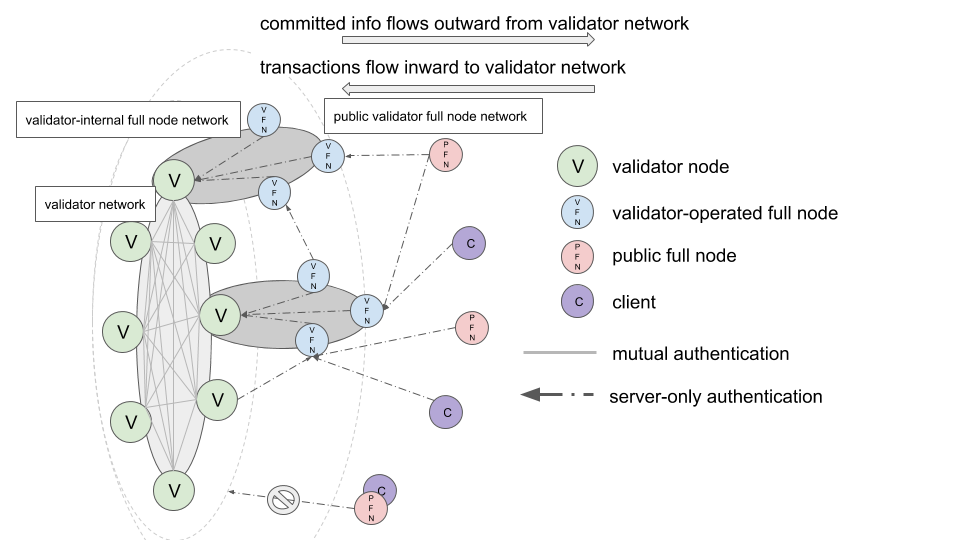

# DiemNet

## Version and Status

2020/07/14 v1 Draft

## Introduction

This document describes **DiemNet**, the primary network protocol used for communication between any two nodes in the Diem ecosystem. The protocol only describes the structure and order of messages on the wire, while relying on an underlying transport (TCP) for the actual message delivery. In addition, all communication between peers MUST be encrypted and authenticated using [Noise protocol](noise.md). DiemNet supports multiplexing several application protocols concurrently over a single connection. For each application protocol, DiemNet provides two kinds of messaging semantics: (1) a fire-and-forget DirectSend and (2) a unary RPC.

## Terminology

* **Connection**: The instance of a transport session between dialer and listener.
* **Client**: In the context of a connection, the client is the side that initiated the connection. Also sometimes referred to as the "initiator" or "dialer".
* **Server**: In the context of a connection, the server is the side that received the connection. Also sometimes referred to as the "responder" or "listener".
* **PeerId**: A peer's id, a 16-byte value which is either:

  * In the validator network, the on-chain [AccountAddress](../common/data_structures.md#accountaddress) of the validator peer
  * In all other networks, the last 16 bytes of the peer's static x25519 public key

## Standard Network Topology

While DiemNet does not assume a specific network topology, we will frame the specification in terms of the standard Diem network topology for clarity.

### Node Types

* **Validator Node (V)**: A validator node is a core node type in the Diem network. The validator network is comprised of all validator nodes registered for the current epoch, as defined by the `ValidatorSet` in the [`OnChainConfig`](../consensus/README.md#onchainconfig). For DDoS resistance and defense-in-depth purposes, a validator node SHOULD be isolated from all other node types except for other validators and the VFNs it controls.
* **Validator Full Node (VFN)**: VFNs are full nodes owned and operated by one of the Diem validators. VFNs will typically connect to their validator over an internal VPC to maintain isolation of the validator node. VFNs can also service all node types on public-facing endpoints.
* **Public Full Node (PFN)**: In contrast, PFNs are any non-validator operated full nodes that primarily interface with Diem by communicating with VFNs.
* **Client Node (C)**: Client nodes are effectively PFNs that do not store ledger history.

### Authentication Modes

* **Mutual**: In networks with mutual authentication, both sides of a connection authenticate the opposite side in the secure transport handshake.
* **Server-only**: In networks with server-only authentication, only the client or dialing side of a connection authenticates the server or listening side in the secure transport handshake.

### Networks

* **Validator Network (VN)**: The validator network is a fully-connected, mutually authenticated network consisting only of validator nodes. Non-validators (i.e., any peer without a keypair in the current epoch's validator set) are explicitly not allowed to join the validator network and other validators will reject any unauthenticated inbound connections. Validators in the Validator Network [synchronize mempools](../mempool/README.md) of transactions, order and execute transactions with [consensus](../consensus/README.md), and synchronize ledger states with [state sync](../state_sync/README.md).
* **Validator-internal Full Node Network (VFNN)**: Each validator operates a logically private network consisting of only a validator and its operated VFNs. For operational simplicity, the v1 version of each VFNN operates in a server-only authentication mode, with the Validator as the server and the VFNs as the clients. VFNs will typically forward transactions to their upstream validator via [mempool](../mempool/README.md) and synchronize their ledger state with their upstream validator via [state sync](../state_sync/README.md).
* **Public Validator Full Node Network (PVFNN)**: A publicly accessible network of VFNs that services transaction submission and state queries for all node types. For instance, public clients may submit transactions to the Diem Network and synchronize their ledger states over the PVFNN.
* **Public Full Node Network (PFNN)**: There is no public network of PFNs in Diem v1.

Below is a diagram that illustrates the set of standard Diem node types, the different network configurations, and the different connection authentication modes.



## Base Transport

DiemNet makes the following assumptions about the underlying transport:

* Connection-oriented
* Ordered and reliable delivery of messages
* Unicast communication
* Session-local state - protocol state is not preserved across transport protocol sessions

Today, DiemNet only supports TCP as the base transport, with the capacity to upgrade to new base transports using the addressing scheme.

## Secure Transport

All communication between nodes MUST be encrypted and authenticated using the [DiemNet Noise IK protocol](noise.md).

By virtue of using the Noise IK handshake, the client always authenticates the server, as the initial noise handshake message is encrypted so only a server with the intended keypair can decrypt it and respond to it. This pattern is analogous to the client using TLS certificate pinning, pinned to a specific public key, for every connection.

In contrast, the server may or may not authenticate the client, depending on the specific network configuration. In Diem v1, only the Validator Network uses mutual authentication, where validators will only allow inbound connections from other current validators.

## DiemNet Versioning Scheme

In an effort to prevent protocol ossification and allow backwards-incompatible protocol upgrades, all DiemNet protocols are versioned and can be negotiated in various ways.

Primarily, the [DiemNet handshake protocol](handshake-v1.md) is responsible for negotiating the [DiemNet messaging protocol](messaging-v1.md) version and supported application protocol versions. The handshake protocol is "pre-negoiated" in nodes' advertised network addresses as it is not intended to be changed very frequently.

## DiemNet NetworkAddress

DiemNet uses [`NetworkAddress`](network-address.md) to encapsulate the precise set of protocols used to dial a peer. Canonical DiemNet addresses in v1 contain the following protocols, in sequence, in human-readable format:

1. Base Transport: one of:
    * `"/ip4/<ipaddr>/tcp/<port>"`
    * `"/ip6/<ipaddr>/tcp/<port>"`
    * `"/dns/<name>/tcp/<port>"`
    * `"/dns4/<name>/tcp/<port>"`
    * `"/dns6/<name>/tcp/<port>"`
2. Secure Transport Upgrade:
    * `"/ln-noise-ik/<x25519-public-key>"`
3. DiemNet Handshake Upgrade:
    * `"/ln-handshake/<version>"`

For example, a full DiemNet `NetworkAddress` in human-readable format:

```
"/ip4/10.0.0.61/tcp/6080/ln-noise-ik/080e287879c918794170e258bfaddd75acac5b3e350419044655e4983a487120/ln-handshake/0"
```

DiemNet `NetworkAddress`es are advertised via the [onchain discovery protocol](onchain-discovery.md) or stored in local configurations.

## Discovery

DiemNet does not prescribe a method for node discovery. Different discovery mechanisms are used in the validator and full-node networks:

* Validators use the [onchain discovery protocol](onchain-discovery.md) to discover each other.
* All nodes use the [onchain discovery protocol](onchain-discovery.md) to discover VFNs.
* Discovery information needed to bootstrap initially is provided as "seed" peers through configuration.

These protocols operate on top of the core DiemNet protocol.

## Connection Lifecycle

### Connection Establishment

An expanded view of the connection handshakes looks like:

```
server: TCP::bind [address]
client: discover server_address = "/ip4/[address]/ln-noise-ik/[public_key]/ln-handshake/[version]"

...

// TCP handshake
client: TCP::connect [address]
server: TCP::accept

// DiemNet Noise IK handshake
client: server_peer_id = Noise::upgrade_outbound [public_key]
server: client_peer_id = Noise::upgrade_inbound

// DiemNet version handshake
client: (server_version, server_protocols) = Handshake::upgrade [version]
server: (client_version, client_protocols) = Handshake::upgrade [version]
```

where `Noise::upgrade_outbound` and `Noise::upgrade_inbound` are defined in [Noise#Handshake](noise.md#handshake) and `Handshake::upgrade` is defined in [Handshake-v1](handshake-v1.md).

### Connection Deduplication

DiemNet v1 tries to maintain at-most-one connection per peer. If a peer attempts to open more than one connection to a server, the server will only keep the most recent connection and close the older connection. When operating in peer-to-peer mode, two nodes can also simultaneously dial each other. In the event two peers simultaneously dial each other, we need to be able to do tie-breaking to determine which connection to keep and which to drop in a deterministic way. In this case, both peers will compare the dialer `PeerId` of both connections and keep the connection with the greater dialer `PeerId` (in lexicographic order).

### Messaging Protocol

After establishing and negotiating a complete connection, peers may begin exchanging DiemNet messages as defined in the [DiemNet messaging protocol](messaging-v1.md). These messages are framed, encrypted, and decrypted using the `Noise::encrypt` and `Noise::decrypt` protocols defined in [Noise#Post-handshake](noise.md#post-handshake) before sending or receiving over the base TCP connection. Note that multiple `NetworkMsg` may be sent or received in a single Noise frame.

Since the Noise layer limits frame sizes to at-most `65535` bytes, of which `16` bytes are always reserved for the AES GCM authentication tag, sending a serialized `NetworkMsg` (include the big-endian 4-byte length prefix) over-the-write first requires splitting it into chunks of size at most `65535 - 16 = 65519` bytes.

#### Sending a single `NetworkMsg` over a negotiated Diem Transport, in simplified pseudo-rust:

```rust
const MAX_NOISE_FRAME_LEN: u16 = 65519; // u16::MAX - AES_GCM_TAG_LEN

const MAX_DIEMNET_FRAME_LEN: u32 = 8388608; // 8 MiB

fn send_one_msg_and_flush(socket: TcpStream, msg: NetworkMsg) {
    // Serialize the message using BCS
    let msg_bytes = bcs::to_bytes(msg);

    if msg_bytes.len() > MAX_DIEMNET_FRAME_LEN {
        abort("serialized message is too large!");
    }

    let msg_len: [u8; 4] = msg_bytes.len().to_big_endian_bytes();
    // Concatenate the msg length and serialized msg bytes into a msg frame
    let msg_frame = msg_len || msg_bytes;

    // Split the msg frame into chunks of size at-most MAX_NOISE_FRAME_LEN bytes
    for msg_chunk in msg_frame.chunks(MAX_NOISE_FRAME_LEN) {
        // Encrypt the msg chunk (and append the authentication tag)
        let crypto_bytes = Noise::encrypt_with_ad(null, msg_chunk);
        let crypto_len: [u8; 2] = crypto_bytes.len().to_big_endian_bytes();
        // Concatenate the length and encrypted bytes into a crypto frame
        let crypto_frame = crypto_len || crypto_bytes;

        // Send the encrypted frame over-the-wire
        socket.send(crypto_frame);
    }
}
```

<!-- TODO(philiphayes): describe receiving a message without over complicating... -->

### Connection Termination

Peers may crash or drop connections at any time without any warning and compliant implementations must handle these cases.

When closing a connection, peers are may perform a graceful shutdown by first draining their pending outbound messages, then sending a TCP write half-close, and finally draining inbound messages until observing the remote peer's TCP write half-close.

<!-- TODO(philiphayes): expand on graceful shutdown -->
