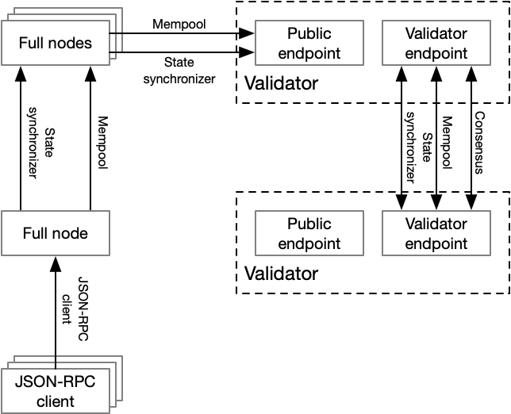
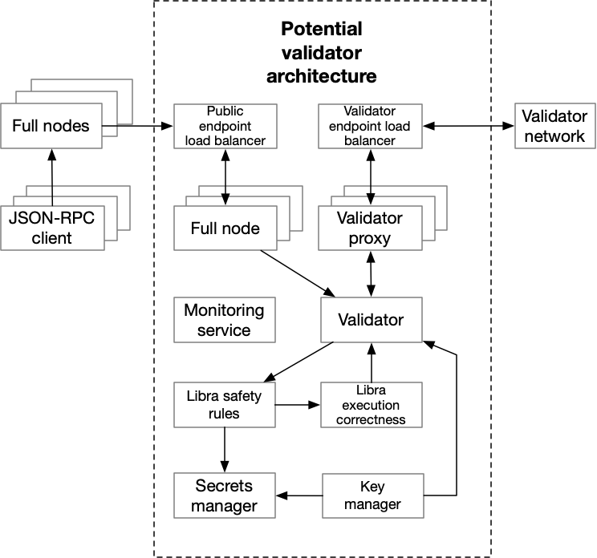

# Protocol Specification

This document describes the protocol specifications for the Libra Payment Network (LPN). The intended audience for this document are as follows:

* Virtual Asset Service Providers (VASPs), designated dealers (DDs), and other [ecosystem developers](https://libra.org/en-US/white-paper/) who build software that can interface with the LPN.
* Developers who work on supporting transaction validation and interface with the validation protocols.
* Those interested in improving the protocol specifications and/or understanding the LPN in more detail.

The reference implementations for all LPN specifications is [Libra Core](https://github.com/libra/libra). Libra Core is maintained by the open-source developer community on behalf of the [Libra Association](https://libra.org/en-US/association/). After the initial launch of the LPN, all specification changes will be proposed via the Libra Improvement Proposals (LIP) process - which is not yet finalized and public. For expedience prior to the launch of the LPN, changes to the specification will be made directly in the documentation and code.

## Overview

The Libra Association is an independent membership organization headquartered in Geneva, Switzerland. The Association's purpose is to coordinate and provide a framework of governance decision-making for the Libra network and Reserve; to oversee the operation of the Libra payment system; to facilitate the provision of services on top of the Libra Blockchain in a safe and compliant manner; and to establish social impact grant-making in support of financial inclusion.

The LPN is backed by the Libra Blockchain that serves as a solid foundation for financial services, including a new global payment system that meets the daily financial needs of billions of people. The Libra blockchain was created to meet the following three requirements:

* Able to scale to billions of accounts, which requires high transaction throughput, low
latency, and an efficient, high-capacity storage system.
* Highly secure to ensure the safety of funds and financial data.
* Flexible, so that it can power future innovation in financial services.

The Libra Blockchain is designed from the ground up to holistically address these requirements and builds on the learnings from existing projects and research — a combination of innovative approaches and well-understood techniques. The [Libra whitepaper](https://developers.libra.org/docs/assets/papers/the-libra-blockchain/2019-09-26.pdf) provides much of the rationale behind the overall design.  More details on the Libra Association and its mission are available on [libra.org](https://libra.org)

## Architecture

The Libra network consists of different types of actors:

* **Validators**. These are run by the association members to form a network (the validator network) enabling them to share transactions between each other, synchronize blockchain state and run a consensus protocol that agrees on transaction ordering and execution.
* **Full Nodes**. These can be run by anyone who wants to verify the state of the blockchain and synchronize to it. Full nodes replicate the full state of the blockchain by querying each other or by querying the validators directly, they can also forward transactions to the validators.
* **Clients**. A client is any part of the system that needs to submit transactions or query the blockchain. They contrast with full nodes by not storing the full state. A client communicates with full nodes exclusively via a JSON-RPC interface. The full nodes and validators are not required to provide these JSON-RPC interfaces to clients. It is important to note that while full nodes always verify the integrity of the current state through re-executing transactions and verifying consensus signatures created by the validators, clients can choose to either trust the full node they are querying or verify the validators proofs as well. For this reason we define two types of clients:

  * **Verifying clients**. By default, clients are bootstrapped with a state and a set of validator, and can thus be epoch-aware by syncing this state with the blockchain. This way, a verifying client can verify the proofs carried in every response they obtain from full nodes they query. A full node, for instance, is a verifying client. A developer could develop a custom verifying client with the LPN specifications for specific applications, for instance, a light weight client that only keeps the more recent subset of account state.
  * **Non-verifying clients**. A client might query a third-party to access the state of the blockchain without verifying the signatures from the validators. The optional JSON-RPC protocol supports this mode of operation, and developers are also free to build other systems that accomplish this task. This specification does not define how a client should find such a service. As an example, some clients could run their own full nodes that expose the JSON-RPC protocol and access these endpoints under secure channels. In this setup, a non-verifying client delegates proof verification to the full node.

Below is a recapitulating diagram of the Libra network. The arrow tail signifies the sender of a network request and the arrow head is the receiver of the network request.

## The Libra network

While a validator has a public endpoint and a validator endpoint, in order to support additional features and properties, such as the principle of least privilege, key rotation, monitoring, DoS protection, scalability, etc., it can be composed of a number of internal components. Below is an example validator architecture that addresses many of these aspects.

## Specifications

As [depicted](#The-Libra-network), there are 4 network protocol specifications:

* **[Consensus protocol](consensus/consensus.md)**. This is how agreement is reached between a known set of validators assuming byzantine fault-tolerant (BFT) conditions.
* **Mempool protocol**. The protocol is used between validators, between full nodes, and between validators and full nodes to quickly re-share user transactions. This is how transactions are passed upstream, eventually intending to reach a validator that proposes a block that includes these transactions.
* **State synchronizer protocol**. The protocol used between validators, between full nodes, and between validators and full nodes to replicate the ledger history and ledger state of the committed blockchain.
* **[JSON-RPC](../json-rpc/json-rpc-spec.md) client to full node protocol**. The protocol used between clients and full nodes to submit transactions and query the state of the blockchain. This uses the [JSON-RPC 2.0](https://www.jsonrpc.org/specification) protocol, and takes into account trusted or untrusted full nodes.

In addition, these specifications build on top of a common set of specifications:

* **[Libra canonical serialization (LCS)](https://libra.github.io/libra/libra_canonical_serialization/)**. This details how data is canonically serialized and deserialized. Hashing and signing of data structures are applied after LCS serialization.
* **Common data structures**. These are the data structures that are used across more than one specification.
* **LibraNet**. This describes a handshake and wire protocol for all networking protocols. This relies on the [Noise protocol framework](https://noiseprotocol.org/) for integrity and confidentiality.
* **P2P discovery**. This defines how clients can safely find the endpoints of the LPN validators.
* **Authenticated data structures**. This describes the ledger history, ledger state, and events data structures.
* **Move virtual machine (VM)**. This defines the semantics of the Move bytecode interpreter and Move bytecode verifier.
* **Libra adapter**. This defines the checks performed on a transaction before passing its script into the Move VM (e.g., signature checking).

## Specification upgrades

The LPN specifications are designed to support upgrades over time via the Libra Improvement Proposal (LIP) process. Unlike many other blockchains that determine when upgrades are live in mainnet through community organization and coordination, the timing for LPN specification upgrades is directed by the Libra Association. The full LPN specifications are split into smaller specifications in order to limit the affected parties. For example, the JSON-RPC client specification can be upgraded without affecting the validating service specifications and correspondingly the validating nodes (validators). Each specification is versioned sequentially beginning with 1\. Over time, the specifications may be divided or merged to balance the size of the affected parties against the overhead of maintaining and versioning separate specifications.

The process for upgrading the LPN specifications is as follows:

1. **Seed an idea**. A Contributor should socialize their idea with the Libra developer community and Maintainers. They might create a [GitHub issue](https://github.com/libra/libra/issues) or use another means of gathering feedback.

2. **[Standard LIP](https://lip.libra.org/overview)**. A Contributor proposes a new standard LIP that modifies an existing specification(s) or proposes a new specification. If the standard LIP reaches the "Accepted" status, the proposed changes will be set in the new specification version as well as implemented in the Libra Core master branch. Other implementations of the protocol must follow these changes as well.

3. **LPN upgrade**. There are two types of specification upgrades: backwards-incompatible (e.g. hard forks) or backwards-compatible (e.g. soft forks). Unlike conventional software systems, backwards-incompatible upgrades are likely to be much more common than backwards-compatible upgrades in LPN. Because the purpose of LPN is to agree on the bit-precise result of executing a computation and most specifications contribute to that result, almost every upgrade will break compatibility with previous versions. Thus, we will assume that proposed upgrades are backwards-incompatible by default and require rigorous justification to handle an upgrade as backwards-compatible. In addition, changes to the following specifications are backwards-incompatible by definition:

    * Libra canonical serialization
    * Authenticated data structures
    * Move virtual machine
    * Libra adapter

    In order to describe the LPN upgrade process, we will define specification S with current in-production version V and next accepted version V+1.

    * **Backwards-incompatible specification changes** The Libra Association will publicly announce that a backwards-incompatible specification change to S is occurring with V+1 and that on a production date (e.g. 3-6 months in the future), the V+1 specification will become eligible to be deployed in production. All validators and clients will be required to have already upgraded to software that can support V+1 by that point. After the production date, the Libra Association will ensure that the LPN validators have upgraded (i.e., by verifying the software versions) and after verification will submit an on-chain transaction to make V+1 active. After the transaction is committed, all clients that have upgraded will interoperate on V+1 rather than V automatically. All older software that is unable to interoperate with V+1 will fail. In summary:

      1. Libra Association announces a production date and the software versions validators and clients need to run in order to continue to interoperate with the LPN.
      2. Validators and clients upgrade to the prescribed software versions prior to the production date.
      3. After confirming the validators support V+1 and after the production date has passed, the Libra Association submits the necessary transaction on-chain to make V+1 live.
      4. After the transaction is committed, V+1 is live in production. Validators and clients both use the V+1 version of the specification and any actors running with version V are no longer able to interoperate.

    * **Backwards-compatible specification changes**. Although the version of the specification S will increase, since the previous active version V of the specification will continue to operate correctly, the Libra Association will publicly announce a deadline for the LPN validators to adopt version V+1\. This will provide clients an opportunity to know when V+1 will be supported and start leveraging V+1\. After this deadline passes, all the LPN validators will actively support the upgraded specification version V+1 and implicitly version V since version V+1 is backwards-compatible. In most cases, backwards-compatible changes will have overlapping functionality (i.e. 2 APIs for syncing transaction history, the newer one containing mores features than the previous one) and a future upgrade of the specification (e.g. V+2) may remove the duplicate functionality from V+1, making V+2 a backwards-incompatible change for V+1\. Some examples of these types of changes include LibraNet specification changes or adding new APIs for state synchronization. In summary, LPN validators upgrade to the V+1 specification by a deadline set by the Libra Association while LPN clients can optionally upgrade to the V+1 specification.

4. **Finalize upgrade**. After the upgrade is running in production, all productionized LIPs move from "Accepted" to "Final". Additionally, the specifications listed in production are updated.

## Current specifications

All specifications are versioned at their initial versions until after mainnet launch.
