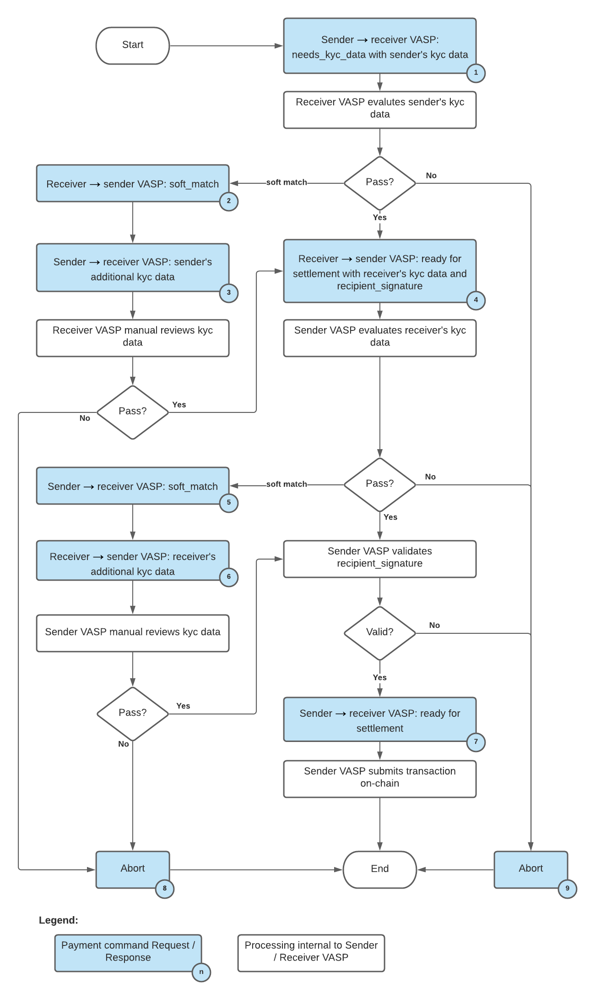

# Off-Chain Travel Rule Exchange

This protocol is used to exchange KYC information about a potential transaction between to parties that will be resolved on-chain upon its completion. This is a dual attestation, preflight protocol. At the end of the protocol, the sender will receive a signature from the recipient so that the Diem Payment Network can verify that the transfer has been signed off by both the sender and recipient. Some considerations:
* Participants that do not implement a dual attestation, preflight protocol cannot transfer amounts above the travel rule limit. This is one such protocol.
* Participants may reject travel rule requests for transfers below the travel rule limit.

## PaymentCommand

All requests between participants are structured as `PaymentCommand`s within `CommandRequestObject`s (as shown in the example below):

```
{
    "_ObjectType": "CommandRequestObject",
    "command_type": "PaymentCommand",
    "cid": "88b282d6-1811-29f6-82be-0421d0ee9887",
    "command": {
        "_ObjectType": "PaymentCommand",
        "payment": {
            "sender": {
                "address": "dm1pg9q5zs2pg9q5zs2pg9q5zs2pg9skzctpv9skzcg9kmwta",
                "kyc_data": {
                    "payload_version": 1,
                    "type": "individual",
                    "given_name": "ben",
                    "surname": "maurer",
                    "address": {
                    "city": "Sunnyvale",
                    "country": "US",
                    "line1": "1234 Maple Street",
                    "line2": "Apartment 123",
                    "postal_code": "12345",
                    "state": "California",
                    },
                    "dob": "1920-03-20",
                    "place_of_birth": {
                    "city": "Sunnyvale",
                    "country": "US",
                    "postal_code": "12345",
                    "state": "California",
                    }
                },
                    "status": {
                        "status": "ready_for_settlement",
                    }
            },
            "receiver": {
                "address": "dm1pgfpyysjzgfpyysjzgfpyysjzgf3xycnzvf3xycsm957ne",
            },
            "reference_id": "5b8403c9-86f5-3fe0-7230-1fe950d030cb",
            "action": {
                "amount": 100,
                "currency": "USD",
                "action": "charge",
                "timestamp": 72322,
            },
            "description": "A free form or structured description of the payment.",
        },
    },
}
```

A successful response to this command should look like the following:

```
{
    "_ObjectType": "CommandResponseObject",
    "status": "success",
}
```

A travel-rule exchange may require multiple `PaymentCommand`'s in order to complete. In these instances, the underlying structures may be passed back and forth many times. As outlined in the rest of this section, certain fields must be defined at the outset and others can be defined later. Some fields may be adjusted or mutated throughout the exchange, whereas others must remain immutable.

### PaymentCommand Object

| Field          | Type            | Required | Description |
|-------         |------           |----------|-------------|
| `_ObjectType`  | `str`           | Y        | The fixed string `PaymentCommand` |
| `payment`      | `PaymentObject` | Y        | Contains a `PaymentObject` |

```
{
    "_ObjectType": "PaymentCommand",
    "payment": {
        PaymentObject(),
    }
}
```

### PaymentObject

Some fields are immutable after they are defined once. Others can be updated multiple times (see below). Updating immutable fields with a different value results in a Command error.

| Field                           | Type                  | Required | Mutable | Description |
|-------                          |------                 |----------|---------|-------------|
| `receiver`                      | `PaymentActorObject`  | Y        | Y       | Information about the receiver in this payment |
| `sender`                        | `PaymentActorObject`  | Y        | Y       | Information about the sender in this payment |
|`reference_id`                   | `str`                 | Y        | N       | Unique reference ID of this payment on the payment initiator VASP (the VASP which originally created this payment Object). This value should be globally unique. This must be a UUID according to RFC4122 with "-"s included. |
| `original_payment_reference_id` | `str`                 | N        | N       | Used to refer an old payment known to the other VASP. For example, used for refunds. The reference ID of the original payment will be placed into this field. This field is mandatory on refund. |
| `recipient_signature`           | `str`                 | N        | Y       | Signature of the recipient of this transaction encoded in hex. The is signed with the compliance key of the recipient VASP and is used for on-chain attestation from the recipient party. This may be omitted on blockchains which do not require on-chain attestation. Generated via Recipient Signature. |
| `action`                        | `PaymentActionObject` | Y        | N       | Amount of currency, currency type (XUS, etc.), and the type of action to take. |
| `description`                   | `str`                 | N        | N       | Description of the payment. To be displayed to the user. Unicode utf-8 encoded max length of 255 characters. |

```
{
    "sender": PaymentActorObject(),
    "receiver": PaymentActorObject(),
    "reference_id": "d4115900-aad6-5d81-4123-6b464f1315f5",
    "original_payment_reference_id": "5b8403c9-86f5-3fe0-7230-1fe950d030cb",
    "recipient_signature": "...",
    "action": PaymentActionObject(),
    "description": "A free form or structured description of the payment.",
}
```

### PaymentActorObject

A `PaymentActorObject` represents a participant in a payment - either sender or receiver. It also includes the status of the actor, indicates missing information or willingness to settle or abort the payment, and the Know-Your-Customer information of the customer involved in the payment.

| Field                 | Type            | Required | Mutable | Description |
|-------                |------           |----------|---------|-------------|
| `address`             | `str`           | Y        | N       | Address of the sender/receiver account. Addresses may be single use or valid for a limited time, and therefore VASPs should not rely on them remaining stable across time or different VASP addresses. The addresses are encoded using bech32. The bech32 address encodes both the address of the VASP as well as the specific user’s subaddress. They should be no longer than 80 characters. For Diem addresses, refer to the "account identifier". |
| `kyc_data`            | `KycDataObject` | N        | N       | The KYC data for this account. Immutable once set. |
| `status`              | `StatusObject`  | Y        | Y       | Status of the payment from the perspective of this actor. This field can only be set by the respective sender/receiver VASP and represents the status on the sender/receiver VASP side. This field is mandatory by this respective actor (either sender or receiver side) and mutable. Note that in the first request (which is initiated by the sender), the receiver status should be set to None. |
| `metadata`            | list of `str`   | N        | Y       | Can be specified by the respective VASP to hold metadata that the sender/receiver VASP wishes to associate with this payment. It may be set to an empty list (i.e. []). New metadata elements may be appended to the metadata list via subsequent commands on an object. |
| `additional_kyc_data` | `str`           | N        | Y       | Freeform KYC data. If a soft-match occurs, this field can be used to specify additional KYC data which can be used to clear the soft-match. It is suggested that this data be JSON, XML, or another human-readable form. |

```
{
    "address": "dm1pgfpyysjzgfpyysjzgfpyysjzgf3xycnzvf3xycsm957ne",
    "kyc_data": KycDataObject(),
    "status": StatusObject(),
    "metadata": [],
}
```

### KYCDataObject

A `KYCDataObject` represents the required information for a single subaddress. Proof of non-repudiation is provided by the signatures included in the JWS payloads. The only mandatory fields are `payload_version` and `type`. All other fields are optional from the point of view of the protocol – however they may need to be included for another VASP to be ready to settle the payment.

| Field               | Type               | Required | Description |
|-------              |------              |----------|-------------|
| `payload_version`   | `str`              | Y        | Version identifier to allow modifications to KYC data Object without needing to bump version of entire API set. Set to 1|
| `type`              | `str`              | Y        | Required field, must be either "individual" or "entity" |
| `given_name`        | `str`              | N        | Legal given name of the user for which this KYC data Object applies. |
| `surname`           | `str`              | N        | Legal surname of the user for which this KYC data Object applies. |
| `address`           | `AddressObject`    | N        | Physical address data for this account |
| `dob`               | `str`              | N        | Date of birth for the holder of this account. Specified as an [ISO 8601 calendar date format](https://en.wikipedia.org/wiki/ISO_8601) |
| `place_of_birth`    | `AddressObject`    | N        | Place of birth for this user. line1 and line2 fields should not be populated for this usage of the address Object |
| `national_id`       | `NationalIdObject` | N        | National ID information for the holder of this account |
| `legal_entity_name` | `str`              | N        | Name of the legal entity. Used when subaddress represents a legal entity rather than an individual. KYCDataObject should only include one of legal_entity_name OR given_name/surname |

```
{
    "payload_version": 1,
    "type": "individual",
    "given_name": "ben",
    "surname": "maurer",
    "address": {
        AddressObject(),
    },
    "dob": "1920-03-20",
    "place_of_birth": {
        AddressObject(),
    }
    "national_id": {
    },
}
```

### AddressObject

Represents a physical address

| Field         | Type  | Required | Description |
|-------        |------ |----------|-------------|
| `city`        | `str` | N        | The city, district, suburb, town, or village |
| `country`     | `str` | N        | [Two-letter country code](https://en.wikipedia.org/wiki/ISO_3166-1_alpha-2)|
| `line1`       | `str` | N        | Address line 1|
| `line2`       | `str` | N        | Address line 2 - apartment, unit, etc. |
| `postal_code` | `str` | N        | ZIP or postal code |
| `state`       | `str` | N        | State, county, province, region. |

```
{
    "city": "Sunnyvale",
    "country": "US",
    "line1": "1234 Maple Street",
    "line2": "Apartment 123",
    "postal_code": "12345",
    "state": "California",
}
```

### NationalIdObject

Represents a national ID.

| Field      | Type  | Required | Description |
|-------     |------ |----------|-------------|
| `id_value` | `str` | Y        | Indicates the national ID value,for example, a social security number |
| `country`  | `str` | N        | [Two-letter country code](https://en.wikipedia.org/wiki/ISO_3166-1_alpha-2) |
| `type`     | `str `| N        | Indicates the type of the ID |

```
{
    "id_value": "123-45-6789",
    "country": "US",
    "type": "SSN",
}
```

### PaymentActionObject

| Field       | Type   | Required | Description |
|-------      |------  |----------|-------------|
| `amount`    | `uint` | Y        | Amount of the transfer as defined by the on-chain base units. For example, if XUS is represented on-chain as "1" equals 1e-6 units, then "1" here would also equal 1e-6 units. |
| `currency`  | `enum` | Y        | One of the supported currency types, for example, XUS |
| `action`    | `enum` | Y        | Populated in the request. This value indicates the requested action to perform, and the only valid value is charge. |
| `timestamp` | `uint` | Y        | Unix time indicating the time that the payment `Command` was created. |

```
{
    "amount": 100,
    "currency": "USD",
    "action": "charge",
    "timestamp": 72322,
}
```

### StatusObject

| Field           | Type   | Required | Description |
|-------          |------  |----------|-------------|
| `status`        | `enum` | Y        | Status of the payment from the perspective of this actor. This field can only be set by the respective sender/receiver VASP and represents the status on the sender/receiver VASP side. This field is mandatory by this respective actor (either sender or receiver side) and mutable. Valid values are specified in `StatusEnum` |
| `abort_code`    | `enum` | N        | In the case of an `abort` status, this field may be used to describe the reason for the abort. Represents the error code of the corresponding error. Valid values are specified in `AbortCodeEnum` |
| `abort_message` | `str`  | N        | Additional details about this error. To be used only when `code` is populated |

```
{
    "status": "needs_kyc_data",
}
```

#### AbortCodeEnum

| Error code | Description |
|------------|-------------|
| `rejected` | The payment is rejected. Note, it must not be used in the `original_payment_reference_id` field of future payments. |

#### StatusEnum

| Error code             | Description |
|------------            |-------------|
| `none`                 | No status is yet set from this actor. |
| `needs_kyc_data`       | KYC data is required by this actor. |
| `ready_for_settlement` | Transaction is ready for settlement according to this actor (i.e. the required signatures/KYC data have been provided) |
| `abort`                | Indicates the actor wishes to abort this payment, instead of settling it. |
| `soft_match`           | Actor’s KYC data resulted in a soft-match. It is suggested that soft matches are resolved within 24 hours. |

### Travel Rule Errors

The Travel Rule Exchange extends the Command Errors defined in the off-chain protocol with the following:

| Error code                              | Description |
|------------                             |-------------|
| `invalid_command_producer`              | The HTTP request sender is not the right actor to send the `PaymentObject`. For example, if the receiver sends a new command with `PaymentObject` change that should be done by the sender. |
| `invalid_initial_or_prior_not_found`    | Could not find command by `reference_id` for a non-initial state command object; for example, the receiver received a `PaymentCommand` object that the sender status is `ready_for_settlement`, but the receiver is unable to find a command for the given `reference_id`. |
| `no_kyc_needed`                         | Payment action amount is under travel rule limit. |
| `unknown_address`                       | Unknown `sender.address` or `receiver.address`. |
| `conflict`                              | Either the `cid` has been reused or data is unavailable due to competing requests. |
| `unsupported_currency`                  | Field `payment.action.currency` value is a valid currency code, but it is not supported by the receiver VASP. |
| `invalid_original_payment_reference_id` | Invalid source `reference_id` or it refers to an aborted exchange. |
| `invalid_overwrite`                     | Attempted to overwrite an immutable field or the counter party's fields. |
| `invalid_transition`                    | This error indicates the new `PaymentObject` state is not valid according to the current object state. For example: VASP A sends `RSOFT` to VASP B, VASP B should send the next `PaymentObject` with `ABORT`, or `SSOFTSEND`; VASP A should respond to this error code if VASP B sends `PaymentObject` state `SSOFT`. |

## Performing the Exchange

### PaymentObject Protocol Command Sequence

**PaymentObject State.** Defines the state of a `PaymentObject`. It is used to determine which VASP is expected to issue a command next, and what information is expected to be included in the command to progress the payment. The state is determined by the tuple of the status and and the fields `additional_kyc_data` and `additional_kyc_data` of the Sender and Receiver Actors. The exact fields in the `PaymentObject` for Sender and Receiver actor status are `sender.status.status` and `receiver.status.status`.

The states (Sender Status, Receiver Status, Sender `additional_kyc_data`, Receiver `additional_kyc_data`) are:

Basic KYC exchange flow:

* SINIT: (`need_kyc_data`, `none`, `_`, `_`)
* RSEND: (`need_kyc_data`, `ready_for_settlement`, `*`, `_`)
* RABORT: (`need_kyc_data`, `abort`, `*`, `*`)
* SABORT: (`abort`, `ready_for_settlement`, `*`, `*`)
* READY: (`ready_for_settlement`, `ready_for_settlement`, `*`, `*`)

Soft-match disambiguation states:

* RSOFT (`need_kyc_data`, `soft_match`, `_`, `_`)
* SSOFTSEND (`need_kyc_data`, `soft_match`, `is-provided`, `_`)
* SSOFT (`soft_match`, `ready_for_settlement`, `*`, `_`)
* RSOFTSEND (`soft_match`, `ready_for_settlement`, `*`, `is-provided`)

A star (`*`) denotes *any* value, `is-provided` denotes the field value is provided, while an underscore (`_`) for a field denotes *not set*.

**Final States and next Writer.** The VASP that is the sender of the Payment creates the first `PaymentObject`/`PaymentCommand `, and then the receiver and sender take turns to issue commands updating it until the object they mutate is in one of the final states, namely SABORT, RABORT or READY.

**Protocol Flow Illustration & VASP logic**. Below is a high level illustration of the commands and internal processes a sender and receiver VASPs to define a payment, and update it until it reaches a final state. Light blue blocks represent successful PaymentCommand requests and responses that create or update the PaymentObject. Each is labelled from 1-9, and we will reference these labels when discussing each step in details below.



### Steps of the protocol: The KYC Exchange Flow

The Travel Rule Exchange starts with the Sender sending KYC information and requesting KYC information from the receiver. In the simplest approach, this satisfies the Receiver's requiements and the receiver in turn responds with the appropriate KYC information and a recipient signature The Sender would then finalize the payment (by setting its status to `ready_for_settlement`, see below) and then settle on-chain (status sequence SINIT -> RSEND -> READY). At each step Sender or Receiver may also abort the payment, in their turn, until the payment is finalized (READY).

**Start -> SINIT (Step 1)**

The Sender issues `PaymentCommand` to create the initial `PaymentObject`.

The sender creates a `PaymentObject` that they believe requires KYC information exchange. The payment command includes a full `PaymentObject` including all mandatory fields and the following optional fields populated as:

* `sender.status.status` = `need_kyc_data`.
* `sender.kyc_data` = The `KycDataObject` representing the sender.
* `receiver.status.status` = `none`

**SINIT -> RSEND (Step 4)**

The Receiver issues `PaymentCommand` to update an existing payment.

The receiver VASP examines the `sender.kyc_data` object, and is satisfied that given the sender information the payment can proceed. It responds with a Payment Command that includes:

* `receiver.status.status` = `ready_for_settlement`
* `receiver.kyc_data` = The `KycDataObject` representing the receiver.
* `recipient_signature` = a valid recipient signature.

**SINIT -> RABORT (Step 9)**

The Receiver issues `PaymentCommand` to update an existing payment.

The receiver VASP examines the sender KYC information and is either not satisfied the payment can proceed, needs more time to process the KYC information, or requires additional information to determine if the payment can proceed. It includes a command to abort the payment with an appropriate error code.

* `receiver.status.status`: `abort`
* `receiver.status.abort_code`: one of `no-kyc-needed` or `rejected`.

The sender can initiate a payment on-chain in case of an abort with `no-kyc-needed`.

**RSEND -> READY (Step 7)**

The Sender issues `PaymentCommand` to update an existing payment.

The Sender VASP examines the KYC information from the Receiver and is satisfied the payment can proceed.

* `sender.status.status`: `ready_for_settlement`

The payment should be executed on-chain by the sender (or settled in any other way) following the success of the command.

**RSEND -> SABORT (Step 9)**

The Sender issues `PaymentCommand` to update an existing payment.

The sender VASP receives the Receiver KYC information and decides it cannot proceed with the payment. It issues an abort command:

* `sender.status.status`: `abort`
* `sender.status.abort_code`: `rejected`.

### Steps of the protocol: The soft-match states and flows

A *soft-match* occurs when a VASP checks provided KYC, but cannot disambiguate whether a party to the payment is potentially high-risk or sanctioned, for example, an overlap in identifiers used (name, date of birth, address). In such cases the VASP may require further information from the other VASP to process the payment, some of which may require manual interaction.

The flows below allow the Receiver VASP and the Sender VASP to request additional KYC information from each other.

**Receiver soft-match (SINIT -> RSOFT -> SSOFTSEND)**

After the Sender initiates a payment by providing KYC information (SINIT), the Receiver may determine they require more information to disambiguate a match. In that case they commit a command to set `receiver.status.status` to `soft-match` (state RSOFT) (Step 5) or abort (step 9). The sender may respond with a command that populates the `sender.additional_kyc_data` (Step 6), which sets the field `sender.additional_kyc_data` (state SSOFTSEND) or abort (SABORT, Step not shown in diagram). Finally, if the Receiver is satisfied with the additional information they move to provide all information necessary to go to RSEND (Step 4, see above. This includes receiver KYC information and recipient signature). Otherwise, the receiver can abort to state RABORT (Step 8).

**Sender soft-match (RSEND -> SSOFT -> RSOFTSEND)**

Similarly to the flow above, the Sender at state (RSEND) may decide they need information about the receiver of the payment to disambiguate a soft-match. They set their status `sender.status.status` to `soft-match` (state SSOFT) (Step 5). The receiver can abort (RABORT) (Step not shown in diagram) or provide the additional KYC in `receiver.additional_kyc_data` (state RSOFTSEND, Step 6). The sender may then abort (SABORT, Step 8) or move to READY (Step 7), and settle the payment.
