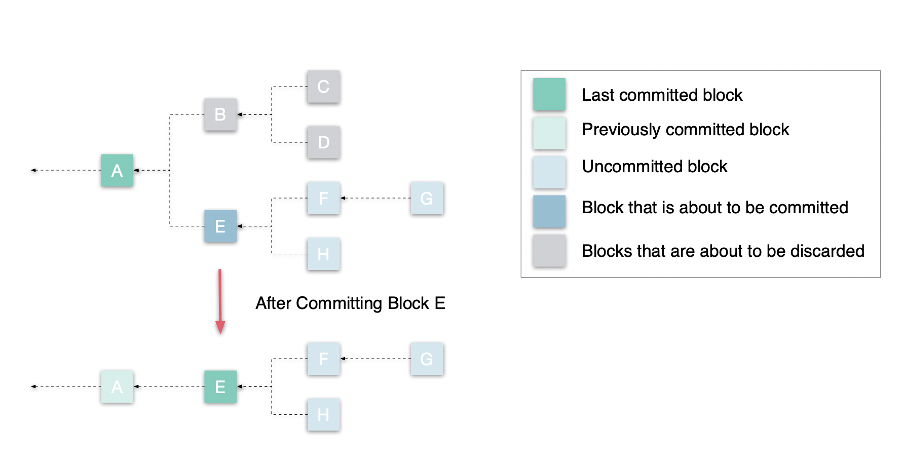

# Diem Execution Correctness Specification

## Abstract

This specification outlines the design and implementation of Diem Execution Correctness (LEC): a secured service
dedicated for executing transactions correctly (with the MOVE VM) and used by Consensus in the Diem payment network.

For those
unfamiliar with the execution flow of TCB, we recommend reading the architecture of [Trusted Computing Base (TCB)](../TCB.md).

## Overview and Architecture

The blockchain can be viewed as a [replicated state machine](https://en.wikipedia.org/wiki/State_machine_replication) where the state can be modified by an agreed rule
which is enforced by both the VM and executor. Each validator or full node is a replica of the system. Starting from a genesis
state S<sub>0</sub>, each transaction T<sub>i</sub> updates a previous state S<sub>i-1</sub> to S<sub>i</sub> via some known function F:

F(S<sub>i-1</sub>, T<sub>i</sub>) => S<sub>i</sub>

Each S<sub>i</sub> is a mapping from accounts (represented by 32-byte addresses) to some data associated with each account (an account state). T<sub>0</sub> is a
hard-coded genesis transaction which [write set](../move_adapter) produces the genesis state. Transactions starting from T<sub>1</sub>  are transactions
submitted by clients and each makes changes to some number of accounts when applied on the previous state. Since the consensus
protocol guarantees that all honest nodes see the same sequence of transactions T<sub>0</sub>, T<sub>1</sub>, ..., T<sub>n</sub> and their execution results,
all of the non-Byzantine nodes will reach the same sequence of states S<sub>0</sub>, S<sub>1</sub>, ..., S<sub>n</sub>.

The job of LEC is to take the totally ordered transactions, apply each transaction on the previous state,
and persist the transactions as well as the states to Storage. The execution system cooperates with the consensus algorithm
to help it agree on a proposed set of transactions and their execution. Such a group of transactions is a *block.* Unlike in
other blockchain systems blocks have no significance other than being a batch of transactions — every transaction is identified
by its version — its position within the ledger. Each consensus participant builds a tree of blocks like the following:



A block is a list of transactions that should be applied in the given order once the block is committed. Each path from the
last committed block to an uncommitted block forms a valid chain. There are two possible operations on this tree:

1. Add a block to the tree using a given parent, extending a specific chain (for example, extending block F with the block G).
When we extend a chain with a new block, the block should include the correct execution results of the transactions in the
block as if all its ancestors have been committed in the same order. However, all the uncommitted blocks and their execution
results are held in some temporary location (most likely memory for now) and not visible to external clients.
2. Committing a block. As consensus collects more and more votes on blocks, it decides to commit a block and all its ancestors
according to some specific rules. Now we save all these blocks to permanent storage and also discard all the conflicting blocks
at the same time.

For example, in the above diagram, A was already committed at this point. The system is about to commit E.
Since B conflicts with E, all of B's descendants and B itself are no longer valid and will be discarded.

To ensure the correnctness of execution, i.e., the enforcement of the state-changing rule,
a secure and audited execution service is necessary to guarantee this statement. In Diem Core, it is LEC that plays
this role, which is built on top of `Executor` library which has the following two jobs to help :

* **execution**: Executor can accept transactions to execute based on a specific state merkle tree and generates a new speculative tree according to the changeset produced by the VM processing the transactions.
* **commit**: Executor is the only module in Diem core that has write access to Storage. Once a new state has reached consensus across the quorum, it is Executor that commits the agreed state to Storage.

Let's review the system flow chart to understand how LEC works with other Diem core services. The diagram below arguments the architecture of a part of Diem core system that relevant to LEC with numbered steps showing the interations between LEC and the other components.


The numbered steps of a completed flow from startup to committing a block:

0. Before LEC starts, it needs to be assured that when a validator node is started, SSB has already been initialized with
`execution keypair` and `consensus_keypair`, the cryptographic key pair signing execution results from LEC and verifying
that in LSR and the one signing votes in LSR for verifying nodes' identity.
1. When LEC starts, it will be the only one that has access to the `execution_private_key` in SSB, it will read
and store the private key locally.
2. Similar to 1, LSR will read the `execution_public_key` and `execution_private_key` from SSB when starting and store it
locally.
3. Consensus sends block execution request to LEC via RPC calls.
4. LEC executes the block and returns the result, i.e., the state compute result and the signature corresponding to this block.
5. Consensus will generate the vote of this block and send it to LSR to sign.
6. LSR verifies the validity of the vote and sign it with `consensus_private_key`.
7. LSR returns the signed vote to Consensus.
8. At some later point in time, Consensus reaches the agreement on the vote, then it requests to commit the block to LEC.
9. LEC sends the commit command to Storage with necessary data, persisting the change to the Diem blockchain.


## Data Structures

In this section, we specify data structures specific to or shared by all but primarily used by LEC. Any dependent data
structures not provided here are specified in the [common data structures document](../../common/data_structures.md).

### Public Data Structures

In this section, we discuss the data structures that are depended by other modules, some of which will be also serialized
and sent over wire as RPC messages.

#### StateComputeResult

`StateComputeResult` is a group of data that summarizes the result of the execution of a block to agree on, also
including metadata needed for other purposes such as vote generation and stats report. LEC is responsible for generating
the id of the new state, which is the speculative transaction accumulator root hash after applying the execution result
to the state resulting from the parent block.

```rust
pub struct StateComputeResult {
    /// transaction accumulator root hash is identified as `state_id` in Consensus.
    root_hash: HashValue,

    /// Represents the roots of all the full subtrees from left to right in this accumulator
    /// after the execution. For details, please see [`InMemoryAccumulator`](accumulator::InMemoryAccumulator).
    frozen_subtree_roots: Vec<HashValue>,

    /// The frozen subtrees roots of the parent block,
    parent_frozen_subtree_roots: Vec<HashValue>,

    /// The number of leaves of the transaction accumulator after executing a proposed block.
    /// This state must be persisted to ensure that on restart that the version is calculated correctly.
    num_leaves: u64,

    /// The number of leaves after executing the parent block,
    parent_num_leaves: u64,

    /// If set, this is the new epoch state that should be changed to if this block is committed.
    epoch_state: Option<EpochState>,

    /// Not every transaction in the payload succeeds: the returned vector keeps the boolean status
    /// of success / failure of the transactions.
    /// The compute status (success/failure) of the given payload. The specific details are opaque
    /// for StateMachineReplication, which is merely passing it between StateComputer and
    /// TxnManager.
    compute_status: Vec<TransactionStatus>,

    /// The transaction info hashes of all success txns.
    transaction_info_hashes: Vec<HashValue>,

    /// The signature of the VoteProposal corresponding to this block.
    signature: Option<Ed25519Signature>,
}
```

### Private Data Structures

Some data structures are private but important to the implementation of LEC, so it is worthwhile to be introduced
here.

#### ExecutedTrees

`ExecutedTrees` wraps the in-memory state sparse merkle tree and the transaction accumulator that
represent a specific blockchain state collectively. Usually it is a state after executing a block with an exception
that in `StateSync`, it can represent a state of these two merkle trees between transactions instead of
blocks.

```rust
pub struct ExecutedTrees {
    /// The in-memory Sparse Merkle Tree representing a specific state after execution. If this
    /// tree is presenting the latest committed state, it will have a single Subtree node (or
    /// Empty node) whose hash equals the root hash of the newest Sparse Merkle Tree in
    /// storage.
    state_tree: Arc<SparseMerkleTree>,

    /// The in-memory Merkle Accumulator representing a blockchain state consistent with the
    /// `state_tree`.
    transaction_accumulator: Arc<InMemoryAccumulator<TransactionAccumulatorHasher>>,
}
```

#### TransactionData

It is a necessary set of data associated with a transaction in the speculative result of an executed but uncommitted
block cached in LEC. In addition to the output generated by the VM which includes write sets and events, this also has the
in-memory trees.

```rust
pub struct TransactionData {
    /// Each entry in this map represents the new blob value of an account touched by this
    /// transaction. The blob is obtained by deserializing the previous blob into a BTreeMap,
    /// applying relevant portion of write set on the map and serializing the updated map into a
    /// new blob.
    account_blobs: HashMap<AccountAddress, AccountStateBlob>,

    /// The list of events emitted during this transaction.
    events: Vec<ContractEvent>,

    /// The execution status set by the VM.
    status: TransactionStatus,

    /// The in-memory Sparse Merkle Tree after the write set is applied. This is `Arc` because the
    /// tree has uncommitted state and sometimes `StateVersionView` needs to have a pointer to the
    /// tree so VM can read it.
    state_tree: Arc<SparseMerkleTree>,

    /// The in-memory Merkle Accumulator that has all events emitted by this transaction.
    event_tree: Arc<InMemoryAccumulator<EventAccumulatorHasher>>,

    /// The amount of gas used.
    gas_used: u64,

    /// The transaction info hash if the VM status output was keep, `None` otherwise.
    txn_info_hash: Option<HashValue>,
}
```

#### ProcessedVMOutput

This is the entire data of processing the vm output of a series of transactions to the parent
in-memory state merkle tree and accumulator. Each instance of `ProcessedVMOutput` is associated with
the corresponding block and cached in the block tree of LEC identified by the block id. It is noted
that `StateComputeResult` could be generated from `ProcessedVMOutput`.

```rust
pub struct ProcessedVMOutput {
    /// The entire set of data associated with each transaction.
    transaction_data: Vec<TransactionData>,

    /// The in-memory Merkle Accumulator and state Sparse Merkle Tree after appending all the
    /// transactions in this set.
    executed_trees: ExecutedTrees,

    /// If set, this is the new epoch state that should be changed to if this block is committed.
    epoch_state: Option<EpochState>,
}
```

### Abstracted Modules

In this section, we specify the abstracted external compoenents LEC relies on at a high level. Instead of introducing
the implementation details, we focus most on the interface and the correspoding effect on that external modules.

#### VMExecutor

Internally, LEC calls VM's execution interface, `VMExecutor`, to translate human-readable transactions
to storage friendly writeset that modify the blockchain state.

```rust
pub trait VMExecutor: Send {
    /// Executes a block of transactions and returns output for each one of them.
    fn execute_block(
        transactions: Vec<Transaction>,
        state_view: &dyn StateView,
    ) -> Result<Vec<TransactionOutput>, VMStatus>;
}
```

#### Storage

Storage of Diem Core is implemented as `DiemDB`, a rocksdb based storage system highly customized for
Diem. It stores all the required data consistutes the Diem blockchain. After executing a block, LEC will store the
speculative execution result in its own cache and commit it later to storage if consensus commands. The commit
will persist the result into storage and make the execution effect live on chain. Since the commit, all the
modification will immediately take effect and visible. LEC relies on two traits exposed by storage interface:
`DbReader` and `DbWriter`, the names of which are both self-explanatory. For `DbReader`, LEC just passes the trait object
to the `StateView` needed by VMExecutor and `DbWriter` only has 1 method.

```rust
/// Only methods required by LEC are listed.
Trait DbReader {
    // Please refer to StateView for more details.
    ...
}

/// Trait that is implemented by a DB that supports certain public (to client) write APIs
/// expected of a Diem DB. This adds write APIs to DbReader.
pub trait DbWriter: Send + Sync {
    /// Persist transactions. Called by the executor module when either syncing nodes or committing
    /// blocks during normal operation.
    fn save_transactions(
        &self,
        txns_to_commit: &[TransactionToCommit],
        first_version: Version,
        ledger_info_with_sigs: Option<&LedgerInfoWithSignatures>,
    ) -> Result<()>;
}
```

#### StateView

`StateView` is an abstraction (trait) that defines the read-only snapshot of the global state of a state merkle tree. It is passed to the VM for transaction execution in Executor implementation, during which the VM is guaranteed to read anything at the given state. We created `VerifiedStateView` that implements `StateView` trait with an additional but critical feature ensuring the state read from storage could be verified against the current state tree root hash.

Whenever `VerifiedStateView` reads an account data from storage, it also requires storage to provide a merkle proof that proves the data returned is consistent with the root hash of the latest persistent state tree. In this way, any data corruption of the accounts being fetched via `VerifiedStateView` will be detected immediately when being read, preventing more serious errors.

````rust
/// `VerifiedStateView` is like a snapshot of the global state comprised of state view at two
/// levels, persistent storage and memory.
pub struct VerifiedStateView<'a> {
    /// A gateway implementing persistent storage interface, which can be a RPC client or direct
    /// accessor.
    reader: Arc<dyn DbReader>,

    /// The most recent version in persistent storage.
    latest_persistent_version: Option<Version>,

    /// The most recent state root hash in persistent storage.
    latest_persistent_state_root: HashValue,

    /// The in-momery version of sparse Merkle tree of which the states haven't been committed.
    speculative_state: &'a SparseMerkleTree,

    /// The cache of verified account states from `reader` and `speculative_state_view`,
    /// represented by a hashmap with an account address as key and a pair of an ordered
    /// account state map and an an optional account state proof as value. When the VM queries an
    /// `access_path`, this cache will first check whether `reader_cache` is hit. If hit, it
    /// will return the corresponding value of that `access_path`; otherwise, the account state
    /// will be loaded into the cache from scratchpad or persistent storage in order as a
    /// deserialized ordered map and then be returned. If the VM queries this account again,
    /// the cached data can be read directly without bothering storage layer. The proofs in
    /// cache are needed by ScratchPad after VM execution to construct an in-memory sparse Merkle
    /// tree.
    /// ```text
    ///                      +----------------------------+
    ///                      | In-memory SparseMerkleTree <------+
    ///                      +-------------^--------------+      |
    ///                                    |                     |
    ///                                write sets                |
    ///                                    |          cached account state map
    ///                            +-------+-------+           proof
    ///                            |      V M      |             |
    ///                            +-------^-------+             |
    ///                                    |                     |
    ///                      value of `account_address/path`     |
    ///                                    |                     |
    ///        +---------------------------+---------------------+-------+
    ///        | +-------------------------+---------------------+-----+ |
    ///        | |    account_to_state_cache, account_to_proof_cache   | |
    ///        | +---------------^---------------------------^---------+ |
    ///        |                 |                           |           |
    ///        |     account state blob only        account state blob   |
    ///        |                 |                         proof         |
    ///        |                 |                           |           |
    ///        | +---------------+--------------+ +----------+---------+ |
    ///        | |      speculative_state       | |       reader       | |
    ///        | +------------------------------+ +--------------------+ |
    ///        +---------------------------------------------------------+
    ///
````

```
account_to_state_cache: RefCell<HashMap<AccountAddress, AccountState>>,
account_to_proof_cache: RefCell<HashMap<HashValue, SparseMerkleProof>>,
```


### Specified Modules

As outlined in the sections above, the LEC is a stand-alone service that executes blocks and stores speculative
results into a local cache. Here, we present the cache design and LEC public interface.

#### SpeculativeCache

SpeculativeCache realized a block tree data strucutre that records parent-child relationship between blocks and
the speculative execution results associated with each block, respectively. When necessary, the cache can prune
the tree to cut off discarded branches and update the block tree with the tip block of the newly committed branch.
The tree structure would look exactly the same as the one in [Overview and Architecture](#overview-and-architecture).

```rust
/// In a leader based consensus algorithm, each participant maintains a block tree that looks like
/// the following in the executor:
/// ```text
///  Height      5      6      7      ...
///
/// Committed -> B5  -> B6  -> B7
///         |
///         └--> B5' -> B6' -> B7'
///                     |
///                     └----> B7"
/// ```
/// This module implements `SpeculationCache` that is an in-memory representation of this tree.
/// The tree is reprensented by a root block id,
/// all the children of root and a global block map. Each block is an Arc<Mutx<SpeculationBlock>>
/// with ref_count = 1. For the chidren of the root, the sole owner is `heads`. For the rest, the sole
/// owner is their parent block. So when a block is dropped, all its descendants will be dropped
/// recursively. In the meanwhile, wheir entries in the block map will be removed by each block's drop().
pub(crate) struct SpeculationCache {
    synced_trees: ExecutedTrees,
    committed_trees: ExecutedTrees,
    // The id of root block.
    committed_block_id: HashValue,
    // The chidren of root block.
    heads: Vec<Arc<Mutex<SpeculationBlock>>>,
    // A pointer to the global block map keyed by id to achieve O(1) lookup time complexity.
    // It is optional but an optimization.
    block_map: Arc<Mutex<HashMap<HashValue, Weak<Mutex<SpeculationBlock>>>>>,
}
```

In the above illustruated block tree example, it we decide to commit `B7`, then `B5`, `B6` and `B7` will be
committed to storage, while `B5'`, `B6'`, `B7'` and `B7'` will all be pruned from the tree and the new block
tree will have only one root node `B7` without any child, which represents the new latest committed state.

#### LEC Interface

LEC exposes a public interface that enables other external modules to call LEC service. The interface
is defined by a `ExecutionCorrectness` trait.

```rust
pub trait ExecutionCorrectness: Send {
    /// Return the block id of the root block of the current block tree.
    fn committed_block_id(&mut self) -> Result<HashValue, Error>;

    /// Reset the executor state to an empty tree with the latest committed block as root.
    fn reset(&mut self) -> Result<(), Error>;

    /// Execute a block and return the execution result.
    fn execute_block(
        &mut self,
        block: Block,
        parent_block_id: HashValue,
    ) -> Result<StateComputeResult, Error>;

    /// Commit blocks to storage, specified by block ids.
    fn commit_blocks(
        &mut self,
        block_ids: Vec<HashValue>,
        ledger_info_with_sigs: LedgerInfoWithSignatures,
    ) -> Result<(Vec<Transaction>, Vec<ContractEvent>), Error>;
}
```

#### Executor Interface

`Executor` provides two public `trait` interfaces, `ChunkExecutor` and `BlockExecutor`. `ChunkExecutor` is used by
`StateSync` to execute and commit an arbitrary length of continuous txns in the syncing mode of FN. `BlockExecutor`
is wrapped by LEC to provide block-related execution and commit APIs.

```rust
pub trait ChunkExecutor: Send {
    /// Verifies the transactions based on the provided proofs and ledger info. If the transactions
    /// are valid, executes them and commits immediately if execution results match the proofs.
    /// Returns a vector of reconfiguration events in the chunk
    fn execute_and_commit_chunk(
        &mut self,
        txn_list_with_proof: TransactionListWithProof,
        // Target LI that has been verified independently: the proofs are relative to this version.
        verified_target_li: LedgerInfoWithSignatures,
        // An optional end of epoch LedgerInfo. We do not allow chunks that end epoch without
        // carrying any epoch change LI.
        epoch_change_li: Option<LedgerInfoWithSignatures>,
    ) -> Result<Vec<ContractEvent>>;
}

pub trait BlockExecutor: Send {
    /// Get the latest committed block id
    fn committed_block_id(&mut self) -> Result<HashValue, Error>;

    /// Reset the internal state including cache with newly fetched latest committed block from storage.
    fn reset(&mut self) -> Result<(), Error>;

    /// Executes a block.
    fn execute_block(
        &mut self,
        block: (HashValue, Vec<Transaction>),
        parent_block_id: HashValue,
    ) -> Result<StateComputeResult, Error>;

    /// Saves eligible blocks to persistent storage.
    /// If we have multiple blocks and not all of them have validator signatures, we may send them to storage
    /// in a few batches. For example, if we have
    /// ```text
    /// A <- B <- C <- D <- E
    /// ```
    /// and only `C` and `E` have signatures, we will send `A`, `B` and `C` in the first batch,
    /// then `D` and `E` later in the another batch.
    /// Commits a block and all its ancestors in a batch manner.
    ///
    /// Returns `Ok(Result<Vec<Transaction>, Vec<ContractEvents>)` if successful,
    /// where Vec<Transaction> is a vector of transactions that were kept from the submitted blocks, and
    /// Vec<ContractEvents> is a vector of reconfiguration events in the submitted blocks
    fn commit_blocks(
        &mut self,
        block_ids: Vec<HashValue>,
        ledger_info_with_sigs: LedgerInfoWithSignatures,
    ) -> Result<(Vec<Transaction>, Vec<ContractEvent>), Error>;
}
```

It is noted that `BlockExecutor` is quite similar to `ExecutionCorrectness` except that `execute_block` takes
a different parameter set in signature because Executor doesn't require to know any metadata of a block
besides its id and transactions.

### Implementation Details

LEC is a wrapper of a trait object implementing `BlockExecutor` that signs the result, so we focus on the two
crucial interfaces in `BlockExecutor`/`ExecutionCorrectness`: `execute_block` and `commit_block`.

#### execute_block

The core functionality of this method is given a blockchain state, to translate a block into a new state.

1. check whether the block to be executed is a descendant of uncommitted reconfiguration block. If it is, follow
the reconfiguration rule to return the same execution result as its parent. If not, go 2.
2. Fetch the parent block speculative result including the `ExecutedTrees` from the cache, from which a
`VerifiedStateView` can be generated.
3. Feed both the `VerifiedStateView` of the parent block and the transactions in the current block into VM to
execute. VM will spit out the vm outputs.
4. Process the VM outputs to generate `ProcessedVMOutput`. In this process, the `ExecutedTrees` of the current
block is created by leveraging the `VerifiedStateView` of the parent block.
5. Put the execution output of the block to the cache.
6. Extract data needed by Consensus and LSR from `ProcessedVMOutput` as `StateComputeResult` and return.

Once LEC finishes computing a block, it will return necessary execution result to consensus and hold more data
in the local cache. First, it cannot save the block to storage because the block may not end up on the right
chain and be committed eventually. Second, when it later executes another block that extends the current block,
the resulting state tree of the current block needs to be visible to the later one. The component that's
responsible for managing the temporary results is called `ScratchPad`.

#### commit_blocks

By the time consensus decides to commit a block or blocks, it should also have collected signatures on the root hash.
Clients will use these signatures to determine whether a root hash is trusted. These signatures will be sent to
LEC as part of the `commit_block` request and will be forwarded to storage.

1. Fetch all the transactions execution results in the blocks to be committed from the cache and filter out
the failed transactions.
2. Compare the `ledger_info` version and the speculative result of the last block to make sure they are matched.
3. If necessary, skip some leading transactions that have been synced in StateSync to get the final commit transaction
list.
4. Write the execution results of the final list to Storage.

Here we also present the behavior of `execute_and_commit_chunk` defined in trait `ChunkExecutor`.

#### execute_and_commit_chunk

`execute_and_commit_chunk` is called by `StateSync`, executing and committing a chunk of transactions to storage. `Block`
is a concept specific to Consensus which is unknown by Storage or StateSync. Here, `Chunk` denotes an arbitray length of
continuous transactions. When Executor is syncing transactions from another node, it can use this method to sync
transactions w/o committing a ledger info.

1. Reset the speculation block since we start to enter syncing mode.
2. Verify the `transaction_list_with_proof` is a valid transaction list against the provided target `ledger_info` and
get the number of leading transactions in the list that should be skipped since they may have been committed already.
3. Verify no fork happens (the proof provided is consistent with the committed blockchain state).
4. Created a `VerifiedStateView` from `sync_trees`, which is the latest synced state.
5. Execute the list of transactions based on the created state view, similar to `execute_block`.
6. Verify the execution results matches the transaction_info in the proof.
7. Figure out whether need to commit a ledger_info with this batch.
8. Commit to Storage and update `sync_trees`.

### Security Considerations

In this section, we discuss serveral security considerations contributing to the design of LEC service, including
the authenticated link between LEC and LSR, and the services models that can be tuned to satisfy different security
needs.

#### Two Party Security Model

When executing transactions, we use the [two-party security model](https://eprint.iacr.org/2016/994.pdf) to
authenticate everything we read from Storage. This allows us to remove Storage from TCB. If LEC and VM work correctly,
whatever problems the storage system has will be detected before they affect the correctness of the whole system.

Conceptually, for each transaction T<sub>i</sub>, the execution can be performed in the following steps via `VerifiedStateView`:

1. Executor should already have the root hash of previous state: H<sub>i-1</sub> = root_digest(S<sub>i-1</sub>).
2. Executor invokes VM with the transaction. VM outputs read set (RS) and write set (WS). RS is a map where each key
is an address and each value associated with the key is the blob value of the account with a Merkle proof.
The write set WS is another map from address to its new blob value.
3. For each value that we read from storage, executor verifies the value is correct using the proof and root hash H<sub>i-1</sub>.
4. Executor computes H<sub>i</sub> by combining the proofs and the new values.

Since the root hash of genesis state is available to Executor, the above process can be repeated for T<sub>1</sub>, T<sub>2</sub>, ...
Using the diagram below as an example: the top half illustrates what executor does and the bottom half shows what storage
does. They compute S<sub>6</sub> root hash independently but they should reach the same value.


Note that Executor/LEC uses a binary tree to represent the Sparse Merkle Tree in memory, but the storage system uses
Jellyfish Merkle Tree as the physical representation. The main consideration is that LEC is part of the TCB, so it
uses a simpler data structure. Storage is not part of the TCB, so it can use more complex data structure to achieve
better IO efficiency. Some more details to figure out / clarify:

#### Authenticated link between LEC and LSR

According to the design doc of LSR, LEC resides in zone 2 verifying the integrity of storage and faithfully executing
transactions whereas LSR resides in zone 1 with a higher security level. In the current system design, the communication
between LSR and LEC needs to go through Consensus. The required execution result to be passed from LEC to Consensus first,
and then submitted to LSR. Since Consensus has a lower security level than the both, in order to guarantee the integrity
of execution results, we have to build an authenticated link between LEC and LSR based on which LSR could trust the
execution result passed from Consensus. Here, LEC leverages an asymmetric cryptographic key named "execution" in
Secure Storage Backend where only LEC can get private key to sign result and LSR can fetch the public key to verify
it.

#### Runtime Security Mode

LEC can run in three modes, which has different security implications:

* **Local**: LEC service runs in the same thread with main thread.
* **Thread**: LEC service runs in a seperate thread from the main thread but is still in the same process.
* **Process**: LEC service runs in a separate process.

The ultimate goal is to put LEC service in a separate process such in a more isolated container and only exposes its
APIs through RPC calls. This can completely turn LEC service into an independent service, hardening it against
various memory attacks and less code dramatically reducing the potential for bugs. Moreover, standalone service can
offer LEC more flexibility in upgradability and less attack surface compared to running it with other system modules.
On the contrary, `Local` mode is quite simple and intuive but has the most vulnerabilities. `Thread` mode is a tradeoff
between `Local` and `Process` since it shares heap but not stack with the main thread.

We use `Local` mode most for testing purpose and currently use `Thread` mode in production. The next step of LEC is to
move towards `Process` mode.
