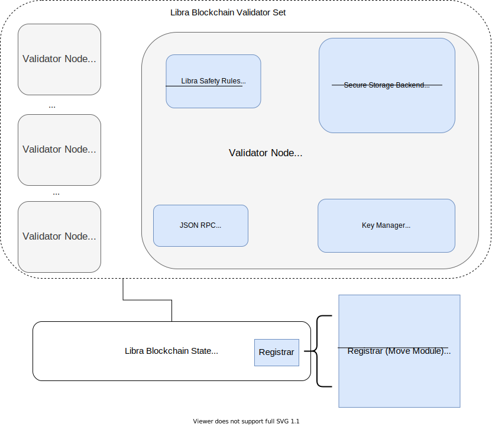

# Key Manager specification

This specification outlines the design and execution of the Key Manager (KM): the primary service responsible for managing and rotating cryptographic keys used by validator nodes and validator full nodes in the Diem payment network.

## Table of Contents

1. [Overview](#overview): We begin this specification by first presenting a broad overview of the KM. Here, we motivate the KM, identify the cryptographic keys the KM is responsible for, discuss the KM architecture and outline the high-level operational flow of the KM.
2. [External Components and Abstracted Modules](#external-components-and-abstracted-modules): Next, we discuss in detail the external services the KM relies upon during execution, and present the abstracted external modules leveraged at runtime.
3. [Key Manager Modules and Data Structures](#key-manager-modules-and-data-structures): Third, we present the general data structures defined and used by the KM. This includes a description of how the KM is started and the various entry points into the service.
4. [Security Considerations](#security-considerations): Finally, we conclude this specification by outlining the various security considerations that need to be taken into account when deploying the KM.

## Overview

Validator nodes (VNs) and validator full nodes (VFNs) generate and store cryptographic keys in order to securely participate in the Diem network. For example, each VN in Diem maintains a secret and unique cryptographic key that can be used to sign votes on quorum certificates; this allows VNs to achieve [consensus](https://github.com/diem/diem/tree/main/specifications/consensus) on transactions within Diem. Likewise, all VNs and VFNs in the network maintain cryptographic keys to authenticate and encrypt communication between nodes; thus, preventing adversaries from interfering with network communication in order to perform attacks.

To maintain the integrity and confidentiality of cryptographic keys in the Diem network, the KM is responsible for automatically rotating these keys over time. This provides freshness for keys used by the VNs and VFNs mitigating long range attacks, where keys are compromised and gathered over long periods of time.

### Cryptographic Keys

At present, the KM plays a role in rotating the following asymmetric cryptographic keys in Diem:

1. The _consensus_ key -- an `Ed25519PrivateKey` used by VNs to sign votes on quorum certificates to achieve consensus.

Note: from this point forward, whenever we refer to a cryptographic key by name (e.g., the consensus key), we are referencing the private exponent of the key (e.g., the `Ed25519PrivateKey`). References to the public exponent of a cryptographic key will always be clarified.

### Key Manager Architecture

At a high-level, the KM is designed to be a stand-alone service that drives the rotation of cryptographic keys across the relevant services and components that make up a VN and VFN. Each VN/VFN instance in the Diem network will deploy its own KM to manage the keys on that instance and perform rotations as required. The diagram below shows a broad overview of the KM operating within the context of a VN. The rest of this section is dedicated to explaining this architecture and presenting how it operates.



**Key Manager Architecture**: First, there are several important components that must be highlighted within the architecture diagram above; these are displayed in color:

* **Secure Storage**: First, Secure Storage (SS) is the storage backend used by the KM to persist and hold cryptographic keys. The KM relies on SS as a single source of truth regarding the value of any cryptographic key for the VN/VFN. For more information about the SS, see the specification, [here](https://github.com/diem/diem/tree/main/specifications/trusted_computing_base/secure_storage).
* **Validator Configs**: Second, the mapping between VNs/VFNs to cryptographic keys is stored on the Diem blockchain in a `Validator Config` resource held under each validator operator's account. For example, in the case of the consensus key, each VN will register their consensus key in the validator config of that node, on-chain. The consensus key for that VN can then be seen by all other VNs in the network, and thus used to authenticate the consensus votes signed by the consensus key. To protect the validator config of each VN/VFN, each VN/VFN is assumed to have a unique and private identity key, called the _operator key_ that has permission to update the validator config for that VN. The _operator key_ is initialized and held in the SS for each VN and VFN. More details on validator configs and the _operator key_  is presented below.
* **JSON RPC Endpoint**: Third, in order to interact with state on the Diem blockchain (e.g., update each validator config), the KM requires the ability to read and write transactions to the blockchain. To achieve this, a JSON RPC endpoint is assumed to be online and available to handle KM requests.
* **Components with Exported Keys**: Fourth, and finally, each VN may have multiple components that maintain direct copies or exports of cryptographic private keys. It is important to note these components explicitly, as they not only affect how the KM supports key rotations, but they also have significant security implications. For example, in the diagram above, we can see the Diem Safety Rules (LSR) component. LSR is a component within each VN responsible for participating in consensus (see [here](https://github.com/diem/diem/tree/main/specifications/trusted_computing_base/safety_rules)). For performance reasons, LSR maintains its own local copy of the consensus private key, which we term an _exported key copy_. We highlight components that maintain exported key copies and discuss the implications of key copies to the KM's role in further detail below.

### Consensus Key Rotation Protocol

Given the KM architecture presented above, we now describe the high-level flow of a VN consensus key rotation as performed by the KM. The diagram below augments the architecture diagram with numbered steps showing the interactions between the KM and the various components in the architecture. We explain each step in detail below:


1. Before the KM is deployed, it is assumed that when the VN is started, the SS is automatically initialized with: (i) the operator key, i.e., the identity key for the VN (denoted **operator_private**); and (ii) the consensus key, i.e., the key by which the VN will sign quorum certificates to achieve consensus (denoted **consensus_private**), Moreover, it is further assumed that the public exponent of **consensus_private** (denoted **consensus_public**) will already be registered on-chain in the validator config for the VN using the public exponent of **operator_private** (denoted **operator_public**).
2. When the KM is invoked to perform a consensus key rotation, it will first contact the SS to produce a new consensus private key, **consensus_private<sup>{i+1}</sup>**, internally and overwrite the current consensus private key, **consensus_private<sup>{i}</sup>**.
3. Once the SS has overwritten **consensus_private<sup>{i}</sup>** with **consensus_private<sup>{i+1}</sup>**, it will return the public exponent of the new consensus key, **consensus_public<sup>{i+1}</sup>**, to the KM (this is the new consensus public for the VN).
4. The KM will take the new consensus public key returned by the SS, **consensus_public<sup>{i+1}</sup>** and generate a _rotation transaction_ that updates the on-chain validator config with the new consensus public key for the VN using the operator public key (i.e., sets **consensus_public<sup>{i}</sup>** to **consensus_public<sup>{i+1}</sup>** for the validator config of the VN). The KM will then forward the new rotation transaction to the SS to be signed.
5. The SS will sign the rotation transaction using **operator_private** internally and return the _signed rotation transaction_ to the KM.
6. The KM will take the signed rotation transaction and forward it to the Diem blockchain via the JSON RPC endpoint (i.e., the endpoint by which the KM can read and write transactions to the blockchain).
7. At some later point in time, the signed rotation transaction is committed to the blockchain, meaning that when the next consensus reconfiguration event occurs (i.e., the next set of VNs is to selected to perform consensus, see [here](https://github.com/diem/diem/tree/main/specifications/consensus)), the consensus key for the VN will be updated to **consensus_public<sup>{i+1}</sup>**.
8. Once all 6 steps above have been completed, the consensus key for the VN has successfully been rotated both inside the SS, and on the blockchain. However, due to performance reasons, it's possible that other components within the VN may have previously exported the consensus private key and thus hold temporary copies of the old key locally. For example, LSR is one such component: to improve the throughput and latency of the consensus algorithm, LSR exports the consensus private key upon initialization, and maintains a copy of the private key in local memory. This avoids having to contact the SS whenever it wishes to sign a quorum certificate. In order to prevent this key from becoming stale, LSR monitors the blockchain for reconfiguration events, and after each reconfiguration event, LSR will verify if the consensus key for this VN has been rotated. If so, LSR will query the SS directly to export the consensus private key corresponding to the consensus public key registered in the validator config on-chain (i.e., fetch **consensus_private<sup>{i+1}</sup>** for **consensus_public<sup>{i+1}</sup>**).
9. Upon a key export request, the SS will verify the requester has appropriate permissions to retrieve the requested key, and if so, return the key as required. In this case, it will return **consensus_private<sup>{i+1}</sup>** to LSR. This concludes the consensus key rotation.

### Consensus Key Rotation Failures

At any point during a consensus key rotation, it is possible for any component within the key rotation pipeline to fail. For example: (i) the KM itself may crash during a key rotation; (ii) the SS may be offline for some period of time; (iii) the JSON RPC endpoint may fail to forward signed rotation transactions to the blockchain; or (iv) a component that maintains an exported key copy may fail (e.g., LSR). As such, it is the responsibility of the KM to provide fault tolerance against key rotation failures. For this, the KM assumes that any and all failures are transient, i.e., that the failure will occur for only a finite amount of time, after which the failed component will resume operation and the KM can address any inconsistencies. We make several important observations regarding consensus key rotation failures:

1. First, we note that the worst thing that could happen as a result of a failure is that there is a consensus key mismatch between various components in the pipeline. For example, the consensus private key held in the SS, and the consensus public key registered on-chain may differ if the signed rotation transaction never makes it to the blockchain during a rotation (i.e., step 5 above). This results in a liveness issue, as the VN will not be able to continue to participate in consensus -- however, safety is not be violated. In this scenario, the KM will need to re-sync the consensus key versions between the SS and the blockchain. See the failure recovery protocol section below for how to recover from this.
1. Second, we note that there may be instances where a component within the VN that maintains an exported key copy (e.g., LSR) requires access to a previous version of the consensus key in order to operate. This can occur if the component fails at a critical point during a key rotation. For example, imagine a case where the consensus key has been rotated successfully from **consensus_private<sup>{i}</sup>**  to **consensus_private<sup>{i+1}</sup>** , both in the SS and on-chain, and the KM is currently waiting for a reconfiguration event to occur for the rotation to complete (step 6 above). During this time, it's possible that LSR may fail and recover. In this case, LSR requires another copy of the consensus key to participate in consensus. However, a reconfiguration event has yet to occur, as such, the new consensus key held in the SS (**consensus_private<sup>{i+1}</sup>**) will not be valid until the reconfiguration occurs. In this case, LSR will simply have to wait before the VN can once again participate in consensus. While this is only a temporary liveness issue, it is undesirable, and thus recommended that the SS maintains the last **N=2** versions of all keys it has rotated to avoid this and allow previous key versions to be acquired. Therefore, LSR can query the SS for the old key version (**consensus_private<sup>{i}</sup>** ), and use that while waiting for the reconfiguration event to trigger the retrieval of the new key version (**consensus_private<sup>{i+1}</sup>** ). We note that while **N=2** is sufficient to handle this scenario, it's possible that other scenarios may arise where **N=2** is insufficient (i.e., when LSR may require the consensus key >1 version behind the most recent). Given that such scenarios are extremely rare, however, and only result in a temporary liveness issue, we don't deem it necessary to prevent such cases.

**Failure Recovery Protocol:** To achieve fault tolerance against component failures (including the KM itself), the KM should periodically check the state of the consensus key across components in the system, by performing the following steps:

1. Verify that the consensus key version held in the SS (**consensus_private<sup>{i}</sup>** ) corresponds to the consensus key version registered on the Diem blockchain for this VN (**consensus_public<sup>{i}</sup>** ). If so, no action is required as everything is consistent. If these key versions differ, however, the KM should proceed to step 2 below.
2. Check if a signed rotation transaction that updates the validator config to the consensus key version currently held in the SS has recently been submitted to the blockchain. If so, it's likely that the KM simply needs to wait until the transaction is processed. In this case, the KM should sleep before returning to step 1 above. If a signed rotation transaction hasn't recently been submitted, or one was previously submitted but it has now expired (i.e., passed the transaction expiration time), the KM should proceed to step 3 below.
3. The KM should regenerate the signed rotation transaction to update the on-chain consensus key version, and resubmit the transaction to the blockchain (i.e., see, step 3 in the [consensus key rotation](#consensus-key-rotation-protocol) section above). The KM should then sleep for a while and return to step 2 above.

**LSR Failure Recovery Steps:** As already outlined in this section, should LSR fail and restart at any point, it will need to read the currently registered consensus public key on the blockchain for this VN and retrieve the corresponding private key from the SS. Given that the SS maintains **N=4** versions of the consensus key at any time, this should be successful in the majority of cases. If the SS fails to contain the corresponding private key for the consensus key version registered on-chain, LSR should simply wait until a reconfiguration event occurs which announces the new consensus key, and retrieve the corresponding private key from the SS before resuming execution.

## External Components and Abstracted Modules

In this section, we discuss in further detail the external components relied upon by the KM. These are: the secure storage (SS), the validator configs, and the JSON RPC endpoint. For each of these components, we present abstractions (e.g., component interfaces) in order to reason about the correctness of the KM protocols. Assuming each of these external components is implemented correctly (i.e., according to the interfaces they expose), we argue for the security and correctness of the KM.

### Secure Storage (SS)
The SS offers a secure persistent backend for generating, storing and managing security-critical data. While this includes a wide variety of data types (e.g., arbitrary text, json blobs, waypoints etc.), the KM only requires cryptographic key support from the SS. As such, we focus on this support here. For further information about the SS, see the specification [here](https://github.com/diem/diem/tree/main/specifications/trusted_computing_base/secure_storage).

At a high-level, the KM requires several important functionalities from the SS. We list these functionalities below, and for each functionality, explain what it is required, and where it is used.

- **Secure Key Generation**: First, the KM requires the SS to be able to securely generate cryptographic private keys internally. This is needed: (i) initially when the VN is created, i.e., to initialize the value of each private key. This is step 0 in the KM key rotation protocol in the section above; and (ii) whenever a key rotation is subsequently performed, i.e., to generate a new version of the private key locally. This is step 1 in the KM key rotation protocol above.
- **Signature Generation**: Second, the KM requires the SS to be able to sign data (e.g., a transaction hash) using private keys held internally inside the SS. This avoids having to expose private keys to the world outside the SS. Here, the KM requires signature generation support when it requests the SS to sign the rotation transaction using the consensus key -- step 3 in the KM key rotation protocol.
- **Key Versioning**: Third, the KM requires the SS to be able to store and maintain multiple versions (e.g., **N=2**) of each private key locally. This is needed to recover from specific failure scenarios, e.g., LSR requiring a previous version of the consensus key after a failure. See the [consensus key rotation failures](#consensus-key-rotation-failures) section above.
- **Private Key Export**: Fourth, the KM requires the SS to allow the exporting of private keys outside the domain of the SS. This is so that specific components within each VN can maintain *hot copies* of specific keys. For example, LSR requires a local hot copy of the consensus key for performance reasons (see the section above).

To support all of the required functionalities listed above for the KM, the SS provides a complete cryptographic key API named `CryptoStorage`. The snippet below shows a simplified `CryptoStorage` API. To view the full API, see the SS specification [here](https://github.com/diem/diem/tree/main/specifications/trusted_computing_base/secure_storage).

```rust
// CryptoStorage offers a secure storage engine for generating, using and managing cryptographic
/// keys securely.
pub trait CryptoStorage: Send + Sync {
    /// Securely generates a new named Ed25519 key pair and returns the corresponding public key.
    fn create_key(&mut self, name: &str) -> Result<Ed25519PublicKey, Error>;

    /// Returns the private key for a given Ed25519 key pair, as identified by the 'name'.
    fn export_private_key(&self, name: &str) -> Result<Ed25519PrivateKey, Error>;

    /// Returns the private key for a given Ed25519 key pair version, as identified by the
    /// 'name' and 'version'.
    fn export_private_key_for_version(
        &self,
        name: &str,
        version: Ed25519PublicKey,
    ) -> Result<Ed25519PrivateKey, Error>;

    /// Rotates an Ed25519 key pair by generating a new Ed25519 key pair, and updating the
    /// 'name' to reference the freshly generated key.
    fn rotate_key(&mut self, name: &str) -> Result<Ed25519PublicKey, Error>;

    /// Signs the given message using the private key associated with the given 'name'.
    fn sign_message(&mut self, name: &str, message: &HashValue) -> Result<Ed25519Signature, Error>;

    /// Signs the given message using the private key associated with the given 'name'
    /// and 'version'.
    fn sign_message_using_version(
        &mut self,
        name: &str,
        version: Ed25519PublicKey,
        message: &HashValue,
    ) -> Result<Ed25519Signature, Error>;
}
```

As can be seen from the snippet above, the `CryptoStorage` API offered by the SS provides all of the required functionalities for the KM to operate correctly. More specifically:

- **Secure Key Generation** is offered by the `create_key(..)` and `rotate_key(..)` API calls. As such, the SS can be initialized when the VN is started by calling `create_key(..)` for the `operator_key` and `consensus_key`. Moreover, each time the KM needs to generate a new key version for the consensus key, `rotate_key(consensus_key..)` can be called.
- **Signature Generation** is offered by the `sign_message(..)` and `sign_message_using_version(..)` API calls. As such, the KM can request the SS sign the rotation transaction by calling `sign_message(operator_key,rotation_transaction)`.
- **Key Versioning** is supported by the `rotate_key(..)`, `export_private_key_for_version(..)` and `sign_message_using_version(..)` API calls. The version of each key is specified using the public key, and multiple versions of each key (i.e., **N>1**) are maintained by the SS.
- **Private Key Export** is offered by the `export_private_key(..)` and `export_private_key_for_version(..)` API calls. As such, LSR can request a local copy of the consensus key using either of these API calls (depending on the version required).

### Validator Configs

As discussed in the overview section above, the validator configs offer a _public key infrastructure_ (PKI) that maps the identity of each VN to the corresponding cryptographic keys (e.g., the consensus key). While this mapping could be done using another PKI system, in Diem, we run this PKI directly on the blockchain. This provides a single source of truth that is both tamper and censorship resistant.

To allow dynamic updates to the consensus key, the `ValidatorConfig` decouples the operator key of each VN from the consensus key, allowing VNs to retain a single operator key over time despite performing multiple rotations. To achieve this, each VN in Diem is responsible for publishing and maintaining their `ValidatorConfig`. This configuration is associated with each VN using the VN's _operator account_, and the only way in which to update the `ValidatorConfig` is to sign a Diem transaction using the operator key associated with that account. As a result, only the operator of each VN can modify this configuration. This makes the `ValidatorConfig` an ideal location in which to publish the consensus key of each VN.

The snippet below shows the on-chain `ValidatorConfig` of each VN:

```rust
pub struct ValidatorConfig {
    pub consensus_public_key: Ed25519PublicKey,
    /// This is an bcs serialized Vec<EncNetworkAddress>
    pub validator_network_addresses: Vec<u8>,
    /// This is an bcs serialized Vec<NetworkAddress>
    pub fullnode_network_addresses: Vec<u8>,
}
```

As can be seen in the snippet above, `ValidatorConfig` contains a field named `consensus_public_key` of type `Ed25519PublicKey`. This field contains the currently published consensus key of the VN, thus allowing other VNs in the network to identify the consensus key of this VN.

**Epoch-specific ValidorConfig Snapshots**: For security and performance reasons, the `ValidatorConfig` of each VN is copied into an external move module called `ValidatorInfo` whenever the VN is selected to participate in a consensus round (i.e., epoch). This snapshot (or copy) is taken at the beginning of each epoch for the next consensus round. `ValidatorInfo` contains the identity information of each VN participating in consensus. As a result, on each epoch change in Diem (i.e., reconfiguration), the VNs participating in that epoch will have their consensus public key frozen for the duration of that epoch, and all other VNs in the network will expect that VN to use the published consensus key in `ValidatorInfo`. This means that consensus key rotations will only take effect on the next reconfiguration (i.e., when a new snapshot of `ValidatorConfig` is copied into `ValidatorInfo`). The snippet below shows `ValidatorInfo`:

```rust
/// After executing a special transaction indicates a change to the next epoch, consensus
/// and networking get the new list of validators, their keys, and their voting power.  Consensus
/// has a public key to validate signed messages and networking will has public identity
/// keys for creating secure channels of communication between validators.  The validators and
/// their public keys and voting power may or may not change between epochs.
pub struct ValidatorInfo {
    // The validator's account address. AccountAddresses are initially derived from the account
    // auth pubkey; however, the auth key can be rotated, so one should not rely on this
    // initial property.
    account_address: AccountAddress,
    // Voting power of this validator
    consensus_voting_power: u64,
    // Validator config
    config: ValidatorConfig,
    // The time of last recofiguration invoked by this validator
    // in microseconds
    last_config_update_time: u64,
}
```

As can be seen in the snippet above, every `ValidatorInfo` contains a copy of the most up-to-date `ValidatorConfig` published on the blockchain before the epoch change. This contains the identity information of each VN during the current epoch, including the consensus key published by that VN.

### JSON RPC Endpoint

As discussed in the overview section above, the KM must be able to communicate with the Diem blockchain in order to read and update the consensus key of each VN registered on-chain. To achieve this, the KM uses the JSON RPC API offered by each VN endpoint. To execute all steps in the KM rotation and failure recovery protocols, the KM requires the API to provide the following list of functionalities:

* **ValidatorConfig Retrieval**: First, the KM requires the JSON RPC API to support retrieval of the `ValidatorConfig` published on-chain for each specific VN. This is needed for failure recovery, for example, when the KM needs to determine if the current consensus key registered on-chain matches the consensus key held in the SS.
* **ValidatorInfo Retrieval**: Second, the KM requires the JSON RPC API to support retrieval of the `ValidatorInfo` constructed at the beginning of each epoch. This is needed for failure recovery of LSR. For example, if LSR crashes and recovers, it will need to read the `ValidatorInfo` constructed for the VN in this epoch in order to determine which version of the consensus key each vote should be signed with.
* **Transaction Submission**: Third, and finally, the KM requires the API to support transaction submission to the Diem blockchain. This is required so that the KM can submit signed rotation transactions whenever a consensus key rotation is performed (i.e., step 5 in the KM consensus key rotation protocol above).

To support all of the functionalities listed above, the JSON RPC endpoint provides the following API. For brevity, we only list the API calls used by the KM.

```rust
/// Returns the associated AccountStateWithProof for a specific account. This method returns the
/// AccountStatewithProof at the height currently synced to by the server. To ensure the
/// correct AccountStatewithProof is returned, the caller should verify the account state proof.
pub fn get_account_state_with_proof(&mut self, account: AccountAddress) -> Result<AccountStateWithProof, Error>;

/// Submits a signed transaction to the Diem blockchain via the JSON RPC API.
pub fn submit(signed_transaction: SignedTransaction) -> Result<(), Error>;
```

As can be seen from the snippet above, the JSON RPC API supports two calls, `get_account_state_with_proof(..)` and `submit(..)`. These are used by the KM to achieve the required functionality in the following manner:

* **get_account_state_with_proof**: First, the `get_account_state_with_proof(..)` call returns an associated `AccountStateWithProof` for a specified `AccountAddress`. This call can be used by the KM to: (a) retrieve the `ValidatorConfig` of a specific VN, by passing in the address of the VN to query (i.e., `get_account_state_with_proof(vn_address)`); and (b) retrieve the `ValidatorInfo` of a VN for the current or next epoch. To achieve this, the KM can pass in the `validator_set_address`, an account address specified by Diem to hold specific information about the current VN set (i.e., `get_account_state_with_proof(validator_set_address)`). For further information about what the KM should do with the associated `AccountProof` returned for each call, see the [security considerations](#security-considerations) section below.
* **submit**: The `submit(..)` call provides the ability to submit a signed transaction to the blockchain. As such, the KM can call this method with the signed rotation transaction to perform a rotation (i.e., `submit(signed_rotation_transaction)`).

## Key Manager Modules and Data Structures

As outlined in the overview section above, the KM is a stand-alone service that operates autonomously in a controlled execution loop. In this section, we present the entry point into the KM and the controlled execution loop. Where appropriate, we present relevant data structures.

### Point of Entry and Execution Loop

The KM operates with a single point of entry: a `main(..)` execution function. To initialize the KM and invoke execution using this function, the KM requires specific configuration information. The code snippet below shows the information required by the KM on startup (i.e., the `KeyManagerConfig`):

```rust
pub struct KeyManagerConfig {
    /// Key Manager execution specific constants
    pub rotation_period_secs: u64,
    pub sleep_period_secs: u64,
    pub txn_expiration_secs: u64,

    /// External component dependencies
    pub json_rpc_endpoint: String,
    pub chain_id: ChainId,
    pub secure_backend: SecureBackend,
}
```

As can be seen in the code snippet above, the KM requires three execution specific constants at startup:

1. `rotation_period_secs`: First, the KM requires knowing the period of time between each consensus key rotation (in seconds). This specifies how frequently the KM will perform a rotation. For example, if this is set to `3600` seconds, the KM will rotate the consensus key every hour.
2. `sleep_period_secs`: Second, as the KM is designed to run autonomously in a controlled execution loop, the KM requires knowing how long to sleep between executions (in seconds). This prevents the KM from _busy waiting_ when there is no work to be done and reduces execution load on the machine.
3. `txn_expiration_secs`: Finally, the KM needs to know how long each rotation transaction it creates should be valid for (i.e., the transaction expiration time of each rotation transaction). This prevents transactions from being valid at all points in the future, creating the potential for security vulnerabilities (e.g., replay attacks). If a rotation transaction has been submitted to the blockchain (using the `submit()` JSON RPC API call) but has not ultimately been written to the blockchain within this time, the KM will need to reconstruct a new transaction.

Moreover, the KM requires configuration information about how to communicate with the external components it relies on. These are:

1. `json_rpc_endpoint` and `chain_id`: First, the KM requires knowing about the JSON RPC endpoint that it should talk to (i.e., when reading and writing transactions to the blockchain). `json_rpc_endpoint` follows a url format, for example, `https://123.123.123.123:8080`.

2. `secure_backend`: Second, the KM requires knowing about the SS to which it can communicate. This includes the connection credentials to use, the url location of the SS, any supported API version etc.

**Execution Loop**: Once the KM has been correctly initialized using a valid `KeyManagerConfig`, the KM follows a single execution loop that obeys the rotation and failure recovery protocols outlined in the overview section above.

At a high-level, this means that the KM follows these simple steps in an infinite loop:

1. Verify that the consensus key held by the SS matches the one registered in `ValidatorConfig`. If not, follow the failure recovery protocol above.
2. Read the current time and if enough time has passed since the previous consensus key rotation, perform a consensus key rotation by executing the rotation protocol outlined above.
3. Sleep for `rotation_period_secs` and then return to step 1.

## Security Considerations

In this section, we discuss several interesting security considerations that affect the safety and liveness of the KM and/or each VN.

* **Proving Consensus Key Ownership**: As discussed above, each VN will announce its consensus public key on-chain. This occurs by essentially updating the mapping between each `operator_key` and `consensus_key` for the VN. However, to ensure that this occurs securely, it is essential that when such updates occur on-chain, ownership of the keys being published are proven. Otherwise, _spoofing_ attacks could occur. For example, consider the case where a malicious or Byzantine VN publishes a transaction on-chain that updates their consensus key to be the same consensus key owned by another VN (i.e., the malicious VN spoofs a consensus key owned by another VN). In this case, there will be two operator keys mapping to the same consensus key. This may allow the malicious VN to benefit financially by appearing to participate in a consensus round, despite not actually doing any work. To avoid this type of attack (and other attacks that might not be so obvious..), the validator config on-chain should require a signature from the consensus key when a validator config update occurs.

* **Avoiding Exported Key Copies**: At present, each VN may contain components that manage exported key copies locally, for example, LSR, which stores a local copy of the consensus key in memory in order to sign votes. While this may be beneficial for performance reasons (i.e., LSR doesn't need to contact the SS to perform a signature on each vote), it does lead to concerns about key compromise: if LSR is less secure than the SS, an adversary will simply target the key copy in LSR to compromise the key. Thus nullifying any defenses put into place to protect the consensus key in the SS. To avoid this, the use of exported key copies is _heavily discouraged_, and any components that maintain exported key copies should have significant justifications for doing so. Moreover, such components should be strictly audited for security vulnerabilities, as they will likely become the target of adversaries when deployed.

* **Enforcing Periodic Key Rotation**: Key rotation is an attractive means of protecting against various types of attacks on each VN. However, without strictly enforcing key rotation within the network (i.e., making it mandatory), it is possible that VNs will not perform key rotation frequently enough to see any security benefits (e.g., due to being lazy or wanting to avoid the financial or operational costs of performing a rotation). To avoid this, it is essential that VNs that do not rotate their keys frequently enough are disincentivized and/or penalized for their actions. One way to achieve this is to exclude lazy VNs from the set of possible VNs that may participate in the Diem consensus algorithm. Such exclusions may then be lifted once the VNs meet the key rotation requirements. This will help to protect the Diem network against old or compromised keys.

* **Verifying vs. Non-verifying the JSON RPC Endpoint**: As discussed above, in order for the KM to perform key rotations, it must be able to read and write transactions to the blockchain. The KM does this internally by interfacing with a JSON RPC endpoint. However, one notable challenge arises when performing such interaction: how does the KM know the information it is being supplied by the endpoint is correct and up-to-date? If an attacker can compromise the JSON RPC endpoint, it may feed the KM stale information or incorrect blockchain state (e.g., transactions). As a result, this could cause a liveness violation for the VN node (e.g., the KM could fail to see that the VN does not have the correct consensus key registered on the blockchain, and thus will be unable to participate in consensus). To defend against this, it is critical that the KM verifies all information returned via the JSON RPC endpoint (e.g., the KM should verify proofs of account state and ensure that the height of the blockchain is monotonically increasing). This will help to reduce the attack surface against the KM. Note, however, that while the KM can verify the blockchain is growing sequentially, it is unable to verify that the information being presented to it is fresh (i.e., that the responses returned by the JSON RPC endpoint hold the most up-to-date information). As such, without querying and aggregating the responses of multiple different JSON RPC endpoints, there are always some levels of implicit trust between the KM and the endpoint it relies on.

* **Minimizing the size of the KM and the corresponding TCB**: At present, the KM communicates with the JSON RPC endpoint via a JSON RPC client that verifies API responses. To achieve this, the KM implementation handles and parses both HTTP and JSON responses internally. From a security perspective, however, this is less-than-ideal. The KM forms part of the trusted computing base (TCB) of each VN (read more about the TCB, [here](https://github.com/diem/diem/tree/main/specifications/trusted_computing_base)). As a result, any and all code placed into the KM must be free from software bugs and vulnerabilities. It is critical, therefore, to reduce the amount of code placed into the KM, as this in turn reduces the attack surface of the KM and thus the TCB. We therefore argue that it is more appropriate for the KM to delegate communication with the JSON RPC endpoint to another external component, and only handle the structured API responses and proofs directly. This will prevent the KM from having to perform complex and unnecessary operations locally (e.g., parsing JSON, serialization/deserializing objects). This reduces the size of the TCB and makes the implementation easier to reason about/verify.
